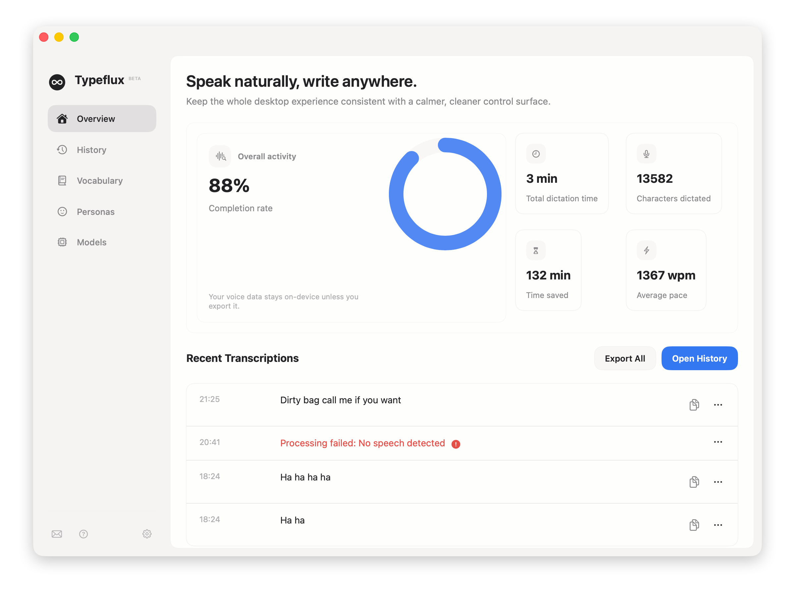

# Typeflux

[](https://github.com/mylxsw/typeflux/actions/workflows/test.yml)
[](https://codecov.io/gh/mylxsw/typeflux)

Typeflux is a macOS menu bar voice input tool built with Swift. It is designed for a fast "hold to talk, release to insert" workflow: press a hotkey, speak naturally, let the app transcribe your speech, and send the resulting text back into the currently focused app.

The project is aimed at people who want voice input to feel like a native part of desktop typing instead of a separate recording workflow. In addition to plain dictation, Typeflux also supports voice-driven text rewriting, streaming transcription previews, clipboard synchronization, and local or remote speech/LLM backends.



## What Typeflux Does

Typeflux lives in the macOS menu bar and listens for a configurable hotkey. Once activated, it records audio, shows a floating status overlay, transcribes the recording, and then tries to inject the final text into the active application. It also copies the result to the system clipboard as a fallback and keeps a history of recent sessions.

The product supports two major interaction patterns:

1. Dictation mode: speak and insert the recognized text at the current cursor position.
2. Editing mode: select existing text first, then speak an instruction to rewrite or transform that selected content.

This makes the app useful both for raw text entry and for higher-level editing workflows such as polishing, shortening, translating, or rephrasing selected text with voice commands.

## Highlights

- Native macOS menu bar app built in Swift with Swift Package Manager.
- Hold-to-talk interaction with a lightweight floating overlay.
- Automatic text insertion into the focused app, with clipboard fallback.
- Streaming transcription support for responsive feedback.
- Multiple speech-to-text backends, including local and remote providers.
- Voice-driven text rewriting powered by configurable LLM services.
- History storage with retry support and audio/text session review.
- Built-in settings UI for hotkeys, providers, personas, model options, and preferences.
- Privacy-conscious architecture that supports fully local transcription setups.

## Key Features

### 1. Fast voice input workflow

Typeflux is optimized around a low-friction desktop loop:

1. Press and hold a hotkey.
2. Speak.
3. Release to finish recording.
4. Receive live or near-live transcription.
5. Insert the result into the active app and copy it to the clipboard.

The app also includes a locked recording mode for longer sessions.

### 2. Dictation and voice editing

Typeflux is not limited to plain transcription. When text is already selected, the workflow can treat the selection as input context and apply a voice instruction to rewrite it. This makes the project useful as both a speech input utility and a voice-operated editing assistant.

### 3. Flexible speech backends

The codebase already includes support for several speech-to-text providers:

- Apple Speech
- Whisper API / OpenAI-compatible remote speech APIs
- Local model transcription
- Multimodal LLM transcription
- Alibaba Cloud realtime ASR
- Doubao realtime ASR

The routing layer can fall back to Apple Speech when configured to do so.

### 4. Flexible LLM backends

For rewrite or post-processing workflows, Typeflux supports:

- OpenAI-compatible LLM services
- Ollama for local model serving

This makes it possible to run the app against hosted APIs, self-hosted endpoints, or local desktop model stacks depending on your privacy, latency, and cost requirements.

### 5. History and observability

Typeflux stores session history, supports retrying previous records, and includes supporting pieces such as usage statistics and network debug logging. This is helpful for both product iteration and day-to-day debugging during development.

## Why This Project Is Interesting

Typeflux sits at the intersection of desktop UX, speech recognition, accessibility APIs, and LLM-assisted text workflows. The project is intentionally modular: hotkeys, audio capture, transcription, overlay UI, clipboard handling, text injection, settings, history, and model routing are separated into focused components.

That modularity makes the repository a good base for:

- experimenting with new speech providers,
- adding custom rewrite prompts or personas,
- testing local-first voice pipelines,
- building alternative desktop input experiences,
- or shipping a polished internal productivity tool for macOS users.

## Requirements

- macOS 13 or later
- Xcode with Swift 5.9+ tooling, or an equivalent Swift toolchain
- Microphone permission
- Accessibility permission for text injection
- Speech Recognition permission when using Apple Speech or Apple fallback

For some providers, you may also need:

- API keys and endpoint URLs for remote STT or LLM services
- local model files for local speech or local LLM workflows
- a valid code signing identity if you want a stable local development app identity across rebuilds

## Installation

### Download the latest release

The easiest way to install Typeflux is to download the pre-built `.app` bundle from the [Releases](https://github.com/mylxsw/typeflux/releases) page:

1. Download `Typeflux.zip` from the latest release.
2. Unzip the archive.
3. Drag `Typeflux.app` to your **Applications** folder.
4. Launch Typeflux from Applications.
5. Grant the requested permissions (Microphone, Accessibility, and Speech Recognition) when prompted.

### Build from source

If you prefer to build from source, follow the steps below.

## Getting Started

### Build

```bash
swift build
```

### Run tests

```bash
swift test
```

### Launch the app in development mode

```bash
make run
```

This builds the Swift package, assembles a stable `.app` bundle in `~/Applications/Typeflux Dev.app`, and launches it.

### Launch with logs attached to the terminal

```bash
make dev
```

This is the most convenient mode when developing the workflow, permissions flow, overlay behavior, or provider integrations.

## Documentation

- [Usage Guide](./docs/USAGE.md)
- [Make Commands](./docs/MAKE_COMMANDS.md)
- [Release Guide](./docs/RELEASE.md)

## Development Notes

### Why the project runs as an `.app`

Typeflux relies on macOS capabilities such as menu bar behavior, privacy permissions, and accessibility APIs. The repository includes helper scripts that package the debug binary into an app bundle before launch so that the app has a stable identity and macOS does not repeatedly invalidate permissions during normal development.

### Privacy and permissions

If required permissions are missing, the app surfaces guidance and opens the relevant macOS settings panes. During development, expect to grant at least:

- Microphone
- Accessibility
- Speech Recognition, when applicable

### Local development workflow

The most common inner loop is:

1. Edit code.
2. Run `swift test` for logic changes.
3. Run `make dev` to launch the app with logs attached.
4. Validate hotkeys, recording, transcription, overlay updates, and text injection in real desktop apps.

## How to Contribute

We welcome contributions from people interested in desktop productivity, voice UX, speech recognition, local AI, and macOS systems work.

A good way to get started:

1. Read the module layout above and run the app locally.
2. Start with one bounded area such as STT providers, overlay behavior, settings UX, text injection, or history.
3. Add or update tests in `Tests/TypefluxTests` when your change affects business logic, parsing, routing, or prompt behavior.
4. Keep modules focused and prefer extending existing abstractions instead of adding one-off code paths.

## Design Principles

The codebase is moving toward a few clear principles:

- Keep the interaction loop extremely fast.
- Prefer modular provider abstractions over hard-coded vendor logic.
- Preserve a usable fallback path when direct text injection fails.
- Support both cloud-powered and local-first workflows.
- Make the menu bar app understandable and hackable for contributors.

## License

This project is licensed under the GNU General Public License v3.0 (GPL-3.0). In practical terms, that means people are allowed to use, modify, and redistribute the code, but if they distribute a modified version or a derivative work, they must also provide the source code under the same GPL-compatible terms.

If you want a stronger network-service copyleft requirement for hosted SaaS deployments, you may want to consider AGPL in the future. For now, this repository uses GPL v3 as requested.

See the [LICENSE](./LICENSE) file for the full text.
