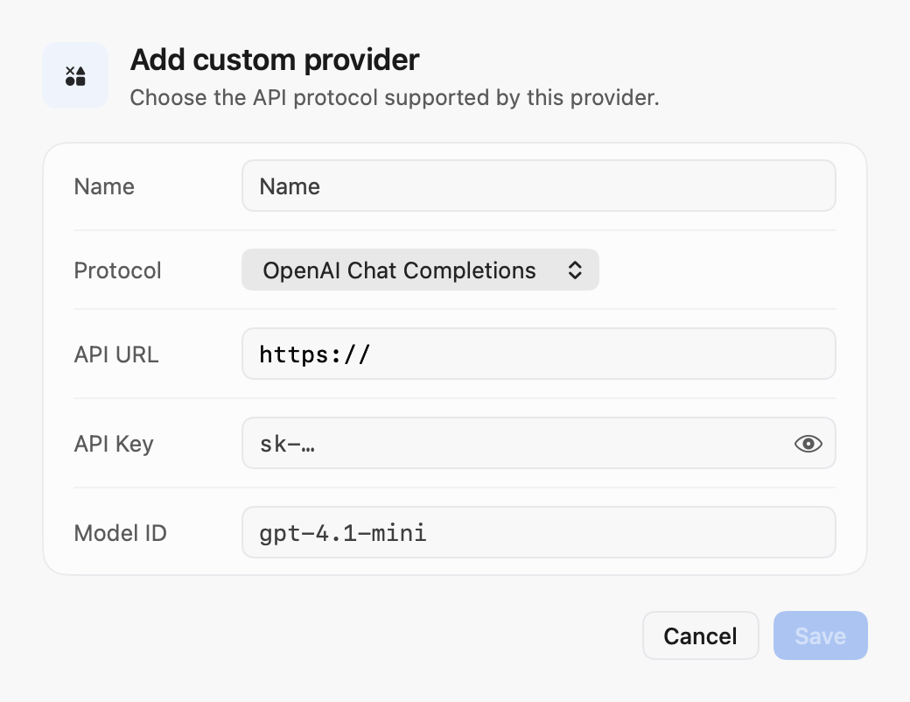

<div align="center">

# [Typeflux](https://typeflux.app) - Talk. We'll Type.

Hold `Fn` to dictate, or double-press `Fn` to ask anything. Typeflux delivers lightning-fast, accurate voice-to-text directly into any macOS application. Free, open-source, and supports local models — your voice never has to leave your Mac.

[](https://github.com/mylxsw/typeflux/actions/workflows/test.yml)
[](https://codecov.io/gh/mylxsw/typeflux)

English | [简体中文](./README.zh-CN.md)

[](https://youtu.be/ZxWWUOEgaJ4)


[View more screenshots](./docs/SCREENSHOTS.md)

</div>


## Download

**[⬇ Download latest release (.dmg)](https://github.com/mylxsw/typeflux/releases/latest)**

1. Download `Typeflux.dmg` from the latest release
2. Open the DMG and drag `Typeflux.app` to **Applications**
3. Launch and grant Microphone + Accessibility permissions

> **macOS 13+** · Free · No subscription · Fully local inference supported

## Why Typeflux

Most voice input tools force you to switch apps — dictating in one place, then copying and pasting into another. That context switch breaks flow.

Typeflux injects text directly into whichever app you're already using, at the cursor position, the moment you release the hotkey. It feels like typing, just **4× faster** (~200 WPM vs. ~50 WPM).

And when you need more than dictation, **Ask Anything** turns your voice into an AI assistant for Q&A, rewriting, translation, and complex workflows.

## How It Works

```
Hold Fn → Speak → Release → Text appears instantly
Fn ×2 → Ask → Release → Answer, edit, or action
```

1. **Press and hold** `Fn` (default hotkey)
2. **Speak naturally**
3. **Release** — Typeflux transcribes and injects the text at your cursor
4. **Double-press** `Fn` to use Ask Anything for Q&A, selected-text edits, and agent workflows
5. The result is also copied to clipboard as a fallback

## Features

### One-Click Voice Input
Hold `Fn` to start, release to stop. No switching input methods, no clicking buttons — works in any text field across browsers, code editors, terminals, and native apps.

### Ask Anything (`Fn` ×2)
More than just dictation. Double-press `Fn`, speak on the second press, then release to chat with an AI agent using your voice:

- **Voice Q&A** — Ask questions and get instant answers
- **Content Rewrite** — Select text, then speak an instruction like "make this shorter" or "translate to English"
- **Complex Workflows** — Handle multi-step tasks through natural conversation

### Local-First, Privacy-First
Run entirely on your Mac with on-device models. No API keys needed, no data leaves your machine. We don't collect, store, or analyze any of your voice or text data.

### Custom Personas
Create named instruction sets for different scenarios — work emails, study notes, casual chat, code comments — and switch between them from the menu bar.

### Multiple Speech Backends
| Provider | Type | Best For |
|----------|------|----------|
| Typeflux Cloud | Cloud | Zero-config, balanced accuracy |
| Local Model | Local | Privacy, offline use |
| Alibaba Cloud ASR | Cloud streaming | Low latency, Chinese |
| Doubao Realtime ASR | Cloud streaming | Chinese optimization |
| Google Speech-to-Text | Cloud | Multi-language, enterprise |
| OpenAI (Whisper API) | Cloud | High accuracy |
| Multimodal LLM | Cloud | Vision + audio tasks |
| Groq | Cloud | Fast inference, low cost |
| Free Models | Cloud | No API key, open-source endpoints |

### Custom Model Protocols
In **Settings → Models → Add Endpoint**, choose **Chat Completions**, **Anthropic Messages**, or **Responses**, then enter the endpoint, API key, and model ID. The protocol is saved with the provider and used for model discovery, connection tests, rewrite, and Ask, including streamed replies and tools. Existing custom providers keep Chat Completions until you change their protocol.

You can enter a base URL such as `https://api.example.com/v1` or a full inference URL. Typeflux preserves gateway path prefixes when selecting `/models`, `/messages`, `/responses`, or `/chat/completions`. Model discovery depends on the gateway exposing a compatible `/models` endpoint; otherwise add model IDs manually.



### Local Models
When you choose **Local Model**, Typeflux downloads and runs the model entirely on your Mac:

| Model | Size | Params | Best For |
|-------|------|--------|----------|
| SenseVoice | ~350 MB | 234M | Fast multilingual, strong Mandarin/Cantonese/English/Japanese/Korean |
| FunASR (Paraformer) | ~180 MB | 220M | Fast, accurate Chinese-focused offline ASR |
| WhisperKit Medium | ~1.5 GB | 769M | Balanced English and multilingual dictation |
| WhisperKit Large | ~3 GB | 1.55B | Highest accuracy offline transcription |
| Qwen3-ASR | ~1.3 GB | 0.6B | Strong context understanding, long-form recognition |

### Streaming Preview
See partial transcription results while still speaking, so you get immediate feedback before you release.

### History & Replay
Every session is saved locally. Review past sessions, replay audio, retry transcription with different settings, or export records to Markdown.

## Requirements

- macOS 13 or later
- Microphone permission
- Accessibility permission (for text injection)

For cloud providers: API keys and endpoint URLs.  
For local inference: model files are downloaded automatically on first use.

## Build from Source

```bash
git clone https://github.com/mylxsw/typeflux
cd typeflux

# One-time setup: create a local code-signing identity so macOS
# permissions (microphone, accessibility) persist across rebuilds.
scripts/setup_dev_cert.sh

make run          # build + launch as .app bundle
make dev          # launch with terminal logs attached
make dev-macbook  # use the MacBook API at mac-pro.local:8080
make dev-macmini  # use the Mac mini API at mac-mini.local:8080
make dev-macbook PLATFORM=ios # choose an iOS device/simulator and use the MacBook API
make dev-macmini PLATFORM=ios # choose an iOS device/simulator and use the Mac mini API
make full-dev     # launch dev app with bundled SenseVoice resources
make full-release # build the full notarized production installer locally
make release-continue # resume an interrupted local release
swift test        # run tests
```

The Mac LAN targets select a single API endpoint even when `TYPEFLUX_API_URLS`
is inherited from the shell. Realtime ASR addresses are supplied by the selected
API, not by the app Makefile. Set `REALTIME_ASR_SERVER_ORIGINS` in each API's
environment to `http://mac-pro.local:8081` (MacBook) or
`http://mac-mini.local:8081` (Mac mini), then restart that API service.
Clients must be on a network that can resolve these names and reach both ports.
Do not advertise `127.0.0.1` to clients on other devices.
These targets default to `PLATFORM=macos`. With `PLATFORM=ios`, they list paired
iPhones/iPads and available simulators for selection; `DEVICE=<UDID>` skips the
prompt. Simulator launches need no developer team. Physical-device launches
automatically use the Xcode project's team or an available Apple Development
certificate; multiple certificate teams prompt for selection. Set
`TYPEFLUX_IOS_TEAM` to override the team. Local HTTP is enabled
only for the iOS Debug build. See [the iOS quickstart](docs/IOS_QUICKSTART.zh-CN.md).

CI tests are opt-in. On an open pull request, a repository owner, member, or
collaborator can comment `@autotest` to run the test workflow.

> ⚠️ If you skip `setup_dev_cert.sh`, `make run` still works but macOS will re-prompt for permissions on each build (ad-hoc signing).

See [CLAUDE.md](./CLAUDE.md) for the full development guide.

### Run the iOS Ask app

With full Xcode 26+ and an iOS Simulator runtime installed, run from the repository root:

```sh
make ios-doctor   # check the Xcode and simulator environment
make ios-run      # build, install, and launch in Simulator
make ios-preview  # launch an offline UI preview without an account
```

For a paired iPhone with development signing configured:

```sh
TYPEFLUX_IOS_DEVICE='<device-UDID>' TYPEFLUX_IOS_TEAM='<TEAMID>' make ios-deploy
```

The iOS app requires iOS 17+. See the [iOS run, installation, and deployment guide (中文)](./docs/IOS_QUICKSTART.zh-CN.md) for first-time setup, signing, API environments, local archives, and troubleshooting. These commands install the client; they do not deploy the backend or publish to the App Store.

## Documentation

- [iOS Run, Installation, and Deployment (中文)](./docs/IOS_QUICKSTART.zh-CN.md)
- [iOS Ask Client: Architecture and Development](./docs/IOS_CHAT.md)
- [Usage Guide](./docs/USAGE.md)
- [Make Commands](./docs/MAKE_COMMANDS.md)
- [Release Guide](./docs/RELEASE.md)
- [Changelog](./CHANGELOG.md)

## Community

Join the community to share feedback, ask questions, and follow development updates:

- [Join Discord](https://discord.com/invite/Vr5389YrN)
- [X](https://x.com/mylxsw)
- WeChat group:

  

## Contributing

Typeflux is a completely open-source project. We believe great tools should belong to everyone.

Contributions welcome — STT provider integrations, overlay UX, settings views, text injection edge cases, or history/export features are great starting points.

1. Read the module layout in [CLAUDE.md](./CLAUDE.md)
2. Run the app locally with `make dev`
3. Add or update tests for any logic changes
4. Open a PR with a description of user-visible impact

## License

AGPL-3.0. See [LICENSE](./LICENSE).
