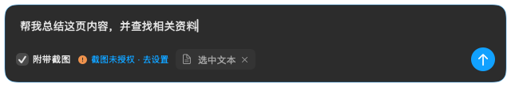
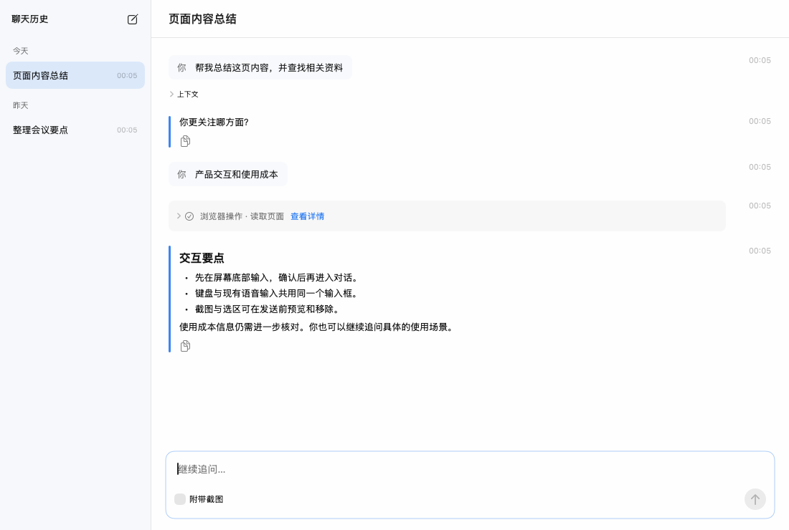
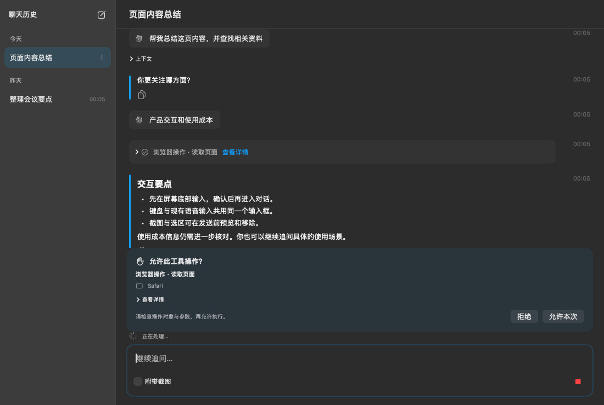
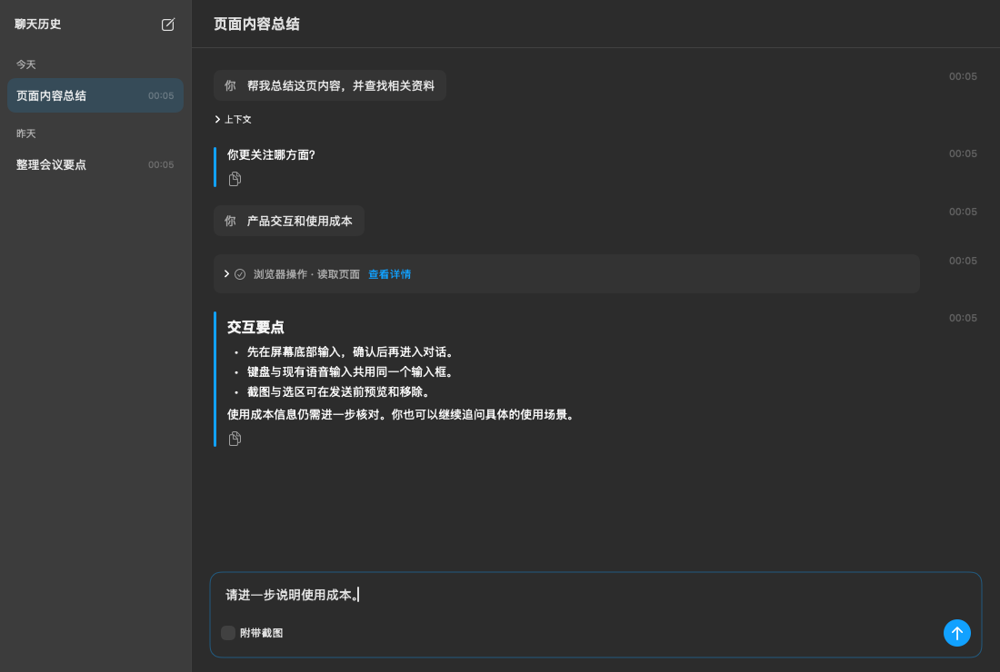
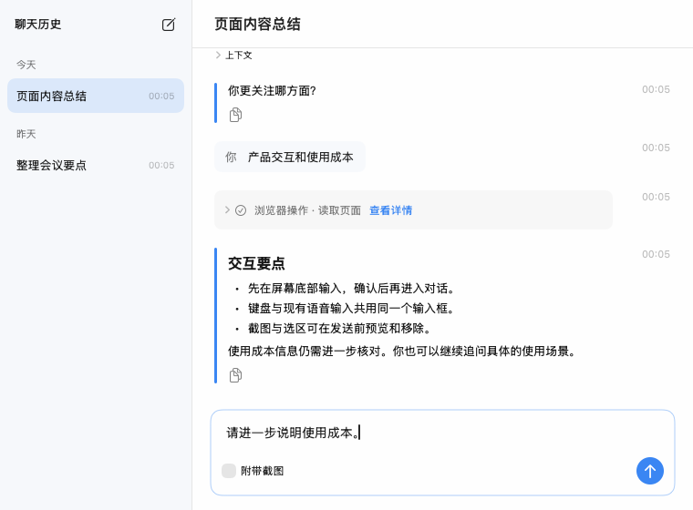
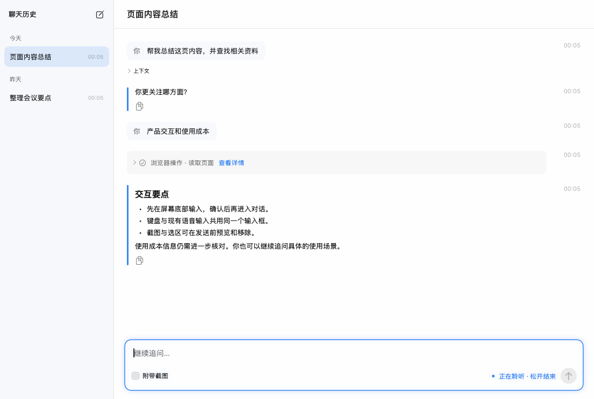
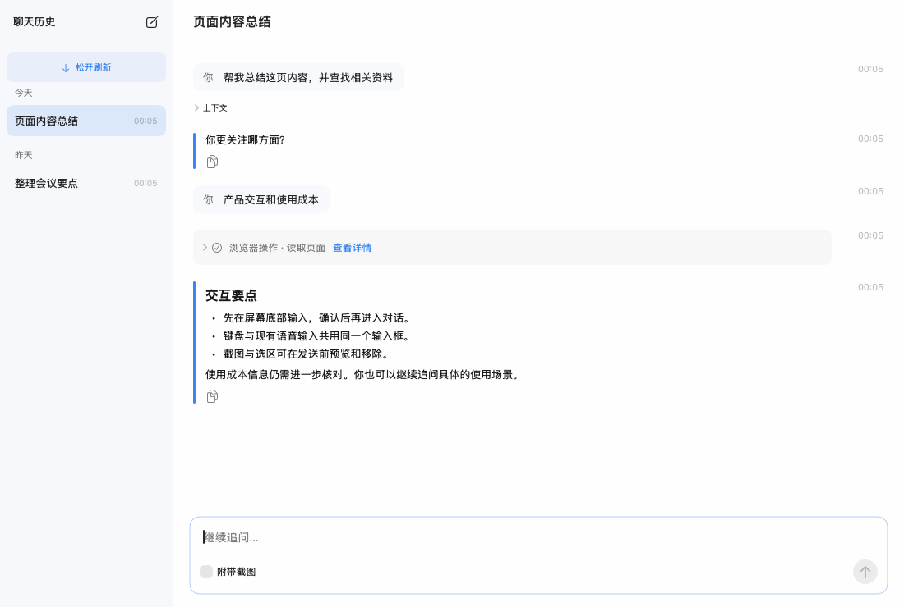

# Ask conversations

Double-tapping the Ask shortcut opens a bottom-centered, borderless composer. It does
not start recording or open the conversation workspace. Return submits;
Shift-Return inserts a newline; Return during IME composition does not submit.
Escape and clicking another application dismiss the composer while preserving
the draft. Existing dictation writes into its native NSTextView.

Submitting opens the workspace with history on the left, messages and tool
results on the right, and a follow-up composer. The menu also opens history.
The first question defaults to attaching a screenshot; follow-ups default to
text only. Attachments can be previewed, removed, or recaptured before sending.
Context is captured before the launcher takes focus. Removing a draft attachment
does not remove context already sent in previous messages.

Production views rendered with synthetic test data:












## Approved continuous-conversation layout

The launcher window is 640 pt wide and starts at 110 pt high, including a 6 pt
transparent gutter for the soft glow. Its visible bottom edge shares the recording
capsule's 58 pt inset above the target screen's usable bottom edge (16 pt window
inset + 42 pt capsule padding). Its native editor grows to 148 pt (226 pt panel)
upward before scrolling, retaining its size when reopened and keeping its bottom
edge fixed.
It has no title bar or close button. Screenshot permission and retry actions live
beside the attachment controls, not in a separate oversized notice. The workspace
uses the existing StudioTheme palette and a 210 pt history sidebar, compact 38 pt
rows, regular body text, continuous left-aligned messages and collapsed tool details.
Both appearances and the 760 x 560 minimum window are covered by render tests.

Conversation selection has its own identity and loading/error states. Cached
content remains visible during refresh; an uncached target cannot accidentally
send as a new conversation. Late responses update their own cache without changing
the user's selection or drafts. Streaming updates replace a row in place instead
of moving it to the top. Pagination merges by conversation ID, never by title.
Reading anchors and drafts are retained separately for each conversation.

The released client generated uppercase UUID strings, while PostgreSQL returned
lowercase IDs in history summaries and retained uppercase IDs in JSON snapshots.
The revised wire models canonicalize conversation UUIDs to lowercase. Old SQLite
snapshots and drafts remain readable under either spelling; higher revisions win,
and deleting a conversation removes both local spellings and its tool journal.
No server migration or deletion of existing cloud history is required.

## Hold-to-talk and edge refresh (approved design 2)

A primary-button hold of 350 ms in either editor starts recording. AppKit's press
recognizer allows 6 pt of movement before recognition; shorter clicks, double-clicks,
modified clicks, IME composition and drag selection keep native editing behavior.
Only the text editor is a hold target, not the screenshot, preview or send controls.
Release stops and transcribes through the application's existing AudioRecorder and
configured STTRouter. Transcription replaces the captured selection/insertion range
without submitting. Fn uses the same card feedback, including its short-tap lock
behavior; it does not show a second recording capsule while a composer owns focus.

The entire floating card or workspace input card has a static blue outline and
soft halo while recording, with a textual listening status. Transcription dims the
outline and disables sending. Escape, loss of focus, screen locking or sleep cancels
capture/delivery and preserves the draft. A late transcript cannot reach another
conversation, changed draft, or another application. A cancelled startup retains
recorder ownership until the driver's completion has been stopped and cleaned up.
Errors appear inline. No microphone buttons or additional waveform effects remain.

The sidebar title has only the new-conversation action; the workspace header has
no context button. Message context and attachment previews still work. Pull down
beyond the history's top edge by 48 pt, then release to refresh. Trackpad momentum
and normal scrolling do not refresh. Wheel input without gesture phases settles
for 200 ms before release. Pointer dragging is also supported. The edge shows a
transient instruction/progress strip; failures retain the list and show a five-second
retry hint. Requests coalesce, and selection, drafts and transcript anchors remain
intact. An accessibility refresh action provides an alternative to the gesture.

## Components

- `AskConversationWindowController` owns the launcher, workspace, and stop-control
  panel. `AppCoordinator` connects the existing hotkey and dictation workflows.
- `AskVoiceInput` owns the editor, selection and asynchronous cancellation boundary.
  `WorkflowComposerRecording` shares the application's recorder/STT services, and
  the legacy workflow forwards composer-focused hotkeys at a main-queue boundary.
- `AskHistoryPullRefresh` observes the existing native scroll view without replacing
  its content or scroll state; `AskHistoryPullGesture` owns the threshold/release rule.
- `AskConversationModel` manages account state, history, drafts, cancellation,
  approval, and recovery. `AskAPIClient` uses the existing authenticated cloud
  transport; active conversations refresh once per second for streamed text.
- `AskConversationCache` stores account-scoped snapshots, drafts and a tool
  execution journal in SQLite under Application Support/Typeflux. Deleting a
  conversation removes its local draft and tool journal after cloud deletion.
- `AskContextCapture` uses accessibility and ScreenCaptureKit. Missing screen
  permission leaves the question usable without an attachment. Screenshots are
  JPEG, capped at 1600 pixels on the long edge and 2 MB. On macOS 14+, Typeflux
  windows are excluded from capture. macOS 13 uses the legacy on-screen capture.
- `AskLocalTools` exposes computer, Safari/Chrome browser, and configured MCP
  tools. Every invocation requires explicit approval. Computer/browser actions
  are bound to the application from which the question was opened. After an app
  restart that target is unavailable: start a new question from the target app.

## Recovery and execution

Stable message IDs make retries after a lost response idempotent. Unconfirmed
messages can be resumed after restart. Tool results are journaled before posting;
an interrupted execution with an unknown outcome is reported instead of replayed.
Approval rechecks the server run before any effect. Only one conversation can
control the desktop at a time. Cancellation blocks late answers and later local
actions; it cannot reverse actions already performed.

Closing an active workspace offers hide-and-continue or stop. Work continues
while the application is alive. Terminating the application does not create a
background agent: interrupted requests fail or expire and require deliberate
resume. Local history survives logout but is partitioned by account.

## Deployment and acceptance

Deploy the companion typeflux-api Ask routes and migration 00035 before shipping
this client. The default cloud model must support vision and tool calling.
Normal cloud credits, entitlements, and rate limits apply.

Focused tests use stubbed cloud/tool services and temporary SQLite files. Run:

```sh
swift test --filter 'Ask|WorkflowControllerProcessingTests.testAskShortcut'
TYPEFLUX_ASK_SNAPSHOTS="$PWD/ask-snapshots" swift test --filter AskConversationVisualTests
```

The opt-in visual suite renders production SwiftUI views and native windows with
synthetic content. It never records audio, captures the desktop, or operates a
real browser. Before release, verify on a signed app with a staging backend:

1. Double Fn shows only the bottom composer, with focus; Fn dictation inserts into
   it. Hold in each editor, release outside its bounds, cancel during startup and
   transcription, and verify the original selection/draft. Check sleep and denied
   microphone permission in a signed app. Verify 58 pt alignment on multiple screens.
2. Pull history from the top with a trackpad and mouse, including a failed network
   request; regular scrolling and momentum must not refresh.
3. Enter sends once, IME confirmation does not send, Shift-Enter adds a newline,
   Escape preserves the draft, and normal voice shortcuts retain their behavior.
4. Screenshot/selection preview and removal work on multiple monitors and with
   permissions denied; follow-ups do not attach a screenshot by default.
5. Conversation history, streaming, cancellation, retry and restart recovery work
   with the deployed model; switching accounts never displays the other history.
6. Approve a harmless browser read and screen capture; deny an action; stop during
   control. Safari/Chrome require Automation permission and their JavaScript from
   Apple Events setting; computer input requires Accessibility permission.
7. Verify configured MCP servers, including a disconnected or failing server.

English and Simplified Chinese strings are provided. The new Ask strings in
Japanese, Korean, and Traditional Chinese currently use English fallbacks except
for selected error messages; existing translated application strings are intact.

## Hold-to-talk validation (2026-09-28)

- Final focused instrumented run: 47 Swift Testing tests and 69 matching XCTest
  tests passed. This includes native window alignment/growth, IME editing,
  transcription ownership and cancellation, startup/release races, Fn routing,
  drag/trackpad/wheel refresh rules, history identity/navigation, and native renders.
- LLVM line coverage: voice transaction 95.45%, recorder adapter 91.86%, model
  93.03%, pull refresh 87.76%, composer 81.18%, views 88.24%, window controller
  81.01%. Ask plus the new recorder adapter totals 85.43%, below the repository's
  90% target. Untested paths include hardware/OS gesture delivery and desktop tools.
- Full `make coverage` run: 2672 XCTest tests, with 8 assertion failures in the
  same four pre-existing workflow tests below; all 130 Swift Testing tests passed.
  Final focused checks additionally cover subsequent gesture/focus refinements.
  The coverage script exits at the known failures, so line coverage was extracted
  directly with llvm-profdata/llvm-cov from the final focused native-render run.
- Existing failures are in `WorkflowControllerProcessingTests`:
  `testAudioPrefixSurvivesDelayedRealtimeSetupInOrder`,
  `testBeginRecordingStartsAudioBeforeRealtimeSessionSetupCompletes`,
  `testConnectivityFailureKeepsRecordingRetryableAndShowsPassiveNotice`, and
  `testLocalTranscriptIsAppliedWhenCloudASRIsCancelledAndRewriteFails`.
- Images show the production SwiftUI components with synthetic fixtures, not
  generated design mockups. Light/dark, permission notices, long text, tool
  approval and minimum-size windows were rendered and inspected.
- Signed-app/staging acceptance remains manual: these tests do not access a
  production account, live microphone, screen recording or real desktop tools.

## Opaque backplates (2026-09-29)

The launcher, workspace, sidebar and follow-up composer now use opaque Ask-specific
surfaces in both appearances. The titled workspace also has an explicit opaque
native window background. The floating panel remains transparent only outside the
rounded card so its corners and recording glow can composite correctly.

`AskSurfaceOpacityTests` renders the production views over red and blue backgrounds
in a clear native window. Interior samples must match across backgrounds, the card
body must have alpha 1, and the outer corner must remain transparent. This test
failed on the previous implementation (20 assertions) and passes with the fix.
The existing window/visual suite also passes; screenshots above were regenerated.
Full regression: all 133 Swift Testing tests passed; 2673 XCTest cases retain the
same four previously documented workflow failures (8 assertions), with no new
failing cases. The targeted opacity/native-render run passed all four tests.
