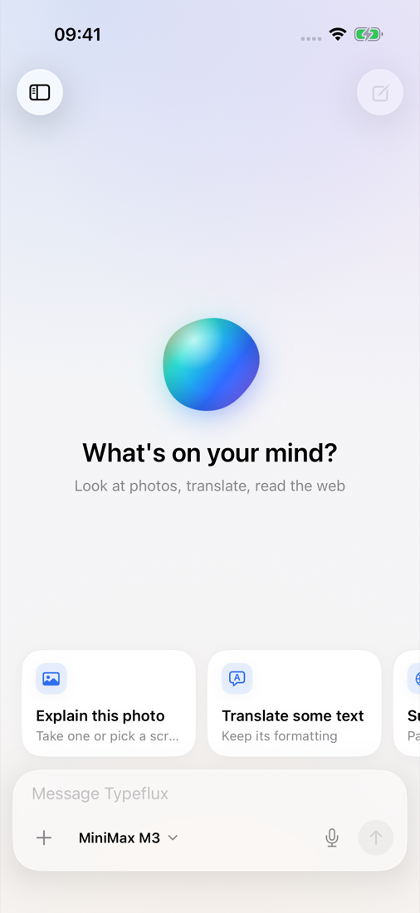
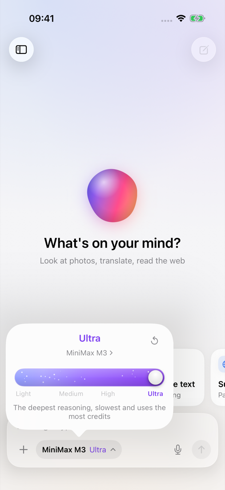
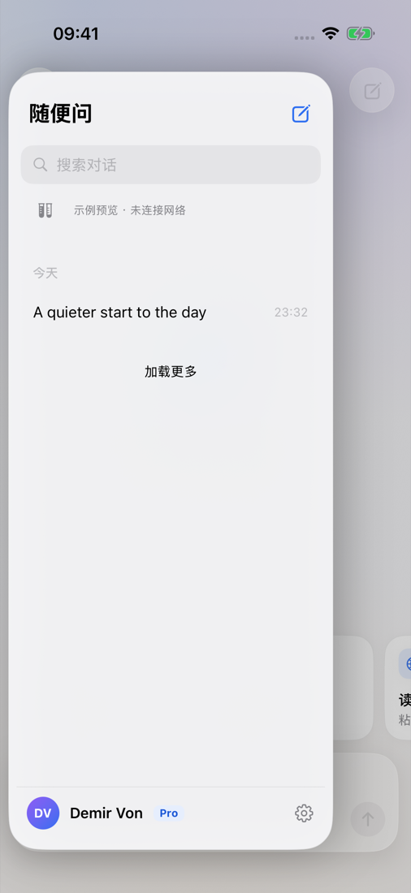
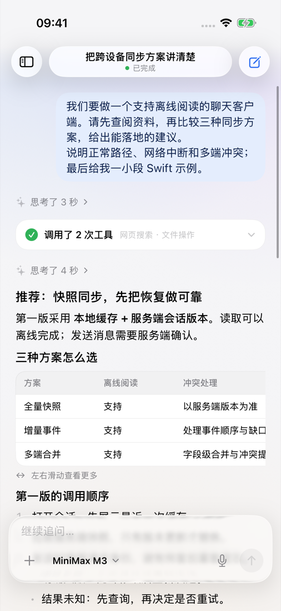
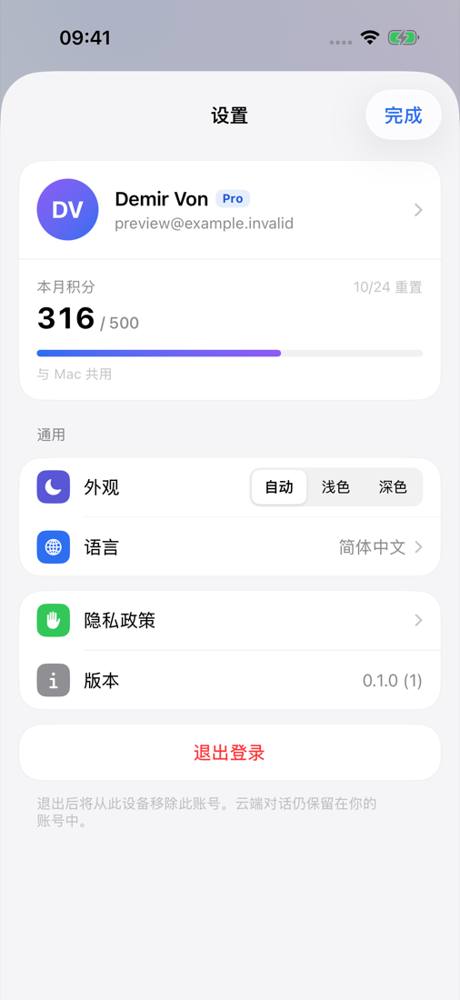
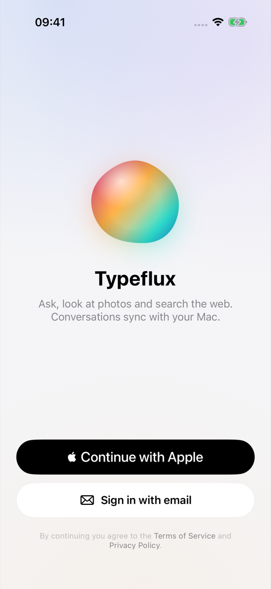

# iOS Ask client

The iOS app is a SwiftUI chat client for Typeflux Ask. It uses the existing
account and cloud conversation API and supports dictation through Apple Speech.
It does not include a keyboard extension, local model inference, or a desktop
tool executor.

## Code ownership

```text
typeflux/
├── Package.swift                    # Existing macOS application and tests
├── Sources/Typeflux/                # macOS UI, voice, local tools, rich Ask state
├── Packages/TypefluxChat/           # Foundation-only shared Swift package
│   ├── Sources/TypefluxChat/        # Wire DTOs, auth decoding, REST, SSE
│   └── Tests/TypefluxChatTests/
├── Apps/iOS/
│   ├── TypefluxIOS.xcodeproj        # Independent iOS application and test target
│   ├── TypefluxIOS/                 # SwiftUI, session state, Keychain, photos
│   ├── TypefluxIOSTests/             # Session, recovery, platform unit tests
│   └── TypefluxIOSUITests/           # Network-free UI flow tests
└── scripts/test_ios.sh
```

Both applications depend on `TypefluxChat`; the package depends on neither app.
The iOS project references only that local package, so building it does not
resolve or compile the desktop audio, browser, or inference dependencies.

The Mac already uses the shared JSON coding, conversation ID normalization,
login response, request/envelope helpers, tool call and conversation summary
DTOs, and SSE framing. Its endpoint failover, complete conversation model,
recovery state, and local execution remain in `Sources/Typeflux`. Mobile DTOs
are a read projection of the cloud document; they are never written back as a
replacement document that could erase desktop-only metadata.

## Current behavior

The interface follows design v4 (GUL-199): the Mac Ask visual language on a
phone, with one accent colour, one type scale and glass only on floating layers.

- The app opens on a new conversation, like the Mac window. History lives in a
  sidebar opened from the top-left button or a swipe from the leading edge: title
  and new conversation, search, Today / Yesterday / Earlier, and an account footer
  with avatar, plan badge and settings. Rows swipe left to delete.
- Sign in from a welcome page with Sign in with Apple or email. The email page has
  persistent field labels, Next → Go keyboard flow, and a two-step password reset
  (emailed code, then new password). Tokens live in endpoint-scoped Keychain entries.
- The conversation shows a glass title pill with the run state
  ("Completed · 2 steps", "Running · step 2"), right-aligned user bubbles, the
  "Thought for N seconds" row, and one tool card per turn ("Called N tools" with
  readable tool names) that stays open while running and folds when done.
  Answers can be copied, shared, or regenerated (latest answer only).
- The composer is the Mac's two-row card: text on top; attach (photo library or
  camera), the model and reasoning chip, dictation (Apple Speech) and send/stop.
- The chip opens the Mac `AskModelEffortCard` layout: level title, model link,
  reset to Auto and the liquid slider with level names; the model page lists
  provider tile, capacity, vision badge and credit multiplier. Switching models
  keeps the closest supported level and explains any adjustment. Auto omits
  `reasoning_effort` from the request.
- Settings shows the profile and this period's credits (shared with the Mac),
  appearance (Automatic / Light / Dark, persisted on this device), language
  (opens iOS Settings), privacy policy, version and a confirmed sign-out.
- Markdown headings, lists, quotes, code cards and horizontally scrolling table
  cards. English and Simplified Chinese follow the system language. Reduce Motion
  freezes the orb, shimmer and spinners; Reduce Transparency uses solid surfaces.
- Send text and a photo with a vision-capable model; a conversation containing
  photos requires one. An existing conversation must load before a follow-up.
- Reload the server snapshot after returning to the foreground. Reconnect an
  interrupted stream without automatically replaying message POSTs.
- Runs waiting for a desktop tool or local model show as waiting for their
  originating device. The phone does not take over those operations.

Not yet available on iOS: deleting the account (no API exists yet; required
before App Store submission), renaming conversations, and in-app purchase.

The server owns cloud history and run state. Drafts and loaded history are held
in memory; this first app does not promise offline history or draft recovery
after process termination. Existing private Mac conversations remain local.
There is no background execution guarantee: the app resumes observation when
it becomes active, while the server owns any ongoing cloud work.

## API compatibility

The phone sends a persistent UUID as `device_id`, a message UUID for idempotency,
`platform: "iOS"`, and an explicit empty `tools` array for every new turn.
Configured server tools remain available. An iOS turn selects a cloud model,
including when continuing a conversation previously using a Mac custom model.

The companion `typeflux-api` change adds platform-aware prompt context and
distinguishes omitted regeneration tools from an explicit empty list; iOS
regeneration always sends an explicit empty `tools` array, so deploy that API
change first. iOS has no tool-result or device-inference submission. The
existing Mac payload remains compatible with the new backend.

Sign in with Apple on iOS uses the bundle ID `app.typeflux.ios` as the token
audience. Enable the capability for that App ID in the Apple Developer account
and add it to the API's comma-separated `APPLE_OIDC_CLIENT_ID`.

## Build and test

For first-time setup, simulator installation, physical-device signing, API
configuration, and Release archives, follow the
[iOS run, installation, and deployment guide (中文)](IOS_QUICKSTART.zh-CN.md).
From the repository root, use:

```sh
make ios-doctor
make ios-run      # Build, install, and launch the live app in Simulator.
make ios-preview  # Debug-only, network-free UI preview.
make ios-help
```

Full Xcode 26+ is required to compile the current SDK APIs and Swift features.
Validation environment: Xcode 27.0 (Swift 6.4) with an iOS 26.5 Simulator
runtime. The deployment target is iOS 17. Open
`Apps/iOS/TypefluxIOS.xcodeproj` and select the `TypefluxIOS` scheme. Simulator
builds use local ad-hoc signing and need no developer credentials; physical
devices require a development team selected in Xcode. Keep simulator signing
enabled so Keychain tests receive the app's entitlements.

```sh
swift test --package-path Packages/TypefluxChat --enable-code-coverage
make ios-test
make coverage
```

The test script picks an available iPhone simulator, preferring one already
booted. To choose a specific simulator:

```sh
TYPEFLUX_IOS_TEST_DESTINATION='platform=iOS Simulator,id=<UDID>' scripts/test_ios.sh
```

The script builds the test app, generates a photo through the DEBUG-only offline
fixture, imports it into that simulator's Photos library, and runs the tests.
It keeps existing Photos assets. A custom destination must contain a concrete
simulator UDID. Set `TYPEFLUX_IOS_TEST_RESULT_BUNDLE_PATH` to a new path to retain
the test result, coverage, and screenshots. Direct `xcodebuild test` runs also
need a seeded photo for the PhotosPicker flow; use the script for a fresh device.

The app defaults to `https://api.typeflux.app`. Override the Xcode build setting
`TYPEFLUX_API_URL` for an HTTPS staging endpoint; credentials are scoped to the
configured endpoint. HTTP, URLs containing credentials, queries, or fragments
are rejected. Never put API keys or account passwords in the project.

For a network-free UI preview, add `--synthetic-preview` to the scheme's launch
arguments in a Debug build. Add `--synthetic-tools` for a desktop-tool run or
`--synthetic-dark` to force dark appearance. This mode uses labelled synthetic conversations,
an in-memory account, and no production requests. It is excluded from Release
builds and is not evidence of live account/API validation.

Additional fixture flags are `--synthetic-rich` (Markdown, reasoning, tools and
Mac image attachments), `--synthetic-stream` (send to start incremental output),
`--synthetic-failure`, `--synthetic-empty`, and `--synthetic-history` (pagination).
`--synthetic-stream-slow` extends each stream stage for inspection. Preview
preferences use a separate UserDefaults domain and reset to System by default;
`--synthetic-preserve-settings` explicitly retains them for persistence tests.

The existing `@autotest` PR workflow runs shared-package, iOS, and Mac tests.
Account registration, purchasing, and App Store distribution are outside this
implementation.

## Simulator previews

These screenshots come from the SwiftUI app with synthetic fixtures, not a live
account or model response. The model names and credit multipliers are test data.








The [v4 validation report](validation/gul-199-ios-v4.md) records the test results
and remaining limitations. The [v4 screenshot set](images/ios/v4) includes all
14 captures, including model selection, streaming, dark appearance, tool details,
email login, and password reset.

## Earlier chat and settings verification

The [screenshot index](images/ios/verification/README.md) covers rich
replies, long streaming output, stop/failure states, PhotosPicker and image
messages, models, keyboard layouts, light/dark settings, account information,
and sign-out confirmation from the earlier interface. Those images came from
its passing native iOS UI-test run using offline fixtures. See the
[validation report](validation/gul-199-ios-chat.md) for results and limitations.

The [screenshot review and optimization plan](validation/gul-199-ios-polish.md)
records the follow-up fixes for navigation readability, neutral stop status,
horizontal scrolling, keyboard layouts, search visibility, and login controls.
