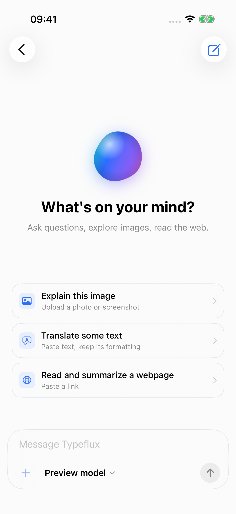
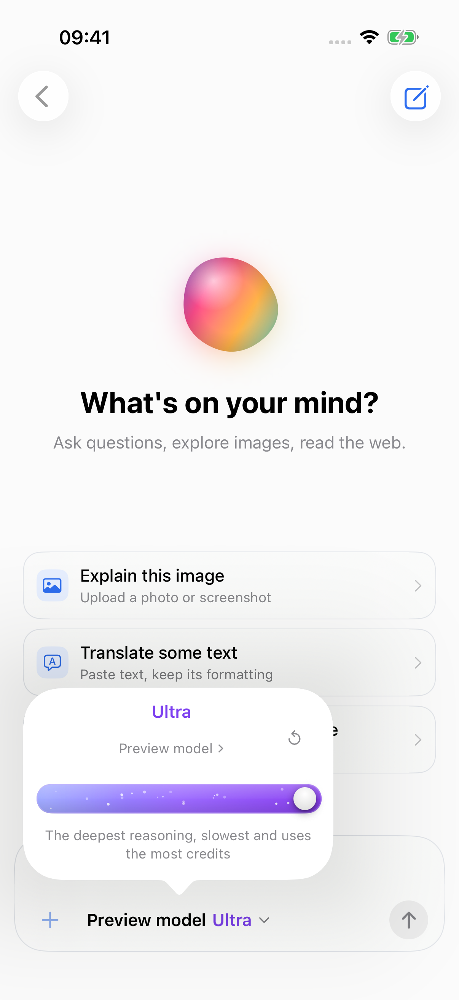
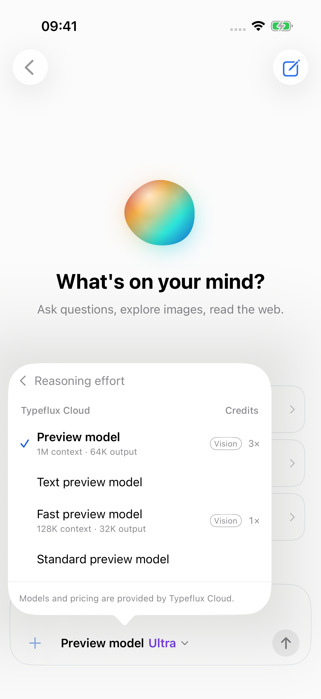
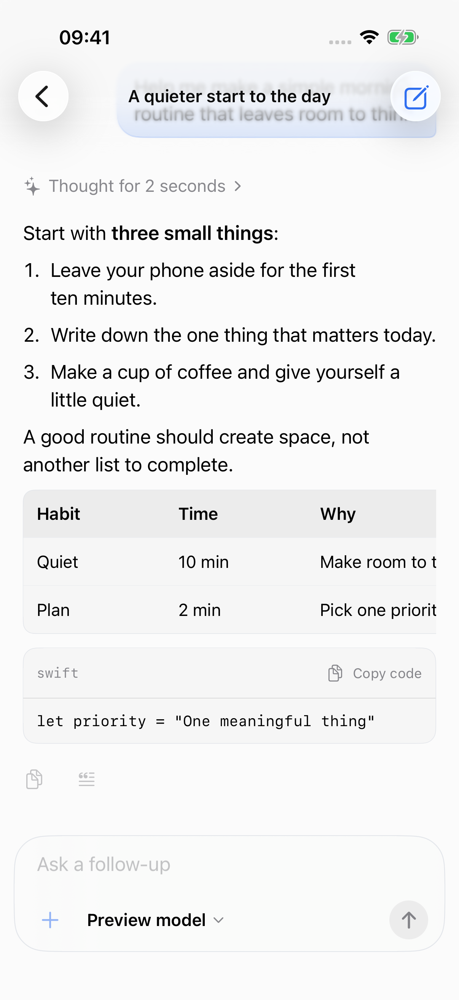
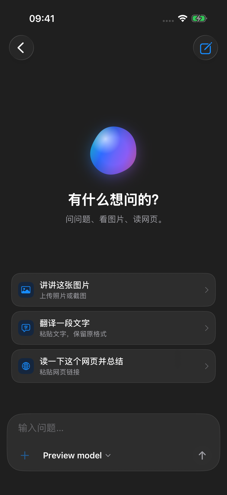
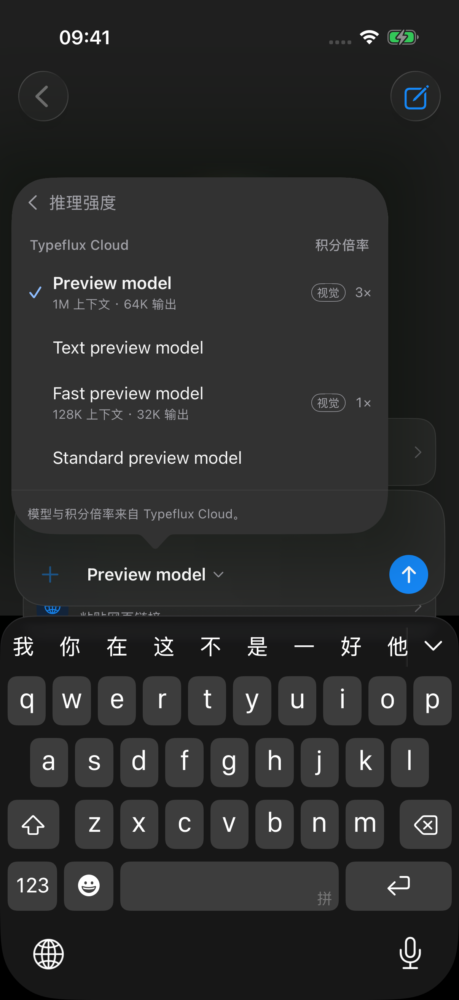

# iOS Ask client

The initial iOS app is a SwiftUI chat client for Typeflux Ask. It uses the existing
account and cloud conversation API. It does not include dictation, a keyboard
extension, local model inference, or a desktop tool executor.

## Code ownership

```text
typeflux/
├── Package.swift                    # Existing macOS application and tests
├── Sources/Typeflux/                # macOS UI, voice, local tools, rich Ask state
├── Packages/TypefluxChat/           # Foundation-only shared Swift package
│   ├── Sources/TypefluxChat/        # Wire DTOs, auth decoding, REST, SSE
│   └── Tests/TypefluxChatTests/
├── Apps/iOS/
│   ├── TypefluxIOS.xcodeproj        # Independent iOS application and test target
│   ├── TypefluxIOS/                 # SwiftUI, session state, Keychain, photos
│   ├── TypefluxIOSTests/             # Session, recovery, platform unit tests
│   └── TypefluxIOSUITests/           # Network-free UI flow tests
└── scripts/test_ios.sh
```

Both applications depend on `TypefluxChat`; the package depends on neither app.
The iOS project references only that local package, so building it does not
resolve or compile the desktop audio, browser, or inference dependencies.

The Mac already uses the shared JSON coding, conversation ID normalization,
login response, request/envelope helpers, tool call and conversation summary
DTOs, and SSE framing. Its endpoint failover, complete conversation model,
recovery state, and local execution remain in `Sources/Typeflux`. Mobile DTOs
are a read projection of the cloud document; they are never written back as a
replacement document that could erase desktop-only metadata.

## Current behavior

- Sign in with an existing email/password account; store access and rotating
  refresh tokens in endpoint-scoped Keychain entries.
- Browse and continue cloud conversations, create conversations, and choose
  from the account's cloud models with their server-provided credit multiplier.
- Use the Mac-aligned colour drop, composer, message bubbles, and history rows.
  A single model entry opens the reasoning card; its model subtitle opens the
  model list. Selecting a model returns to the reasoning card.
- Choose Auto or a supported reasoning level. The model's highest level uses
  purple; switching models keeps the closest supported level and explains any
  adjustment. Auto omits `reasoning_effort` from the request.
- Read foldable reasoning and grouped tool steps, copy or quote a response, and
  view Markdown headings, lists, quotes, code, and horizontally scrolling tables.
- Search loaded history and collapse date groups. English and Simplified Chinese
  follow system language; colours follow light/dark appearance. Reduce Motion
  freezes ambient animation and Reduce Transparency uses solid card surfaces.
- Send text and a photo with a vision-capable model; show streamed responses,
  tool activity/results, and cancellation. A conversation containing photos
  requires a vision-capable model. An existing conversation must load
  successfully before its composer can send a follow-up.
- Reload the server snapshot after returning to the foreground. Reconnect an
  interrupted stream without automatically replaying message POSTs.
- Show runs waiting for a desktop tool or local model as waiting for their
  originating device. The phone does not take over those operations.

The server owns cloud history and run state. Drafts and loaded history are held
in memory; this first app does not promise offline history or draft recovery
after process termination. Existing private Mac conversations remain local.
There is no background execution guarantee: the app resumes observation when
it becomes active, while the server owns any ongoing cloud work.

## API compatibility

The phone sends a persistent UUID as `device_id`, a message UUID for idempotency,
`platform: "iOS"`, and an explicit empty `tools` array for every new turn.
Configured server tools remain available. An iOS turn selects a cloud model,
including when continuing a conversation previously using a Mac custom model.

The companion `typeflux-api` change adds platform-aware prompt context and
distinguishes omitted regeneration tools from an explicit empty list. Deploy
that API change before enabling cross-device regeneration. This initial iOS UI
has no retry/regenerate controls, tool-result submission, or device-inference
submission. The existing Mac payload remains compatible with the new backend.

## Build and test

Validation environment: Xcode 27.0 (Swift 6.4) with an iOS 26.5 Simulator
runtime. The deployment target is iOS 17. Open
`Apps/iOS/TypefluxIOS.xcodeproj` and select the `TypefluxIOS` scheme. Simulator
builds use local ad-hoc signing and need no developer credentials; physical
devices require a development team selected in Xcode. Keep simulator signing
enabled so Keychain tests receive the app's entitlements.

```sh
swift test --package-path Packages/TypefluxChat --enable-code-coverage
scripts/test_ios.sh
make coverage
```

The test script picks an available iPhone simulator, preferring one already
booted. To choose a specific simulator:

```sh
TYPEFLUX_IOS_TEST_DESTINATION='platform=iOS Simulator,id=<UDID>' scripts/test_ios.sh
```

The app defaults to `https://api.typeflux.app`. Override the Xcode build setting
`TYPEFLUX_API_URL` for an HTTPS staging endpoint; credentials are scoped to the
configured endpoint. HTTP, URLs containing credentials, queries, or fragments
are rejected. Never put API keys or account passwords in the project.

For a network-free UI preview, add `--synthetic-preview` to the scheme's launch
arguments in a Debug build. Add `--synthetic-tools` for a desktop-tool run or
`--synthetic-dark` to force dark appearance. This mode uses labelled synthetic conversations,
an in-memory account, and no production requests. It is excluded from Release
builds and is not evidence of live account/API validation.

The existing `@autotest` PR workflow runs shared-package, iOS, and Mac tests.
Account registration, password reset, purchasing, and App Store distribution
are outside this initial chat implementation.

## Simulator previews

These screenshots come from the SwiftUI app with synthetic fixtures, not a live
account or model response. The model names and credit multipliers are test data.







