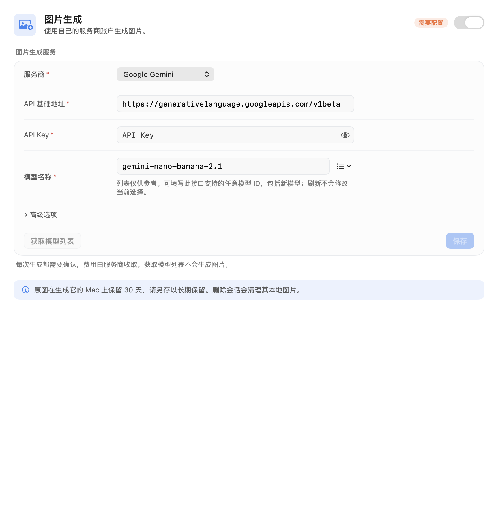
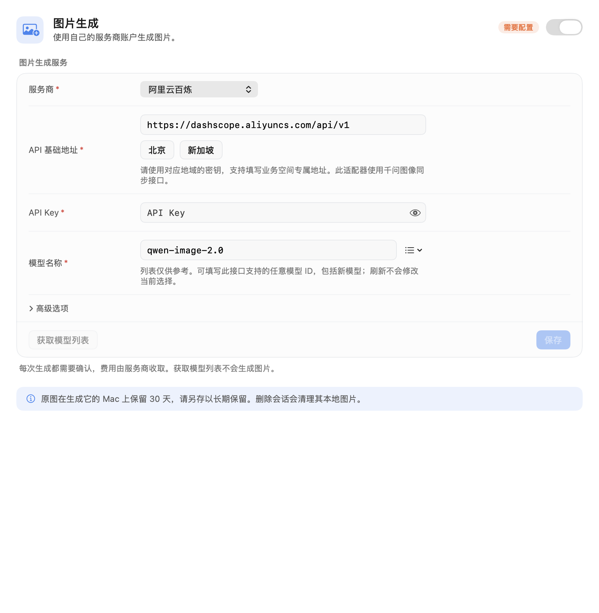
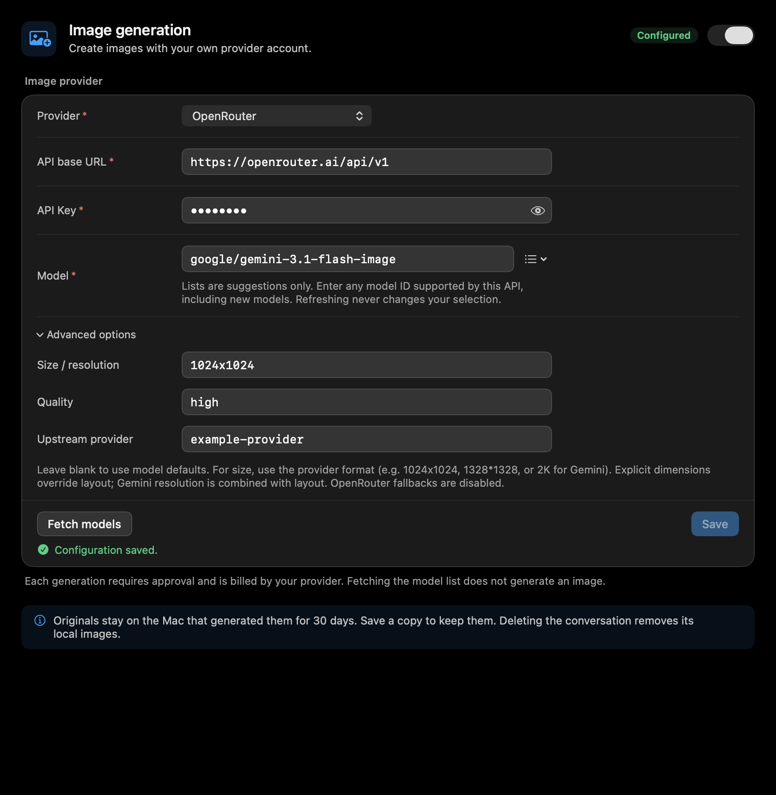

# Client image generation

Configure **Agent → Image generation**, enable the capability, and save a provider,
API base URL, API key, and model ID. Ask for an image in a conversation and approve
the `generate_image` call. The provider bills the user's own account. Conversation
models and image models are configured independently; a text-only conversation
model can invoke this tool.

## Model selection

The editable model field is authoritative. Suggestions are conveniences, never an
allowlist. A manually entered future model ID is saved and sent to the selected API
without requiring an app release. Fetching models neither changes that value nor
generates an image. Failed discovery leaves manual entry and built-in suggestions
available. The selected model must support the adapter's image API.

| Provider | Generation API relative to base URL | Suggestions |
| --- | --- | --- |
| Volcengine Ark | `images/generations` with base64 output | Built-in Seedream IDs; manual model or endpoint ID |
| Alibaba Cloud Model Studio | `services/aigc/multimodal-generation/generation` | `models`, filtered to Qwen image generation, paginated |
| Google Gemini / Nano Banana | `interactions`, image response, `store: false` | Paginated `models` |
| OpenRouter | `images` | `images/models` |
| OpenAI / compatible | `images/generations`, base64 image result | `models` |

Generic Google/OpenAI catalogs can contain non-image models. Image-like names are
shown first, but unfamiliar IDs are retained. Ark's runtime API-key integration
uses presets; it does not require separate cloud-management credentials.

Bailian has Beijing/Singapore shortcuts and editable workspace-specific base URLs.
Keys are scoped to the provider and endpoint in Keychain; changing the endpoint
loads that endpoint's key. Connection and model edits use the same explicit Save
button as Models settings; it is active only when values have changed. The capability
switch takes effect immediately, without saving pending connection edits. The header
shows the saved capability's readiness. Key visibility, advanced-option disclosure,
field styling and save/error feedback follow the existing settings controls. No keys
are written to UserDefaults, conversation receipts, image metadata, or logs.

Blank advanced options defer to provider defaults. An explicit width/height
overrides the tool's layout; Gemini's resolution combines with its aspect ratio.
OpenRouter supports an optional upstream provider slug and disables fallbacks.

## Execution and storage

- Every invocation requires exact approval. The binding covers endpoint, model,
  prompt, effective parameters, and a credential fingerprint. Stable JSON encoding
  prevents spurious approval changes. The existing execution journal prevents
  automatic redispatch after an uncertain receipt or restart.
- Generation POSTs are never automatically retried. HTTP requests reject redirects,
  stream into bounded buffers, support cancellation, and respect the remaining task
  deadline. Error bodies are not surfaced to the model.
- Bailian's returned HTTPS DashScope OSS objects are downloaded without API keys.
  A transient download failure retries that same URL once, within the task deadline,
  without repeating generation.
  Other adapters require embedded base64 results. Arbitrary image URL fetching is
  not exposed by this tool.
- PNG/JPEG originals are validated, then stored as existing local artifacts with
  owner/conversation/run scope. Limits: 16 MiB per image, under 32 MiB combined,
  at most 8 returned images, 8192 pixels per edge and 16,777,216 pixels per image.
  The request asks for a single image where the protocol provides that option.
- Cards show an image preview, full preview, Save, and Copy image. References survive
  conversation reload and legacy text-only receipts. Images expire after 30 days;
  artifact access/generation cleans up expired bundles. Deleting a conversation
  removes its local bundles. Save originals to retain them independently.
- Metadata records the prompt, provider, model, layout, requested size, actual image
  dimensions, request ID, tool call ID, any reported model/provider, and usage. Image bytes are not
  inserted into the conversation model's vision context or uploaded to Typeflux.

The first phase supports macOS client execution in cloud or local conversations.
Server-side generation, Typeflux billing, cross-device image storage, image editing,
and Bailian Wan's asynchronous task API are separate follow-ups. Changing a model ID
does not make an incompatible API protocol compatible.

## Validation

`AskImageGenerationTests`, `AskImageHTTPTests`, `AskImageSettingsTests`, and
`AskImageToolTests` cover provider wire formats, discovery pagination, arbitrary IDs,
Keychain separation, stale discovery, request bounds, approval changes, cancellation,
deadlines, cloud/local conversation receipts, scoped storage and deletion. All
provider requests use fixtures; live paid generation requires user-owned credentials
and is a separate smoke test.

Run `make coverage`. Set `TYPEFLUX_IMAGEGEN_SCREENSHOTS` to an output directory to
export the five provider settings screenshots during the settings tests.

## Provider references

- [Ark image generation](https://docs.volcengine.com/docs/ark/image-generation-api?lang=zh)
- [Qwen Image synchronous API](https://help.aliyun.com/zh/model-studio/qwen-image-api)
- [Bailian model discovery](https://help.aliyun.com/zh/model-studio/list-models)
- [Gemini image generation](https://ai.google.dev/gemini-api/docs/image-generation)
- [Gemini Interactions REST schema](https://ai.google.dev/api/interactions-api-v1)
- [OpenRouter image generation](https://openrouter.ai/docs/guides/overview/multimodal/image-generation)
- [OpenAI image generation API](https://developers.openai.com/api/reference/resources/images/methods/generate)
