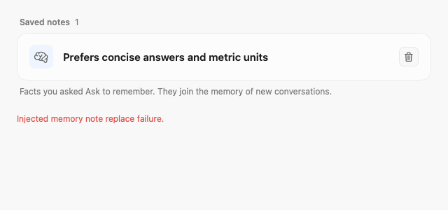

# Explicit memory persistence (GUL-170)

Remember, forget and clear now build a candidate dictionary while holding the
store lock. The file adapter commits that candidate atomically before the store
publishes it in memory. Encoding, directory creation or write failures propagate
to the caller and leave the last committed in-memory state intact. Deduplication
therefore cannot turn a previously failed remember request into false success.

`AskMemoryNoteFileStorage` is the injectable I/O boundary. The production adapter
retains Foundation's atomic write and file-protection options. Tests stage either
a partial or complete candidate before injecting write/replacement failure; the
destination remains unchanged. Successful test commits use real files and the
production adapter, with fresh stores checking restart behavior.

The settings model retains the visible note and exposes the deletion error until
a successful retry or reload. `AskLocalTools` already propagates thrown memory
errors, so its public tool contract is unchanged.

## Compatibility and scope

- The existing owner-to-notes JSON dictionary, IDs, dates, limits and text
  normalization are unchanged. A literal legacy JSON fixture verifies this.
- Owners remain isolated during successful and failed mutations. Concurrent
  writers using the same store remain serialized by its existing lock.
- The change preserves the existing initialization fallback for unreadable JSON.
  It does not add cross-process coordination or a power-loss durability guarantee.
- No dependencies, localization keys, server contracts or database changes.

## Validation

Tested on macOS arm64 with Apple Swift 6.4 / Xcode's macOS 27 SDK. Base revision:
`41d207accecf2f33583be670ead46cf60d32769b`.

The focused suite runs 23 tests (11 new, including the error screenshot) with no
failures or skips:

```sh
TYPEFLUX_MEMORY_NOTES_SNAPSHOTS=/path/to/output swift test --enable-code-coverage \
  --filter 'AskMemoryNoteStoreTests|AskMemoryNotesSettingsTests|AskAgentToolsTests'
```

It covers first-write failure, failure with existing notes, repeated remember,
forget and clear failures, real retries, reopening, owner isolation, legacy JSON,
directory-creation failure, concurrent writes, local-tool error propagation and
the settings error state.

Full XCTest execution passed 2,558 tests. A separate standard Swift Testing run
executed 557 tests: 556 passed and the existing
`accountNameClickTogglesTheAccountCard` test failed with four assertions. The same
failure occurred on the unmodified base before implementation. The full suite is
therefore not green. The initial base run also failed the persona-picker
sound-disabled test; it passed in the implementation's full XCTest run.

The first coverage attempt hung in an existing audio test: `releaseStart()` could
run before its fake stream registered a continuation. A one-line test-only
`waitUntilStartCalled()` synchronization fixes that race without changing audio
production code or removing assertions. The base coverage comparison uses that
same synchronization.

The broader opt-in `TYPEFLUX_ASK_SNAPSHOTS` probes also reported launcher-toggle
and window-height failures and exited before a final Swift Testing summary; they
are not counted as passing. The memory screenshot now has its own opt-in variable.
Live model and interactive accessibility validation were not performed. Rendering
the memory error uses synthetic data and an injected disk failure.



## Coverage

Coverage combines the completed full XCTest run and standard Swift Testing run,
including its reported baseline failure. Dependencies, generated build files and
tests are excluded using `--ignore-filename-regex='\.build|Tests'`.

| Core file | Covered / executable lines | Line coverage |
| --- | ---: | ---: |
| `AskMemoryNotes.swift` | 93 / 94 | 98.94% |
| `AskMemoryNoteFileStorage.swift` | 7 / 7 | 100% |
| `AskMemoryNotesSettingsModel.swift` | 13 / 13 | 100% |
| Combined core scope | 113 / 114 | 99.12% |

The core scope also covers 23/24 functions (95.83%) and 63/65 regions (96.92%).
The existing `AskToolsSettingsView.swift` as a whole covers 351/598 lines (58.70%);
it also contains unrelated search, folders and skill-installation UI.

Across all production files, covered lines increased from 61,838/122,680
(50.4059%) on the base to 61,861/122,708 (50.4132%) after the change. Both
measurements use full XCTest plus standard Swift Testing, the same toolchain and
the same dependency lockfile. The base comparison's 2,547 XCTest and 557 Swift
Testing tests passed after applying the test-only audio synchronization above;
the earlier account-card failure is intermittent. This is source coverage, not a
claim that every desktop or live-model integration was exercised.

`make coverage` was attempted. Its report step assumes the older
`TypefluxPackageTests` bundle name; this SwiftPM version produces
`.build/out/Products/Debug/TypefluxTests.xctest`. Reports were exported from the
actual bundle with `xcrun llvm-profdata merge -sparse` and `xcrun llvm-cov export
--summary-only`. When running XCTest and Swift Testing separately, preserve the
first run's `.profraw` file before SwiftPM clears the coverage directory for the
second run, then merge both profiles. No coverage tooling changes are included
in this fix.
