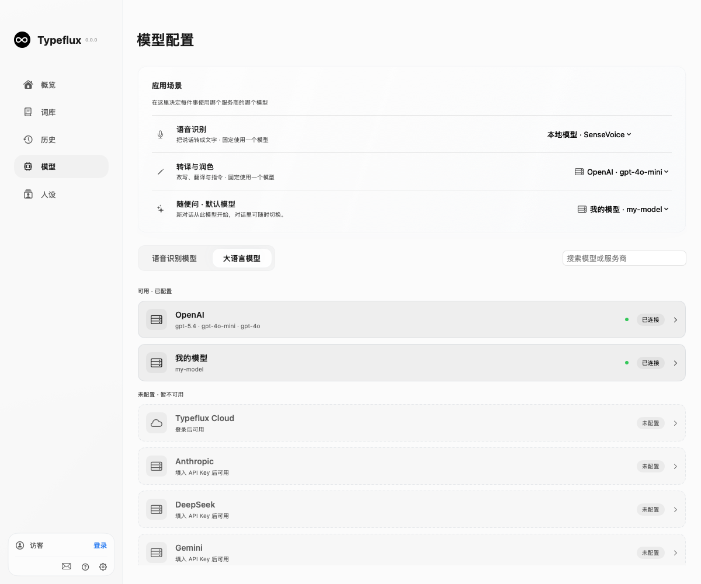
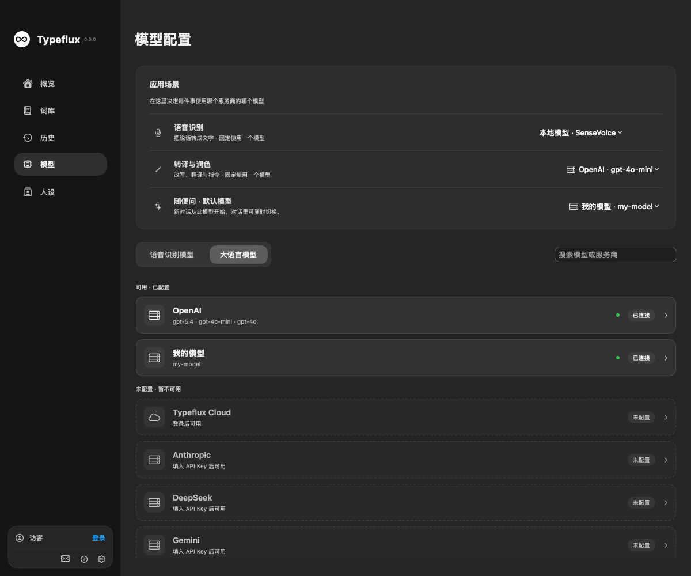
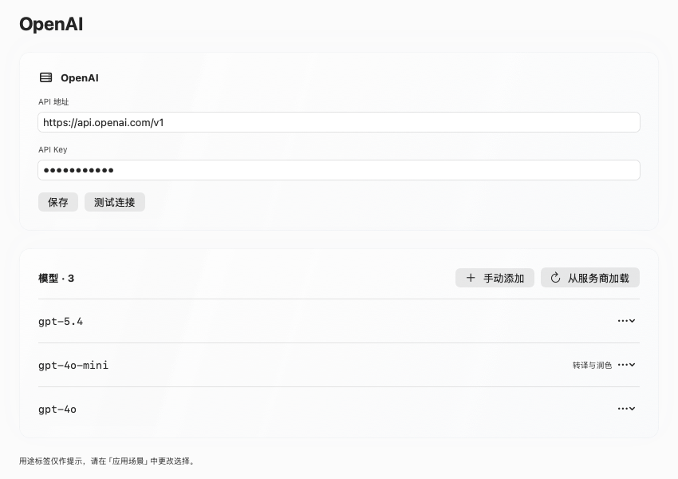
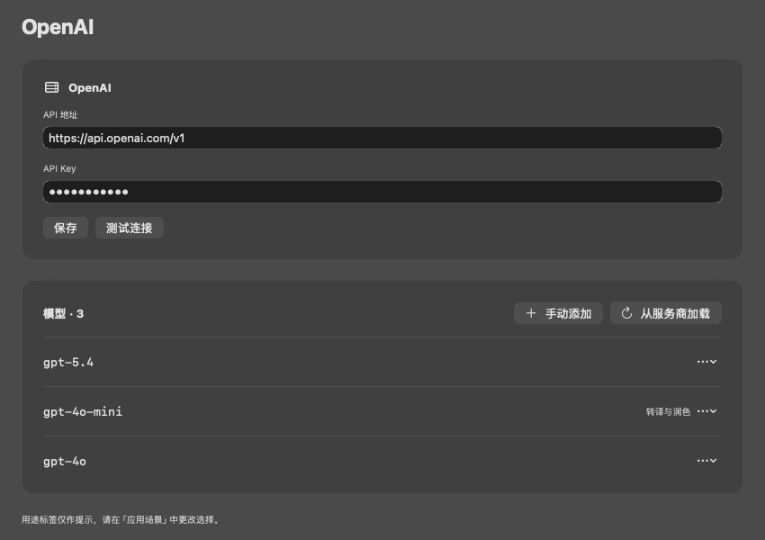

# Provider catalogs and application scenarios

The Models page has separate speech and language tabs. Configured providers appear
first; unavailable providers stay editable and show a reason. Opening a provider
shows its connection and models. The former independent “Manage models” sheet has
been removed. Speech configuration reuses the existing forms.

`DIContainer` owns one `AskModelLibrary`, injected into settings and both Ask
composers. `ModelRegistry` is the single configured LLM catalog: providers own
multiple models, each with a stable reference. `SettingsStore` projects the chosen
rewrite reference to the existing inference services. Cloud aliases retain their
`cloud:` references; device models use stable `custom:` UUIDs understood by the
existing Ask device-inference bridge.

## Selection and availability

Speech and rewrite each use one fixed selection. The Ask default applies to new
conversations. A composer selection changes only subsequent turns in that
conversation; “Set as default” is a separate action. Deleted references remain
invalid until the user reselects, including after a cloud catalog refresh.

A screenshot requires confirmed vision support, including screenshots already in
conversation history. Unknown capability is distinct from unsupported capability;
provider metadata can supply it, or users can confirm it from model documentation
in the model's menu. Obvious embedding/speech-only models remain visible in the
loaded catalog with an exclusion reason. Inference validates the selection again.
With explicit scenes, speech routing reports provider or subscription failures
instead of silently choosing another provider. Existing subscription gates remain.

## Persistence and migration

`models.registry.v2` stores provider/model metadata. Existing provider connection
settings remain in their original storage; migrated custom providers reuse the
original `ask-model-<profile UUID>` Keychain account. Multiple models at one endpoint
share that account. Removing a model does not delete the provider credential.

Migration preserves `sttProvider`, the selected legacy LLM model, existing rewrite
profile references, and `ask.model.default`. Old profile bytes remain as a backup;
new edits write only the unified catalog. Migration is idempotent. A first onboarding
choice made after DI initialization is adopted only while no explicit rewrite
reference exists. Corrupt/future registry data is not overwritten.

## Provider integration

Model loading uses paginated native catalogs for Anthropic and Gemini, `/models`
for OpenAI-compatible providers, `/api/tags` for Ollama, and the existing Typeflux
cloud catalog. HTTP failures and malformed responses are surfaced. Redirects are
rejected before credentials can be forwarded to another host.

Ask device inference supports OpenAI-compatible APIs, Ollama's compatible endpoint,
and native Anthropic/Gemini messages, images and tool results. Gemini tool thought
signatures survive server persistence. Device inference still requires the Typeflux
conversation service; provider requests run on the Mac and arrive as complete
responses, while Cloud keeps streaming previews.

Deploy [typeflux-api PR #75](https://github.com/mylxsw/typeflux-api/pull/75) before
releasing this client. It resolves catalog aliases on the rewrite endpoint, adds
optional catalog `vision` metadata, and preserves bounded tool signatures. Existing
raw-model requests are unchanged; unknown public aliases fail explicitly.

Protocol references: [Anthropic model catalog](https://platform.claude.com/docs/en/api/models/list),
[Gemini model catalog](https://ai.google.dev/api/models),
[Gemini thought signatures](https://ai.google.dev/gemini-api/docs/thought-signatures).

## Actual rendered interfaces

Production SwiftUI views rendered with isolated synthetic data, not design mockups.
Generate using `TYPEFLUX_ASK_SNAPSHOTS=<directory> swift test --filter AskConversationVisualTests.renderModelSelectionSurfaces`.

