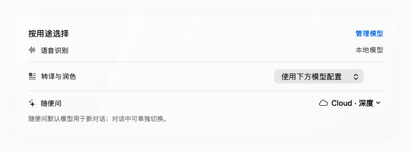
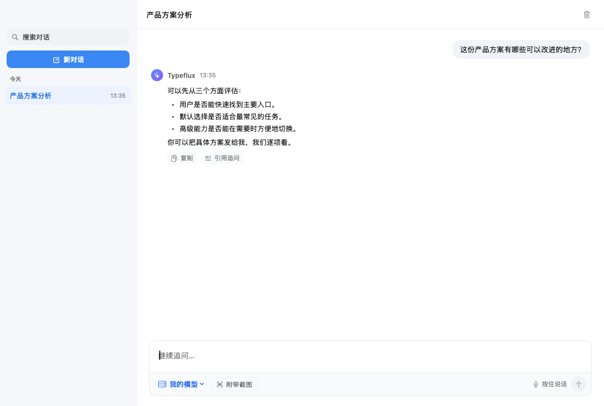

# Independent Ask models

The Models page now keeps speech recognition, rewrite and Ask defaults separate.
The legacy provider settings continue to configure rewrite unless a named model
is explicitly selected in the purpose card. Changing the Ask default affects new
conversations only. Both composers have a model menu; a conversation keeps its
selection and active runs cannot switch models.

Custom profiles support OpenAI-compatible APIs, including localhost HTTP endpoints.
Other endpoints require HTTPS. Name, endpoint and model ID live in local settings;
API keys live in Keychain. The model library can import an existing compatible
provider configuration without changing the original rewrite settings. Removing a
profile does not silently substitute another model. A connection test makes a small,
billable completion request to the configured API.

Custom Ask inference calls the provider directly from this Mac. It still requires
Typeflux authentication and the conversation/history service; history is synced to
Cloud. Tool approval and screenshot handling remain in the existing Ask workflow.
The model must support requested tools/images. Custom replies currently arrive as
complete responses, while Cloud replies retain streaming previews.

Deploy the matching API change first. Additional Cloud models are operator-configured
through `ASK_MODELS_JSON`; no example model is advertised as available by the client.
See the API repository's `ASK_MODELS.md` for the deployment and wire contract.

## Interface snapshots

These are production SwiftUI views rendered with isolated fixture data. “Cloud · 深度”
is an example configured model, not a claim about production availability.

