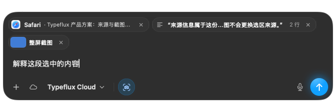
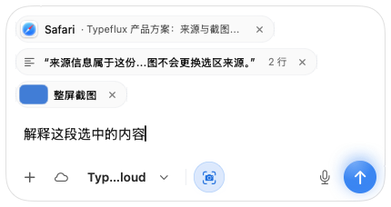
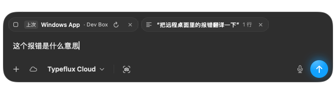

# Ask attached content (GUL-194)

Both the launcher and workspace composer show captured content above the editor.
There is no permanent **Context** button. The footer keeps screenshot and memory
switches; included content stays visible when the window becomes narrow.

- **Application information** shows the captured app and available window title.
  Its details explain that these fields do not read page content or identify an
  execution target. Removing it excludes only the request's `source` field.
- **Selected text** shows a quotation and line count. Clicking it opens the full
  text and its original source. Removing source metadata does not remove this
  selection or its local provenance.
- **Full-display screenshot** shows its thumbnail, with preview and recapture.
  Pending captures and permission failures occupy the same content area. A
  failed recapture retains the previous screenshot and reports the error in its
  preview. Capturing source metadata does not show a screenshot spinner.
- **Restored drafts** keep their original content and mark their source as
  previous. The `arrow.clockwise` action replaces application metadata and clears
  the old selected text. Its tooltip names the current application when known.
  Existing screenshots, memory, typed text and files are retained. The metadata
  capture does not fetch new selected text; only available fields are shown.
- **Removal and recovery** show a five-second Undo confirmation. The attachment
  menu can restore excluded application information or selected text afterward;
  the screenshot switch restores its saved image. Undo changes only the affected
  fields and cannot replay across another draft or account.
- **Narrow windows** wrap content onto more rows. The launcher measures the strip
  so its window grows with those rows. Screenshot and memory remain in the footer.
- **Sent messages** summarize their actual app source, selection line count and
  screenshot beneath the question. Selection and screenshot previews remain
  available. User-uploaded images are not labelled as captured screenshots.

The existing request and draft formats are unchanged, including optional
`sourceOff`, `selectionOff` and `source_bundle_id`. Existing screenshot preferences
remain in effect. No server or permission contract changes are required.

## Validation

Model tests cover independent inclusion, Undo, expiration, source replacement,
failed and cancelled captures, concurrent requests, account/draft changes and
old draft compatibility. Native interaction tests exercise the actual chips,
previews, restore menu, Undo and narrow composer controls. Rendering uses
synthetic content and never captures the user's desktop.

```sh
swift test --enable-code-coverage
TYPEFLUX_ASK_SNAPSHOTS=/path/to/artifacts swift test --enable-code-coverage \
  --filter AskConversationVisualTests.renderSourceContextSurfaces
```




