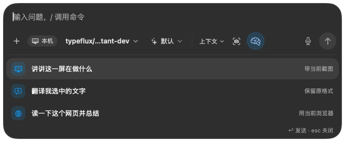
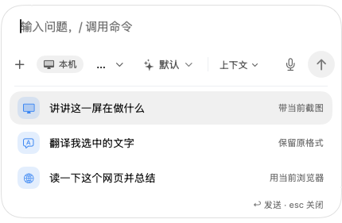
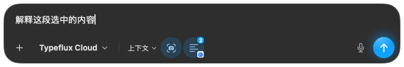
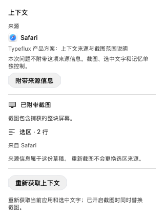

# Ask source context (GUL-194)

The composer exposes captured application metadata through **Context** instead
of a standalone application icon. The entry remains available without a
screenshot, and also appears on workspace drafts that carry source metadata
(for example, a draft restored after a failed send).
On narrow composers, context chips move into the Context panel so their
controls, the microphone and the send button remain reachable.

- Source details show the captured app name and any available window title.
  **Remove source info** excludes only the request's `source` field. Screenshots,
  selected text and memory keep their independent inclusion controls. The local
  source identity is retained so the user can inspect or re-enable it.
- Selected-text chips show their source app as a small badge; the hover card and
  attachment strip name it. The source is provenance, not a live foreground-app
  indicator or a guarantee about a tool's execution target.
- Screenshot details describe the whole captured display. Taking another
  screenshot does not silently relabel an older text selection's source.
- An unfinished launcher draft keeps its captured context and is labelled
  **Draft source**. **Capture current context** explicitly replaces it, preserving
  the question, attachments and inclusion choices. Failed or stale captures keep
  the previous context. Refreshing from Typeflux itself is rejected so the
  launcher/popover cannot become its own source. Switch to the source app first.

`sourceOff` is optional in the local draft format; older drafts still include
their source. The existing `source_bundle_id` cache key is preserved. No server
or request schema change is required.

## Validation

Model tests cover serialized sends and steering, source-size validation,
cache compatibility, restored drafts, refresh success/failure, cancellation,
target changes, account changes, concurrent captures and memory purges. Native
interaction tests exercise the production Context button and source controls.
The UI fixtures use synthetic content and do not capture the user's desktop.

```sh
swift test --enable-code-coverage
TYPEFLUX_ASK_SNAPSHOTS=/path/to/artifacts swift test --enable-code-coverage \
  --filter AskConversationVisualTests.renderSourceContextSurfaces
```

Review the standard and 430 pt launcher images in both appearances, then the
included, excluded, restored, capturing and unavailable context details. Check
that the Context entry and send button remain reachable, scope text wraps, and
source exclusion does not imply disabling other context.

The narrow fixtures use 430 pt for Chinese and 480 pt for English: the existing
local-mode and reasoning labels need more space in English. Interaction tests
check the window bounds and the folded memory and source controls.





