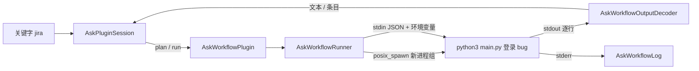

# 随便问：自定义工作流（脚本插件）设计方案

> 状态：W1 已实现（实现说明见第 12 节）；W2 的条目列表和 Alfred 兼容已随 GUL-232 实现（见 `workflow-gallery-output-actions.md` 第 8 节），W2 其余部分和 W3 仍是设计。配套设计稿：`docs/design/ask-launcher-workflows.html`，截图在 `docs/design/ask-launcher-workflows/`。截图：`1-list.png` 条目列表、`2-text.png` 文本结果、`3-error.png` 出错、`4-settings.png` 工作流列表、`5-editor.png` 编辑和测试运行、`6-trust.png` 信任确认。
> 基于已经上线的关键字插件框架（`docs/design/ask-launcher-keyword-plugins.md`，P1 翻译、P2 AI 指令和网页搜索）。工作流就是那份文档 P3 里预留的「脚本插件」。

## 0. 一页结论

1. **工作流 = 用户自己写的插件。** 一个工作流是一个文件夹：一份 `workflow.json` 清单，加上脚本文件。清单里声明触发它的关键字、要什么输入、怎么运行、输出什么。装好以后，它和翻译、AI 指令一样，出现在关键字列表、`/` 面板和设置里。
2. **什么语言都能写。** 运行时有 Python、Node（JS）、TypeScript（Bun / Deno / tsx）、Shell（zsh / bash）、AppleScript / JXA，以及直接运行任何可执行文件（Go、Rust 编译出来的程序，带 shebang 的脚本）。Typeflux 只负责启动进程、传入输入、读回输出，不内置任何语言环境。
3. **一套简单的输入输出约定。**
   - 输入：参数通过 `argv` 传入，完整上下文通过 stdin 的 JSON 和 `TYPEFLUX_*` 环境变量传入。
   - 输出有三种：普通文本（逐行流式显示成文本卡片）、JSON 条目列表（兼容 Alfred Script Filter 的格式）、不输出（只执行动作，比如打开项目）。
4. **结果和按键沿用现有框架。** 文本卡片、条目列表、直接执行三种结果；↩ / ⌥↩ / ⌘C / ⇥ / ⌘R / ⌘↩ / esc 在工作流里的含义和内置插件一样。条目列表随工作流一起实现，它也是 P3 文件、历史插件要用的视图。
5. **安全放在第一位。** 工作流能以用户的权限运行任意代码，所以：
   - 导入的工作流要先看清单和代码，确认「信任」后才能运行；文件被改过要重新确认。
   - 参数只作为 `argv` 数组传入，从不拼接成 shell 命令。
   - 选中的文字仍然要按 ↩ 才交出去。
   - 密钥存在钥匙串里。
   - 每次运行都有超时、输出上限，取消时结束整个进程组。
   - 环境变量会清理，不传 Typeflux 自己的凭据。
6. **分三步做。**
   - W1：清单、运行器、文本和无输出两种结果、信任、模板、基础设置。
   - W2：条目列表、Alfred 兼容、边打边出、密钥、测试面板。
   - W3：打包导入导出、让 AI 帮忙写工作流、受限运行（沙箱）。

## 1. 用户怎么用

### 1.1 几个典型例子

| 关键字 | 做什么 | 运行时 | 结果 |
|---|---|---|---|
| `jira 登录 bug` | 用 Jira API 搜问题，列出前 10 个；↩ 在浏览器打开，⌘C 复制链接，⌥↩ 把「ABC-123 标题」写回 | Python | 条目列表 |
| `md`（选中一段 Markdown） | 用 pandoc 转成富文本 HTML，⌥↩ 替换选中 | Shell | 文本卡片 |
| `code typeflux` | 在 `~/Code` 里模糊找项目，↩ 用 VS Code 打开 | Node / TypeScript | 条目列表 → 直接执行 |
| `ts 1700000000` | 时间戳转成多种格式，边打边出 | 可执行文件（Go） | 条目列表（live） |
| `ip` | 显示内网 IP 和公网 IP | Shell | 文本卡片 |

### 1.2 创建一个工作流

设置 → Agent → 内置工具 →「启动器工作流」→「新建」，选一个模板：

- **文本**（Python / Node / Shell 各一个）：读参数，打印结果。
- **条目列表**（Python / Node）：打印 JSON 条目。
- **打开 / 执行**（Shell）：不输出，执行一个动作。
- **从文件夹导入**、**从 `.typefluxworkflow` 导入**。

模板会在 `~/Library/Application Support/Typeflux/Workflows/<id>/` 下生成 `workflow.json` 和脚本。脚本可以在设置里直接编辑（简单的代码编辑区），也可以「在编辑器中打开」用 VS Code 改。保存后立即生效（监听文件夹变化）。

## 2. 工作流包

### 2.1 目录

```
~/Library/Application Support/Typeflux/Workflows/
  com.mylxsw.jira/
    workflow.json        清单
    main.py              脚本（文件名由清单决定）
    icon.png             可选，也可以用 SF Symbol
    requirements.txt     可选，自己管理依赖
```

工作流的数据目录和缓存目录在运行时通过环境变量告诉脚本：`~/Library/Application Support/Typeflux/WorkflowData/<id>/`、`~/Library/Caches/Typeflux/Workflows/<id>/`。删除工作流时一起删掉。

### 2.2 清单 `workflow.json`

```json
{
  "schema": 1,
  "id": "com.mylxsw.jira",
  "name": "Jira",
  "description": "搜索 Jira 问题",
  "icon": "sf:ticket",
  "version": "1.0.0",
  "author": "mylxsw",
  "keywords": [
    { "keyword": "jira", "title": "搜索 Jira" },
    { "keyword": "jm", "title": "我的问题", "options": { "scope": "mine" } }
  ],
  "input": { "argument": "optional", "selection": "ifEmpty" },
  "run": { "mode": "onSubmit", "debounceMs": 300, "timeoutSeconds": 20 },
  "command": { "runtime": "python3", "script": "main.py", "args": ["{query}"] },
  "output": "items",
  "env": { "JIRA_HOST": "https://jira.example.com" },
  "secrets": ["JIRA_TOKEN"]
}
```

| 字段 | 说明 |
|---|---|
| `keywords` | 默认关键字，每个可以带 `options`（和内置插件的预设参数一样，传给脚本）。用户可以在设置里改名、停用、增加，改动存在设置里，不改清单。 |
| `input.argument` | `required` / `optional` / `none`。`none` 的工作流只要关键字就能运行（例如 `ip`）。 |
| `input.selection` | `ifEmpty`：没有参数时用选中文字（默认），`never`：不要选中文字，`always`：总是一起传（参数和选中文字都给）。 |
| `run.mode` | `onSubmit`（默认，按 ↩ 运行）或 `live`（边打边出，见 §4.3 的限制）。 |
| `command.runtime` | 见 §3。 |
| `command.args` | 参数模板，只允许 `{query}`、`{selection}`、`{option:名字}` 这几个占位符，每一项替换后作为**一个独立的 argv**，不经过 shell。 |
| `output` | `text` / `items` / `none` / `auto`（默认 auto：stdout 是带 `items` 的 JSON 就当列表，否则当文本）。 |
| `env` | 固定的环境变量（不放密钥）。 |
| `secrets` | 需要的密钥名，值由用户在设置里填，存钥匙串，运行时作为环境变量注入。 |

清单用 JSON Schema 校验，出错时设置里显示具体是哪个字段。

## 3. 运行时

| runtime | 怎么启动 | 说明 |
|---|---|---|
| `python3` | `python3 <script> <args…>` | 可以写 `"interpreter": "~/.venvs/jira/bin/python"` 指定虚拟环境。 |
| `node` | `node <script> <args…>` | `.js` / `.mjs`。 |
| `typescript` | 依次找 `bun`、`deno run -A`、`npx tsx` | 设置里可以固定其中一个。 |
| `zsh` / `bash` | `/bin/zsh <script> <args…>` | 参数在脚本里是 `$1`、`$2`。也支持把脚本直接写在清单里（`"inline": "…"`），参数仍然通过 `$1` 传，从不替换进脚本文本。 |
| `osascript` | `osascript <script> <args…>` | AppleScript 或 JXA（`-l JavaScript`）。 |
| `exec` | 直接运行 `script`（要有执行权限） | Go / Rust 程序，带 shebang 的任意脚本。 |

- **找解释器**：从 Finder 打开的 App 只有最小的 PATH。第一次运行时，用登录 shell（`$SHELL -lic 'echo $PATH'`，有超时）取一次用户的 PATH 并缓存，再补上常见目录（复用 `StdioMCPClient.launchEnvironment` 里的列表，加上 `~/.deno/bin`、`~/.nvm` 当前版本、pyenv shims）。找不到解释器时，工作流在设置里标「缺少 python3」，启动器里显示怎么安装，不会运行到一半才报错。
- **工作目录**是工作流自己的文件夹。

## 4. 输入输出约定

### 4.1 输入

脚本可以用下面任意一种方式拿到输入，选最顺手的：

1. **argv**：按 `command.args` 模板。默认 `["{query}"]`，`{query}` 是参数，没有参数时按 `input.selection` 用选中文字。
2. **环境变量**：

   | 变量 | 内容 |
   |---|---|
   | `TYPEFLUX_QUERY` | 关键字后面输入的内容 |
   | `TYPEFLUX_SELECTION` | 选中的文字（只在允许、且用户按了 ↩ 时才有） |
   | `TYPEFLUX_KEYWORD` | 触发的关键字 |
   | `TYPEFLUX_OPTION_<NAME>` | 关键字的预设参数 |
   | `TYPEFLUX_SOURCE_APP` / `TYPEFLUX_SOURCE_BUNDLE_ID` | 打开启动器前的前台应用 |
   | `TYPEFLUX_LANGUAGE` | 界面语言，例如 `zh-Hans` |
   | `TYPEFLUX_WORKFLOW_DIR` / `TYPEFLUX_DATA_DIR` / `TYPEFLUX_CACHE_DIR` | 目录 |
   | `TYPEFLUX_RUN_ID` | 本次运行的 ID，用于日志 |
   | 清单里的 `env` 和 `secrets` | 原样注入 |

3. **stdin**：一行 JSON，内容和上面一样，适合要拿结构化数据的脚本：

```json
{"typeflux": 1, "query": "登录 bug", "selection": null, "keyword": "jira",
 "options": {"scope": "mine"}, "source": {"app": "Google Chrome", "bundleID": "com.google.Chrome"},
 "language": "zh-Hans", "reason": "submit"}
```

`reason` 是 `submit`（按 ↩）、`live`（边打边出）或 `rerun`（⌘R 或条目要求重跑）。

### 4.2 输出

**文本**：stdout 原样显示在文本卡片里，**按行流式**（脚本每 flush 一次，卡片就更新一次）。结束后，↩ 复制、⌥↩ 写回 / 替换选中、⌘C 复制、⌘D 对照、⌘R 重跑、⌘↩ 带着结果问 AI，和 AI 指令一样。

**条目列表**：stdout 是一个 JSON 对象。格式兼容 Alfred Script Filter：Alfred 的脚本把 `items` 原样输出就能用，没有用到的字段会被忽略。

```json
{
  "items": [
    {
      "uid": "ABC-123",
      "title": "ABC-123 登录页在 Safari 上白屏",
      "subtitle": "进行中 · 张三 · 2 小时前",
      "arg": "https://jira.example.com/browse/ABC-123",
      "icon": { "path": "icons/bug.png" },
      "autocomplete": "ABC-123",
      "valid": true,
      "action": "open",
      "mods": {
        "alt": { "subtitle": "写回「ABC-123 登录页在 Safari 上白屏」", "arg": "ABC-123 登录页在 Safari 上白屏", "action": "paste" },
        "copy": { "arg": "https://jira.example.com/browse/ABC-123" }
      },
      "quicklookurl": "https://jira.example.com/browse/ABC-123"
    }
  ],
  "rerun": 2.0,
  "variables": { "scope": "mine" }
}
```

| 字段 | Typeflux 的处理 |
|---|---|
| `title` / `subtitle` / `icon` | 列表行。`icon` 可以是文件、`sf:符号名`，或 `{"type": "fileicon", "path": …}`（显示这个文件的图标）。 |
| `arg` + `action` | ↩ 做什么：`open`（打开 URL 或文件，默认，`arg` 是 http(s) / file 时）、`copy`、`paste`（写回原应用）、`reveal`（在 Finder 中显示）、`run`（把 `arg` 作为新的参数重跑这个工作流）、`askAI`（把 `arg` 交给 AI）。 |
| `mods.alt` / `mods.copy` | ⌥↩ 的动作（默认是写回），以及 ⌘C 复制的内容（默认复制 `arg`）。Alfred 的 `mods.cmd` 会被忽略：在 Typeflux 里 ⌘↩ 永远是「问 AI」，同一个键只有一个意思。 |
| `app` | `open` 用这个应用打开文件或文件夹（名称或 bundle id），例如 `"app": "Visual Studio Code"`。Typeflux 自己的字段，Alfred 没有。 |
| `autocomplete` | ⇥ 把它填进输入框并重新运行（用于逐级深入，例如先选项目再选问题）。 |
| `valid: false` | 这一行只能看，不能执行（例如「没有结果」「需要先登录」）。 |
| `rerun` | 秒数，到时自动再运行一次（例如显示正在进行的构建状态），最小 0.5 秒。 |
| `variables` | 下次运行时作为 `options` 传回去。 |
| `text` | 也可以返回 `{"text": "…"}`，当作文本卡片。 |

**不输出（none）**：脚本做完就行，启动器关闭，底栏提示一次「已完成」。退出码不为 0 时启动器不关闭，显示错误卡片。

**进度**：运行超过 0.5 秒时，卡片显示骨架和「运行中 · 1.2 秒」；stderr 不打断界面，只写进日志。

### 4.3 边打边出（live）的限制

脚本每次按键都启动一个进程，开销和风险都比本机翻译大，所以：

- 只有清单声明 `"mode": "live"` 的工作流才这样做，而且只把**输入的参数**交给它，选中的文字永远要按 ↩。
- 防抖默认 300 ms，最少 150 ms；新的输入到达时，结束上一次运行。
- 单次运行超时 3 秒；连续 3 次超时，本次启动器里改为按 ↩ 运行，并在卡片上说明。
- 导入的工作流第一次使用时，边打边出要用户在信任对话框里单独勾选。

## 5. 运行器



- `AskWorkflowStore`：扫描工作流目录，校验清单，监听文件夹变化；记录信任状态和文件哈希。
- `AskWorkflowPlugin: AskLauncherPlugin`：每个工作流一个实例，插件 ID 是 `workflow.<id>`。`plan()` 按清单决定 live / onSubmit，`run()` 交给运行器，`progress` 回调推送流式文本。
- `AskWorkflowRunner`（actor）：
  - 用 `posix_spawn` 启动，设 `POSIX_SPAWN_SETPGROUP`，这样取消和超时时可以对整个进程组发 `SIGTERM`，1 秒后再发 `SIGKILL`，脚本启动的子进程也不会残留。
  - 环境变量从一个**干净的基础集合**开始（`HOME`、`USER`、`LANG`、`PATH`、`TMPDIR`、`SHELL`），再加 `TYPEFLUX_*`、清单的 `env` 和钥匙串里的密钥。**不继承** Typeflux 自己的进程环境，避免泄露令牌。
  - stdout 上限 1 MB、stderr 上限 256 KB，超出就截断并结束进程；默认超时 30 秒（清单可以改，最多 300 秒）。
  - 同一个工作流同时只跑一个实例；新的运行会先结束旧的。
- `AskWorkflowOutputDecoder`：按 `output` 和 `auto` 规则解析；JSON 解析失败时退回文本，并在卡片上提示「输出不是有效的 JSON」。
- `AskWorkflowLog`：每个工作流保留最近 20 次运行（时间、关键字、耗时、退出码、stderr 末尾 4 KB）。**默认不记录输入和输出**，只有用户在调试模式下打开时才记录。

复用：`StdioMCPClient.launchEnvironment` / `resolveExecutable` 的 PATH 处理，`ProcessCommandRunner` 的输出收集方式；条目动作复用现有的 `AskPluginAction`（`copy`、`writeBack`、`open`、`rerun`、`askAI`），新增 `reveal` 和 `autocomplete`。

框架需要补的：

1. `AskPluginOutput` 增加 `items: [AskPluginItem]`，以及条目列表视图（↑↓ 选择，高度可以预先算出来，沿用 #307 的保留高度，列表变长时编辑区不动）。
2. 插件可以动态注册：`AskPluginSession` 的插件表从 `AskPluginRegistry` 读取，工作流增删时刷新。
3. `AskPluginAction.Kind` 增加 `.reveal(URL)`、`.autocomplete(String)`。

## 6. 安全

工作流就是在用户电脑上运行的代码，和 Alfred 一样以用户的权限运行。我们不假装能把它完全关起来，而是做到：**用户知道自己在运行什么，脚本拿不到不该拿的东西，出了问题能停下来。**

| 风险 | 措施 |
|---|---|
| 导入了恶意或看不懂的工作流 | 导入或第一次启用时弹出**信任对话框**：清单摘要（关键字、运行时、要不要选中文字、要不要边打边出、要哪些密钥）、全部脚本文件的内容预览、来源。用户点「信任并启用」后才会运行。 |
| 信任后脚本被悄悄改了 | 记录工作流文件夹所有文件的 SHA-256。哈希变了就标「已修改」并停用，再次确认后才能运行。用户在设置里自己编辑保存的不需要再确认。 |
| 命令注入 | 参数只作为独立的 argv 传入；不提供「把参数拼进 shell 字符串」的写法。内联 shell 脚本也只能用 `$1` 读参数。 |
| 选中的文字、隐私 | 和内置插件一样：选中的文字只在按 ↩ 后、且清单声明需要时才交给脚本；边打边出只拿到输入的参数。 |
| 密钥泄露 | 密钥存钥匙串，按工作流隔离；只以环境变量注入，不写进清单、日志、导出包。 |
| Typeflux 自身凭据泄露 | 干净的基础环境，不继承 Typeflux 进程的环境变量。 |
| 卡死、刷屏、占资源 | 超时、输出上限、结束整个进程组；同一工作流单实例。 |
| 打开危险链接 | `open` 只接受 http(s)、`file://` 和用户已注册的应用 URL scheme；`file://` 指向可执行文件时只「在 Finder 中显示」，不直接运行。 |
| 想要更严格 | W3 提供「受限运行」：用 `sandbox-exec` 配置文件禁止网络或只允许读写工作流自己的目录。`sandbox-exec` 已被苹果标为弃用但仍可用，所以作为可选项，不作为默认的安全边界。 |

## 7. 设置

设置 → Agent → 内置工具 →「启动器工作流」（和「启动器关键字」并列）。

- **列表**：图标、名称、关键字标签、运行时标签（Python / Node / Shell…）、状态（正常 / 已修改需确认 / 缺少运行时 / 清单有误）、开关。
- **详情**（点开一行）：
  - 关键字表格（改名、停用、增加，带预设参数）。
  - 输入：参数是否必填、要不要选中文字；运行：按 ↩ / 边打边出、超时。
  - 命令：运行时、解释器路径、脚本文件、参数模板。
  - 脚本：内置代码编辑区（等宽字体、行号），「在编辑器中打开」「在 Finder 中显示」。
  - 环境变量和密钥（密钥输入框只写不读，显示「已设置」）。
  - **测试运行**：输入一段参数（可选「带上示例选中文字」），显示解析出的结果预览、stdout、stderr、退出码和耗时。
  - 运行记录：最近 20 次。
  - 导出、删除。
- **新建**：从模板创建；导入文件夹或 `.typefluxworkflow`（zip，内含清单和脚本，不含密钥和数据目录）。

## 8. 和现有功能的关系

- **关键字**：工作流的关键字和内置插件的关键字放在同一个命名空间里，重名校验一视同仁。
- **`/` 面板**：「插件」分组里也列出工作流的关键字。
- **AI**：⌘↩ 把工作流的结果交给 AI，和其他插件一样。W3 里可以让 AI 写工作流：描述需求，生成清单和脚本，放进测试面板运行，用户确认后保存。生成的工作流同样要经过信任对话框。
- **Ask 的工具调用**：以后可以把工作流暴露成 Agent 工具（`AgentTool`），让 AI 在对话里调用。这需要额外的权限确认，不在本方案范围内。

## 9. 测试

- 清单：Schema 校验、默认值、错误提示定位到字段。
- 运行器（用仓库内的小脚本作为夹具：Python、Node、Shell、可执行文件各一个）：
  - argv 和 stdin、环境变量的传递；
  - 带空格、引号、`$()`、`;` 的参数原样到达脚本（命令注入回归）；
  - 干净环境，不含 Typeflux 的变量；
  - 超时、取消后进程组里没有残留进程；
  - 输出上限截断。
- 解码：文本、条目、Alfred 原样输出、JSON 错误退回文本、`rerun`、`variables`。
- 信任：首次运行被拦截；修改文件后重新拦截；自己编辑保存不拦截。
- 隐私：选中文字在 ↩ 之前不会出现在 stdin 或环境变量里；live 只拿到参数。
- 界面：条目列表的高度预算和按键；用真实启动器按键跑一个夹具工作流（`wf hello` → ↩ → 复制）。
- 截图：设计稿里的每个状态。
- 新代码覆盖率 ≥ 90%。

## 10. 里程碑

| 阶段 | 内容 |
|---|---|
| W1 | 清单和校验、工作流目录和监听、运行器（posix_spawn、干净环境、超时、取消、上限）、文本和不输出两种结果、信任对话框和哈希、模板（Python / Node / Shell / 可执行文件）、设置里的列表和基础详情、运行记录。 |
| W2 | 条目列表结果和视图、条目动作（open / copy / paste / reveal / run / autocomplete）、兼容 Alfred Script Filter、边打边出、钥匙串密钥、测试运行面板、TypeScript 运行时选择。 |
| W3 | `.typefluxworkflow` 导入导出、让 AI 写工作流、受限运行（sandbox-exec）、定时 `rerun` 的节流和电量策略。 |

## 11. 需要你确认

1. 工作流放在 `~/Library/Application Support/Typeflux/Workflows/` 可以吗？还是希望放在用户可见的位置（例如 `~/Typeflux/Workflows`），方便用 Git 管理？
2. 是否需要兼容 Alfred 的 Script Filter JSON（我建议兼容：成本低，已有的脚本可以直接用）？整包导入 `.alfredworkflow`（包含 Alfred 的连线图）不打算做。
3. 边打边出对脚本是否开放？我的建议是开放，但只给清单声明了的工作流，并且只传参数、限时 3 秒。
4. TypeScript 默认用 Bun、Deno 还是 tsx？我建议按「Bun → Deno → tsx」顺序自动找，设置里可以固定。
5. 「受限运行」放在 W3 作为可选项可以吗？默认的安全边界是信任对话框、哈希校验和干净环境。

## 12. W1 实现说明

确认的默认值（第 11 节）：工作流放在 `~/Library/Application Support/Typeflux/Workflows/`；兼容 Alfred Script Filter（W2）；边打边出只对声明了的工作流开放、只传参数、限时 3 秒（W2）；TypeScript 按 Bun → Deno → tsx 自动查找；受限运行放在 W3。

**代码位置**（`Ask/QuickResults/Plugins/Workflow/`）
- `AskWorkflowManifest.swift`：清单、默认值、按字段的校验，以及 `{query}` / `{selection}` / `{option:名字}` 的单遍替换（输入里的占位符不会被再次展开）。
- `AskWorkflowRuntime.swift`：各运行时的启动方式；`AskWorkflowPath` 读一次登录 shell 的 PATH（2 秒超时）并补上常见目录。
- `AskWorkflowRunner.swift`：用 `posix_spawn` 启动，带新进程组、`POSIX_SPAWN_CLOEXEC_DEFAULT`（不泄漏文件描述符）和默认信号设置。环境变量只用传进来的那一份，stdin 写入时不会因 SIGPIPE 影响 App。stdout 按行推送，stdout 上限 1 MB、stderr 上限 256 KB。超时或取消时先给整个进程组发 SIGTERM，1 秒后发 SIGKILL；脚本退出后，组里残留的进程也会被结束。
- `AskWorkflow.swift`：读取一个工作流文件夹，算出状态（就绪 / 未信任 / 已修改 / 清单有误 / 已停用）和内容哈希（SHA-256，忽略 `.DS_Store` 和 `__pycache__`，符号链接按目标计入）；运行记录 `AskWorkflowLog` 每个工作流保留 20 条，不记录输入输出。
- `AskWorkflowStore.swift`：扫描目录（启动器打开时在后台进行），保存信任和开关，用模板新建，移到废纸篓。
- `AskWorkflowPlugin.swift`：把工作流接进关键字插件框架。输入规则：参数 / 选中文字 / 两者都要。会准备干净的环境变量和 stdin JSON，退出码、超时、`{"error": …}` 都会变成具体的错误说明，没有输出时关闭启动器。
- `AskWorkflowTemplate.swift`：四个模板（Python / Node / zsh 输出文本，zsh 只执行动作）。
- `Settings/AskWorkflowSettingsView.swift`：设置 → Agent → 内置工具 →「启动器工作流」。列表显示状态、关键字冲突和上次运行情况，可以新建、打开文件夹、在编辑器中打开（用纯文本编辑器，不会误运行脚本）、删除，并提供信任确认面板。

**框架改动**：插件可以声明不需要输入也能运行（`runsWithoutInput`）；请求里带上选中文字（插件仍然只在 ↩ 之后使用）；结果可以要求关闭启动器（`dismisses`）；会话可以替换插件表（工作流增删时）。

**安全上比设计多做的一点**：信任检查在启动器打开时做一次，**按 ↩ 运行前再核对一次文件哈希**，避免打开启动器后脚本被改。

**W1 没做、在 W2 做的**：条目列表（清单里写 `items` 时提示下个版本支持）、边打边出（写 `live` 时同样提示）、钥匙串密钥、设置里的表单编辑和测试运行面板（W1 用外部编辑器改文件）、`.typefluxworkflow` 导入导出。

**测试**（`AskWorkflowTests.swift`）
- 清单：默认值、按字段的校验、参数单遍替换。
- 运行时和 PATH。
- 运行器（真实进程）：
  - 带空格、引号、`$()`、`;` 的参数原样到达；
  - 环境变量只有给定的那些；
  - stdin 能传进去，输出按行流式；
  - 退出码、stderr、被信号结束都能正确报告，启动失败也会报错；
  - 超时、取消和脚本退出后，后台子进程都会被结束；
  - 输出超过上限会截断。
- 存储：信任、修改、停用、删除，坏掉的文件夹，重复 id，模板，关键字冲突。
- 插件：文本卡片和统一操作，选中文字规则，失败、超时、缺少运行时、未信任、信任后被修改，只执行动作的工作流，干净环境和 stdin JSON。
- 设置摘要和信任面板。
- 用真实启动器按键跑一个工作流（`rv hello` → ↩ → ↩ 复制），以及一个只执行动作的工作流关闭启动器。
