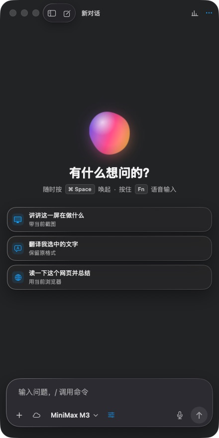
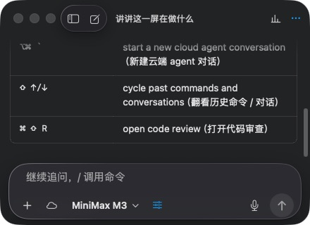
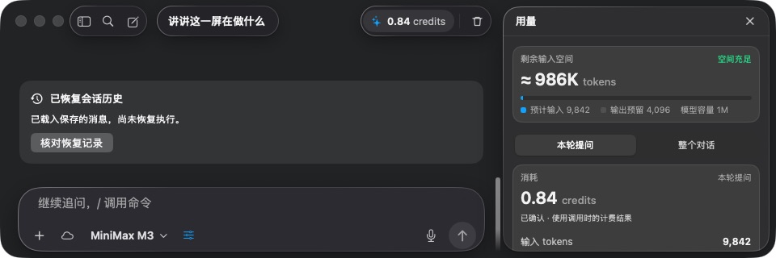

## Responsive Ask workspace

The conversation window supports a 360 × 280 pt viewport. Width determines
panel placement; height determines content density. The editor, conversation
selection, and the user's sidebar preference survive resizing.

| Available space | Behavior |
| --- | --- |
| Below 864 pt wide | History opens in a drawer. |
| Below 938 pt wide | Usage opens over the conversation. |
| At least 938 pt wide | Usage can sit beside a 600 pt reading column. |
| At least 1202 pt wide | History, conversation, and usage fit together. |
| Reading column below 600 pt | Compact header and stacked suggestions. |
| Composer below 600 pt | Secondary context switches move into a menu. |
| Below 500 pt high | Compact welcome, usage cards, and composer; long drafts scroll inside the editor. |
| Below 360 pt high | Suggestions take precedence over the welcome heading. |

Automatic panel changes never overwrite `ask.sidebarCollapsed`. Only one
drawer is interactive at a time; Escape, its close button, or the backdrop
closes it. A transcript following the last answer continues following it when
the viewport changes. Reading older messages does not force a jump to the end.
The slash command list uses the space remaining above the composer, including
when a long draft and attachments occupy a medium-height window.

The AppKit hosting view carries minimum width and height constraints. Setting
`NSWindow.minSize` before installing a hosting view is insufficient: Auto Layout
may supersede it. Saved frames keep their position and dimensions when valid;
obsolete undersized frames are constrained to the supported size and screen.

### Verification

Run `swift test` for the regular regression suite. Native interaction tests are
opt-in because they create key windows and dispatch mouse and keyboard events:

```sh
TYPEFLUX_ASK_RESPONSIVE_TESTS=1 swift test --no-parallel --filter AskResponsiveWorkspaceTests
```

Run the native context-menu integration check separately. Its AppKit menu
tracking loop needs an isolated test process:

```sh
TYPEFLUX_ASK_CONTEXT_MENU_TESTS=1 swift test --no-parallel --filter compactContextMenuTogglesMemoryAndOpensUsage
```

The native suite uses isolated synthetic data and the original conversation
window controller. It checks empty conversations, history, pending approvals,
usage, search, and long drafts at 1180 × 760, 760 × 560, 440 × 880, 960 × 320,
440 × 320, and 360 × 280 pt. Unit tests cover the panel boundaries, native editor
height changes, menu actions, and window restoration.
The command-line test process cannot become the application's key window, so
automatic input-focus restoration after closing a modal still needs an active-app
manual check. Draft contents, selection, and keyboard dismissal are tested.

### Native screenshots

Captured from the production controller with synthetic account and conversation
data. These show the SwiftUI implementation, rather than the HTML prototype.

| Narrow and tall: 440 × 880 | Narrow and short: 440 × 320 |
| --- | --- |
|  |  |


