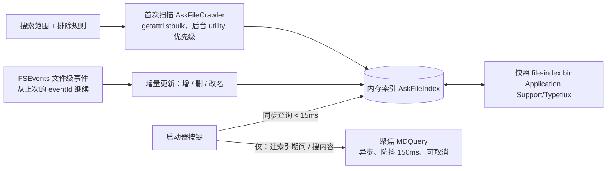

# 启动器内容搜索（应用 + 文件）设计方案

> 状态：设计稿，待确认后开发（GUL-239）。可交互设计稿：`docs/design/launcher-content-search.html`（浏览器直接打开，可以输入、用方向键选择，也可以改设置看效果），截图见 `docs/design/launcher-content-search/`。
> 参考：HapiGo 的搜索设置（应用搜索范围、文档搜索范围、按路径 / 类型 / 文件夹名排除、默认搜索模式、应用模糊搜索）。

## 0. 一页结论

1. **一个输入框同时搜应用和文件**。默认「混合」：最佳匹配排在最前，下面按类型分组（应用 · 系统设置 · 文件 · 文件夹）。另有「应用优先」「文件优先」两种模式，和参考产品一致。
2. **文件用自己的文件名索引，不依赖聚焦（Spotlight）**。索引放在内存里，按键时直接查，p95 < 15 ms；`FSEvents` 实时增量更新，退出前保存快照，下次启动不需要重新扫描。聚焦只用在两处：首次建索引期间先顶上，以及「搜文件内容」。
3. **匹配统一用一套模糊匹配器**，应用和文件共用：全名、前缀、词首、首字母、拼音全拼与首字母（可以从名字中间开始，`ht` 也能找到「2026 年度采购**合同**.pdf」）、包含、按顺序出现（`tbpls` → TablePlus）。多个词分别匹配文件名或所在路径（`typeflux md` → typeflux 项目里的 Markdown）。
4. **↩ 打开；→ 或 ⌘K 打开操作面板**：在访达中显示（⌘R）、快速查看（⌘Y）、拷贝路径（⇧⌘C）、拷贝文件（⌥⌘C）、**带上此文件问 AI（⇧⌘↩）**。⌘↩ 仍然把文字发给 AI，和现在一样。
5. **新增「设置 · 启动器 · 搜索」页**：搜索模式、模糊匹配、结果数量、图标样式；应用搜索范围；文件搜索范围（带索引状态、重建索引）；排除规则（路径 / 文件类型 / 文件夹名，默认排除 `node_modules`、`.git` 等）。
6. 分 4 个 PR：S1 共用匹配器 + 应用范围 + 搜索设置页 → S2 文件索引与启动器结果 → S3 操作面板、快速查看、缩略图、`f` 关键词与筛选 → S4 内容搜索、带文件问 AI。

### 截图

| 文件 | 内容 |
|------|------|
| `1-best-match.png`（`-light`） | `ht`：最佳匹配是「合同」文件夹，文件按组列出，「2026 年度采购合同.pdf」从名字中间命中 |
| `2-app-best-match.png` | `wx` → 微信 |
| `3-no-clear-winner.png` | `invoice`：两个相近文件，「问 AI」保持第一 |
| `4-multi-word-path.png` | `typeflux md`：多词 + 路径 |
| `5-file-mode-content.png`（`-light`） | `f` 文件模式：筛选、排序、搜内容 |
| `6-action-panel.png` | 操作面板 |
| `7-indexing.png` / `8-no-access.png` | 建索引中 / 没有授权 |
| `9-quick-look.png` | ⌘Y 快速查看 |
| `settings-*.png` | 设置 · 启动器 · 搜索：常规、应用、文件（`-light`）、排除 |

## 1. 现状与问题

| 现状 | 问题 |
|------|------|
| `AskAppIndex` 扫描固定的 5 个目录，常驻内存；`AskAppMatcher` 打分 | 搜索范围不能改，也搜不到系统设置里的各个面板；5 分钟定时重扫，刚装的应用最长要等 5 分钟 |
| 没有文件搜索 | 启动器最常见的用途之一缺失 |
| 匹配器只服务应用，拼音只能从名字开头匹配 | 文件名通常更长，`ht` 搜不到「2026 年度采购合同.pdf」 |
| 快捷结果只有计算器、应用两种，`AskQuickResults` 的行和分组都是写死的 | 加文件以后要重新组织：分组、最佳匹配、显示全部、操作面板 |

## 2. 交互设计

### 2.1 启动器结果

```
╭──────────────────────────────────────────────────────────────╮
│ ht                                                           │
│ ＋ ☁ Typeflux Cloud ▾ │ 📷                           🎤  ⬆    │
│ ──────────────────────────────────────────────────────────── │
│ 最佳匹配                                                      │
│ ╭────────────────────────────────────────────────────────╮   │
│ │ 📁 **合同**                    ~/Documents        打开 ↩ │   │  ← 高亮，↩ 打开
│ ╰────────────────────────────────────────────────────────╯   │
│ 文件                                                          │
│   📊 **合同**台账.xlsx           ~/Documents/合同    3 天前    │
│   📄 框架**合同**-飞书.docx      ~/Documents/合同    1 个月前  │
│   📄 2026 年度采购**合同**.pdf   ~/Documents/合同    2 天前    │
│ 问 AI                                                         │
│   ✨ 问 AI “ht”                                     ⌘↩       │
│                    ↩ 打开 · → 更多操作 · ⌘↩ 问 AI · esc 关闭   │
╰──────────────────────────────────────────────────────────────╯
```

- **最佳匹配**：第一名明确命中（规则见 2.3）时单独放在最前、默认高亮，↩ 打开它；「问 AI」移到最后。否则「问 AI」排第一、保持默认，其余结果在下面，用 ↓ 选中。这和现在应用搜索的规则一致，不会抢走用户本来要问 AI 的句子。
- **分组**：应用（≤ 5）、系统设置（≤ 3）、文件（≤ 6）、文件夹（≤ 3）。混合模式下，各组按组内最高分排序；应用优先 / 文件优先模式下，对应的组固定在前面。
- **行内容**：图标（应用图标；文件用系统图标，图片 / PDF 用缩略图）、名称（命中的字加粗并着色）、位置（`~` 缩写，中间省略）、右侧是修改时间；高亮行右侧显示「打开 ↩」。
- **空查询**：文件模式里什么都没输入时，列出最近修改的文件。
- **显示全部**：文件超过 6 个时，文件组最后一行是「显示全部 128 个文件 ⌘↓」，进入文件模式（2.2）。
- **高度**：沿用现在「列表保持出现以来最高高度」的做法（防抖动），上限 420pt，超出在列表内滚动。

### 2.2 文件模式（关键词 `f`）

输入 `f ` 或按 ⌘↓ 进入，输入框前显示「文件」关键词标签（复用现有关键词插件的标签样式，`f` 可以在 设置 · 启动器 · 关键词 里改）。

- **筛选标签**：全部 · 文件夹 · 文档 · 图片 · PDF · 表格与演示 · 代码；⇥ / ⇧⇥ 切换。
- **排序**：相关度（默认）/ 最近修改，⌘S 切换。
- **搜索文件内容**：开关（⌘F）。打开后再用聚焦搜文件内容，结果带「内容匹配」标签和一行摘要；文件名命中仍然排在前面。
- 最多显示「结果数量」设置的条数（默认 30）。
- 查询语法（都可选，普通用户不需要知道）：`.pdf` 或 `ext:pdf` 限定扩展名；`in:设计` 限定所在文件夹名。

### 2.3 谁占回车

和应用搜索相同的「短查询」条件：至少 2 个字符、最多 3 个词、没有问号和句读。满足时：

| 第一名 | 门槛 | 例子 |
|--------|------|------|
| 应用 / 系统设置 | 得分 ≥ 0.8（同现状） | `wx` → 微信 |
| 文件 / 文件夹 | 得分 ≥ 0.88（全名、前缀、首字母完全相同、拼音全拼），且比第二名高 0.05 以上 | `ht` → 合同 文件夹；`invoice` 命中两个相近的发票，分数接近，不占回车 |

应用和文件同分时应用优先。文件模式下第一名总是占回车。

### 2.4 键盘

| 按键 | 行为 |
|------|------|
| ↩ | 执行高亮行：打开应用 / 文件 / 文件夹；「问 AI」行则发送 |
| ⌘↩ | 无论高亮在哪，都把文字发给 AI（现状） |
| ↑ / ↓ | 移动高亮 |
| → / ⌘K | 打开高亮行的操作面板（→ 只在光标位于末尾时生效，不影响编辑） |
| ⌘R | 在访达中显示 |
| ⌘Y | 快速查看（Quick Look 面板，再按 ⌘Y 或 esc 关闭） |
| ⇧⌘C / ⌥⌘C | 拷贝路径 / 拷贝文件（可以直接粘贴到访达、聊天软件） |
| ⇧⌘↩ | 带上此文件问 AI：打开新对话，把文件作为附件放进输入框（复用 GUL-187 的附件），文字是当前输入 |
| ⌥↩ | 打开方式…（列出能打开它的应用） |
| ⌘↓ | 显示全部文件（进入文件模式） |
| ⇥ / ⇧⇥ | 文件模式里切换筛选标签 |
| esc | 先关面板（操作面板 / 快速查看），再清空，最后关闭启动器 |

空格永远是输入，不用来快速查看。底栏提示随高亮行变化：文件是「↩ 打开 · → 更多操作 · ⌘↩ 问 AI · esc 关闭」。

### 2.5 操作面板

在高亮行右侧弹出，可用 ↑ / ↓ 选择、↩ 执行、输入字母筛选：

- 文件：打开、打开方式…、在访达中显示、快速查看、拷贝路径、拷贝文件、拷贝名称、带上此文件问 AI、移到废纸篓（要二次确认，⌘⌫）。
- 文件夹：打开、在访达中显示、在终端中打开、拷贝路径、在此文件夹中搜索（进入文件模式并带上 `in:`）。
- 应用：打开、在访达中显示、拷贝路径、显示简介；正在运行时多「退出」「强制退出」。
- 系统设置：打开。

执行后关闭启动器，并把这次打开记入使用次数（排序用，见 3.4）；拷贝类操作在底栏提示「已拷贝」后关闭。

### 2.6 状态

| 状态 | 表现 |
|------|------|
| 第一次建索引 | 文件组顶部一行「正在建立文件索引 · 42%」；这段时间文件结果来自聚焦，行上不标注；建完无缝切换 |
| 没有权限 | 「桌面」「文稿」「下载」需要授权（macOS 隐私保护）。没授权时文件组顶部一行「授权后可以搜索 文稿 · 桌面 · 下载 ›」，点击打开 系统设置 · 隐私与安全性 · 完全磁盘访问权限；其余目录照常搜索 |
| 范围为空或关闭文件搜索 | 不出现文件组，行为同现在 |
| 文件已经不在 | 打开前 `fileExists` 检查，不在就从索引删掉并提示「文件已移动或删除」 |
| 输入法组字中 | 不搜索（现状） |

## 3. 索引与检索

### 3.1 为什么自建文件名索引

| 方案 | 速度 | 模糊 / 拼音 | 可控性 | 结论 |
|------|------|-------------|--------|------|
| 每次按键查聚焦（`NSMetadataQuery` / `MDQuery`） | 50–300 ms，而且波动大 | 只有前缀和包含，没有拼音、首字母、按顺序出现 | 用户在系统里关掉某个目录就搜不到；结果里常有大量缓存和构建产物 | 不适合逐键搜索 |
| 全盘内容索引（自己读文件内容） | — | — | 耗电、占空间、有隐私顾虑 | 不做 |
| **自建文件名 + 元数据索引（本方案）**，内容搜索交给聚焦 | 内存扫描 < 15 ms | 完全由我们控制 | 范围、排除规则都在设置里 | ✅ |

Alfred、Raycast 的做法类似：文件名自己索引，内容交给聚焦。

### 3.2 数据结构（`AskFileIndex`）

为速度和内存设计：一次查询是对一段连续内存的并行扫描，不分配对象。

```
directories: [DirectoryNode]      // 目录树：parent + name，路径不重复存
names:       [UInt8]              // 所有文件名（小写、去声调、全角转半角）的 UTF-8，首尾相接
entries:     ContiguousArray<Entry>
Entry (32 B) {
  nameOffset: UInt32, nameLength: UInt16, displayOffset: UInt32   // 原始大小写的名字另存
  directory: UInt32                 // 所在目录
  kind: UInt8                       // file / folder / package / alias
  typeGroup: UInt8                  // 文档 / 图片 / PDF / 表格演示 / 代码 / 其它，由扩展名得出
  charMask: UInt64                  // 名字里出现过的字符：a–z、0–9、拼音首字母、其它（分桶）
  modified: UInt32                  // 天，2000-01-01 起
  flags: UInt8                      // hidden、有拼音键 …
}
pinyin: [UInt32: PinyinKeys]       // 只有含汉字的名字才有：全拼音节 + 每个音节在原名中的位置
```

- **字符掩码预筛**：查询也算一个掩码，`entry.charMask & q == q` 不成立就跳过，常见查询能直接排除 90% 以上的条目，剩下的才做字符串比较。
- **并行**：条目按 16K 一段，`DispatchQueue.concurrentPerform` 分段扫描，每段保留自己的前 K 名，最后合并。
- **内存估算**：50 万条 ≈ 条目 16 MB + 名字 10 MB + 目录 3 MB + 拼音 2 MB ≈ 31 MB。默认上限 100 万条，超过时设置页提示缩小范围。
- **线程模型**：索引由一个串行队列持有和修改；查询拿到不可变快照（写时复制的段），所以搜索永远不等扫描，也不需要在热路径上加锁。

### 3.3 匹配（`AskFuzzyMatcher`，应用与文件共用）

从 `AskAppMatcher` 提取，规则表不变，增加两项：

| 命中方式 | 得分 | 例子 |
|---------|------|------|
| 名称完全相同（文件不含扩展名也算） | 1.0 | `readme` → README.md |
| 拼音全拼完全相同 | 0.95 | `weixin` → 微信 |
| 名称前缀 | 0.9 | `calc` → Calculator |
| 首字母 / 拼音首字母完全相同 | 0.88 | `vsc`、`wx` |
| 拼音全拼前缀 | 0.86 | `weix` |
| 名称中某个词的前缀 | 0.82 | `studio` |
| 首字母前缀 | 0.8 | `vs` |
| **新：拼音从名字中间某个字开始（全拼或首字母）** | 0.7 / 0.66 | `hetong`、`ht` → 2026 年度采购**合同** |
| 名称包含 | 0.6 | `hat` → WeChat |
| 字母按顺序出现（模糊匹配开关控制） | 0.45–0.55，越紧凑越高 | `tbpls` → TablePlus |
| **新：只在所在路径中出现**（多词查询中的某个词） | 0.4 | `typeflux md` 的 `typeflux` |

- **多词查询**：按空格拆开，每个词都要命中名字或路径，总分为各词得分的平均值；`.pdf` / `ext:` / `in:` 先拿出来当过滤条件。
- **规范化**：小写、去掉声调和变音符号（`café` = `cafe`）、全角转半角、`_` `-` `.` 都当作词的分隔。
- **拼音**：沿用 `AskAppEntry.pinyinSyllables`（`CFStringTransform` + 多音词表），在建索引时只算一次，并记录每个音节对应原名中的哪个字，用来高亮。
- **高亮**：匹配器同时返回命中的字符区间，视图据此加粗着色。

### 3.4 排序

`最终分 = 匹配分 + 使用加成 + 时间加成 − 深度惩罚`

- 使用加成：从启动器打开的次数，每次 +0.005，最多 +0.05（同现状）。文件按路径记，最多记 2,000 个，按最近使用淘汰。
- 时间加成（仅文件）：`0.06 × e^(−天数/14)`，最近改过的文件靠前。
- 深度惩罚（仅文件）：路径每深一层 −0.004，最多 −0.04。
- 同分：名字短的在前，再按名字排序（同现状）。

### 3.5 建立与更新索引



- **首次扫描**：用 `getattrlistbulk` 一次读一个目录的所有条目（名字、类型、修改时间），比 `FileManager.enumerator` 快 3–5 倍。后台 `utility` 优先级，每 2,000 条让出一次；低电量模式下暂停，接上电源后继续。应用包、照片图库这类「包」只记一条，不往里走。
- **排除规则在扫描时生效**：被排除的文件夹整个跳过，不读也不记。默认排除：文件夹名 `node_modules`、`.git`、`.svn`、`DerivedData`、`.build`、`build`、`Pods`、`__pycache__`、`.venv`、`.Trash`，路径 `~/Library`（但 `~/Library/Mobile Documents` 这类用户显式加入的范围不受影响），以及隐藏文件（可以在设置里打开）。
- **增量**：`FSEventStream`（`kFSEventStreamCreateFlagFileEvents`，延迟 0.5 s）监听所有范围。事件只带路径，更新时 `lstat` 一下就知道是新增、修改还是删除。收到 `MustScanSubDirs` / 事件丢失时，只重扫那个子目录。
- **重启不重扫**：退出（和每 10 分钟有改动时）把索引写成快照（版本号 + 校验和，先写临时文件再改名），同时记下 FSEvents 的 `lastEventId`。下次启动直接加载快照（50 万条约 150 ms，`mmap` 读取），再从 `lastEventId` 补上离线期间的变化。快照损坏、版本不对、范围或排除规则改了，就重建。
- **iCloud / 网盘**：`~/Library/Mobile Documents`、`~/Library/CloudStorage/*` 只读目录项，不会触发下载；占位文件显示云朵标记。
- **外接磁盘**：可以加入范围；卸载后它的条目先隐藏，重新挂载后按卷 UUID 继续用。
- **应用索引**：`AskAppIndex` 改为读设置里的范围，并用 FSEvents 监听这些目录，代替 5 分钟定时重扫。新增「系统设置」来源：macOS 13 以上读 `/System/Library/ExtensionKit/Extensions` 里的设置扩展（名字取本地化名，用 `x-apple.systempreferences:` 打开），老系统读 `.prefPane`。

### 3.6 聚焦（Spotlight）的角色

- **首次建索引期间**：文件结果来自 `MDQuery`（`kMDItemFSName` 包含查询词，限定在搜索范围内），按同一套打分排序；防抖 150 ms，文字变了就取消。
- **搜文件内容**（文件模式的开关）：`kMDItemTextContent` 匹配，限定在搜索范围，结果最多 20 条，带摘要。
- 聚焦被关闭或出错时这两项静默不显示，不影响文件名搜索。

### 3.7 性能目标与验证

| 指标 | 目标 | 怎么验证 |
|------|------|---------|
| 按键到出结果（50 万条，M1） | p50 < 5 ms，p95 < 15 ms | `AskFileIndexBenchmarkTests`（设 `TYPEFLUX_SEARCH_BENCH` 时运行）用 50 万条合成名字跑 1,000 个查询 |
| 应用搜索 | < 1 ms（现状） | 同上 |
| 首次建索引（30 万文件） | < 30 s，CPU 不超过 1 核 | 开发版日志打点 |
| 改动到能搜到 | < 2 s | 集成测试：临时目录里建文件、改名、删除，轮询直到索引更新 |
| 冷启动加载快照（50 万条） | < 200 ms，不在主线程 | 基准测试 |
| 内存（50 万条） | < 40 MB | 基准测试里读 `phys_footprint` |

### 3.8 隐私与安全

- 索引只有文件名、路径、类型和修改时间，只存在本机 `~/Library/Application Support/Typeflux/`，不上传、不进对话、不参与云同步。
- 不读取文件内容；内容搜索由系统的聚焦完成，我们不保存结果。
- 「带上此文件问 AI」是用户明确的操作，走现有附件流程（云端对话会上传，私密对话不上传），附件大小与类型限制不变。
- 设置页提供「清除索引」；关闭文件搜索时立即释放内存并删除快照。

## 4. 设置（设置 · 启动器 · 搜索，新增一页）

现有「基础」页的「启动器应用搜索」开关旁边新增「启动器文件搜索」开关（默认开）；详细配置放在新页「搜索」：

| 分组 | 内容 |
|------|------|
| 常规 | 搜索模式：混合 / 应用优先 / 文件优先；模糊匹配（按顺序出现），默认开；结果数量 10 / 20 / 30 / 50（文件模式的上限）；文件图标：缩略图 / 图标 |
| 应用搜索范围 | 目录列表（默认就是现在的 5 处），添加 / 删除 / 恢复默认；「搜索系统设置」开关 |
| 文件搜索范围 | 目录列表（默认 `~`），每行显示条目数；快捷添加「iCloud 云盘」「网盘（CloudStorage）」；状态卡：已索引 N 项 · 内存 M MB · 最近更新时间 · 实时监控中；「重建索引」「清除索引」；提示：不要加系统目录，范围过大会浪费资源 |
| 排除 | 按路径、按文件类型、按文件夹名三组，可展开、添加、删除；「包含隐藏文件」开关 |
| 权限 | 完全磁盘访问权限的状态和「前往授权」按钮 |

修改范围或排除规则后，变化的部分在后台重扫（新增目录只扫它，删掉的直接从索引移除），不需要整体重建。

## 5. 架构与改动

### 5.1 新增文件

| 文件 | 职责 |
|------|------|
| `Ask/QuickResults/Search/AskFuzzyMatcher.swift` | 共用打分与高亮区间（从 `AskAppMatcher` 提取） |
| `Ask/QuickResults/Search/AskSearchKey.swift` | 名字规范化、字符掩码、拼音键（复用 `AskAppEntry` 的拼音代码） |
| `Ask/QuickResults/Search/AskSearchQuery.swift` | 查询解析：词、`ext:` / `.pdf`、`in:` |
| `Ask/QuickResults/Search/AskSearchSettings.swift` | 模式、范围、排除规则（`Codable`，存 `SettingsStore`） |
| `Ask/QuickResults/Files/AskFileIndex.swift` | 内存索引、并行查询、快照读写 |
| `Ask/QuickResults/Files/AskFileCrawler.swift` | `getattrlistbulk` 扫描与排除规则 |
| `Ask/QuickResults/Files/AskFileWatcher.swift` | FSEvents 封装（可注入，测试用假实现） |
| `Ask/QuickResults/Files/AskSpotlightSearch.swift` | `MDQuery` 文件名回退与内容搜索 |
| `Ask/QuickResults/Files/AskFileActions.swift` | 打开、显示、快速查看、拷贝、废纸篓、带文件问 AI |
| `Ask/QuickResults/Files/AskFileThumbnail.swift` | `QLThumbnailGenerator` 缩略图，`NSCache` 缓存 |
| `Ask/QuickResults/AskQuickActionPanel.swift` | 操作面板视图与状态 |
| `Settings/LauncherSearchSettingsView.swift` | 新的「搜索」设置页 |

### 5.2 改动现有代码

- `AskQuickResults`：`Row` 增加 `.file(Int)`、`.pane(Int)`、`.showAllFiles`、`.notice(...)`；`resolve` 合并应用与文件的结果，按 2.1 的规则分组与排序；`keepChoice` 认文件路径。
- `AskQuickResults.resolve` 仍然同步调用应用和文件索引（都是内存查询）。聚焦结果通过快捷结果框架的异步档（翻译插件已经用上的 generation + 取消机制）合并进来。
- `AskAppIndex`：范围来自设置；FSEvents 代替定时重扫；新增系统设置来源。`AskAppMatcher` 改为调用 `AskFuzzyMatcher`，现有测试保持通过。
- `AskQuickResultsView`：新的文件行、组标题、「显示全部」行、提示行、高亮区间渲染；`height(for:)` 同步更新。
- `AskComposer` 按键：→、⌘K、⌘R、⌘Y、⇧⌘C、⌥⌘C、⇧⌘↩、⌥↩、⌘↓（`AskCommandKey` 新增对应项）。
- 关键词：新增内置插件「文件」，默认关键词 `f`。
- `LauncherSettingsPane` 新增 `.search`；`SettingsStore+Agent` 新增 `askQuickFileSearchEnabled` 与 `askSearchSettings`。
- 本地化：五种界面语言补齐新增文案。

## 6. 测试

- `AskFuzzyMatcherTests`：规则表逐项（含新增的拼音中间匹配、路径匹配）、高亮区间、规范化（大小写、声调、全角）、模糊开关、边界（空、单字母、超长、换行）。现有 `AskAppSearchTests` 原样通过。
- `AskSearchQueryTests`：多词、`ext:`、`.pdf`、`in:`、只有过滤条件没有词。
- `AskFileIndexTests`：插入 / 删除 / 改名、字符掩码预筛不漏结果（与暴力匹配对比的随机测试）、并行分段结果与单线程一致、排序（时间、深度、使用次数）、快照读写与损坏回退。
- `AskFileCrawlerTests`：临时目录：排除路径 / 类型 / 文件夹名、隐藏文件、包不展开、符号链接不跟随、权限不足的目录跳过。
- `AskFileWatcherTests`：假事件流驱动增量更新；`MustScanSubDirs` 触发子目录重扫；真实 FSEvents 的集成测试（临时目录，2 s 超时）。
- `AskQuickResultsTests` / `InteractionTests`：分组与三种模式、谁占回车（应用 / 文件门槛）、显示全部、文件模式与筛选、各快捷键、操作面板、文件已不在、权限提示行、关闭开关。
- `AskQuickResultsVisualTests`：新状态截图（深浅色）。
- `AskFileIndexBenchmarkTests`：见 3.7，默认跳过。
- 覆盖率：新代码 ≥ 80%（项目目标 90%）。

## 7. 里程碑

| 阶段 | 内容 | 验收 |
|------|------|------|
| S1 | `AskFuzzyMatcher` 提取（含拼音中间匹配、高亮）；应用范围可配置、FSEvents、系统设置来源；「搜索」设置页（常规 + 应用范围） | 应用搜索行为不退化；`ht` 类中间拼音生效；新装应用 2 s 内能搜到 |
| S2 | 文件索引（扫描、排除、FSEvents、快照）；启动器文件结果、最佳匹配、分组与模式；设置页文件范围、排除、状态、权限 | 性能目标达标；三种模式；回车规则 |
| S3 | 操作面板与快捷键、快速查看、缩略图、`f` 关键词、筛选与排序、显示全部 | 2.4 / 2.5 全部可用 |
| S4 | 聚焦内容搜索、建索引期间的聚焦回退、带上此文件问 AI | 内容匹配带摘要；附件进入新对话 |

## 8. 待确认

1. 默认文件搜索范围是整个 `~`（排除 `~/Library` 和开发目录），还是只放 桌面 / 文稿 / 下载 / iCloud 云盘？前者更全，首次建索引更久（通常 1 分钟以内）。
2. 文件得分足够高时让它占回车（2.3 的规则），还是文件永远不占回车、只能用 ↓ 选中？
3. 「带上此文件问 AI」用 ⇧⌘↩ 是否合适。
4. 是否需要「文件优先」以外更细的模式（例如只搜应用，完全不出文件）？本稿只做参考产品里的三种。
5. 是否要做历史对话搜索（路线图 M3 的另一半）。本稿不包括，可以作为同一框架下的第三个来源接入。
