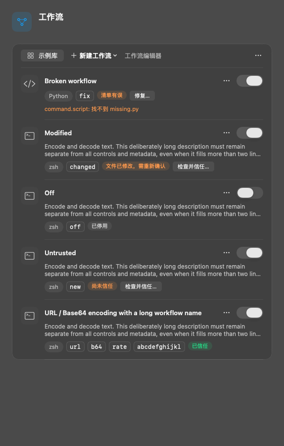
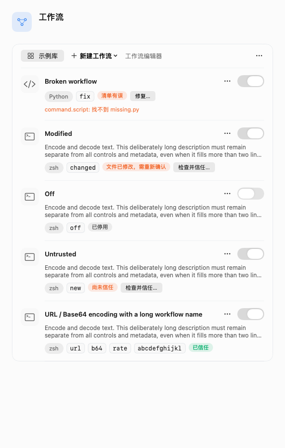
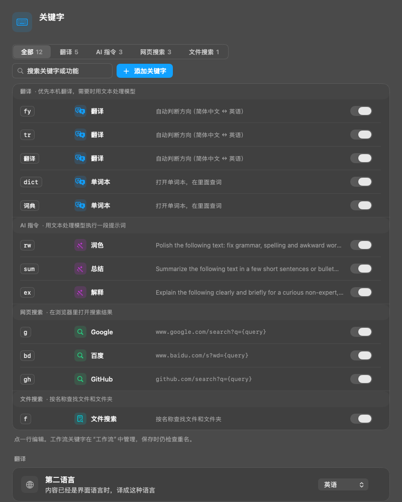
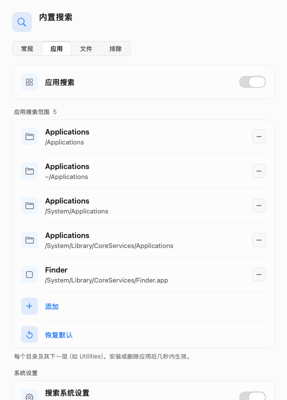

# Launcher settings polish (GUL-243)

Launcher settings share the same 30-point tabs as model and Agent settings. Inline choices use a compact variant. The launcher page and its panes omit repeated introductions. Built-in features contains only Calculator; the app and file switches live at the top of their respective Built-in search tabs and retain their existing stored preferences.

The keyword page manages built-in/custom plugin keywords only. Its rows, filters, search, counts and empty state exclude workflows. Workflow keywords remain reserved during keyword validation. The editor sheets omit the repeated kind description while retaining field guidance and validation.

Workflow rows separate the clickable name and controls from the two-line description and wrapping metadata. Keywords never wrap internally. Trust review, repair, conflict notices and validation errors remain visible; creation actions sit above the list.

These native AppKit/SwiftUI renders use isolated test fixtures. The original annotated screenshots remain on GUL-243.

| Workflows, dark | Workflows, light |
| --- | --- |
|  |  |

| Plugin keywords only | App search switch |
| --- | --- |
|  |  |

Regenerate screenshots with `TYPEFLUX_SETTINGS_SNAPSHOTS=<directory> swift test --enable-code-coverage --filter LauncherSettingsPolishTests`. That suite also checks both 1100×800 and 1100×620 windows, all search tabs, keyword sheets, chip wrapping, non-overlapping controls and click actions. `LauncherSearchSettingsViewTests` verifies saved preferences and a real file index clearing and rebuilding through the moved switch.
