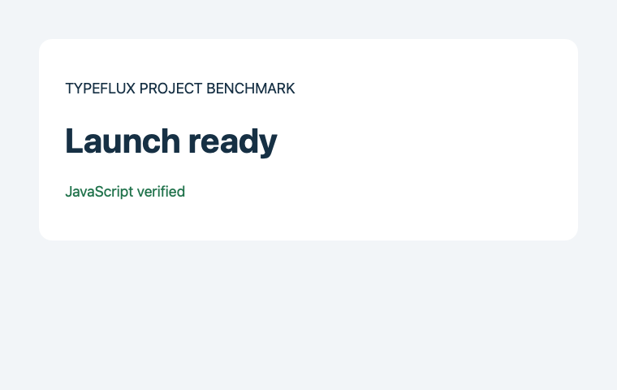
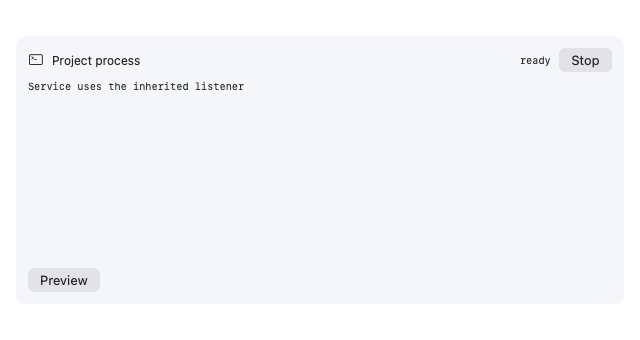
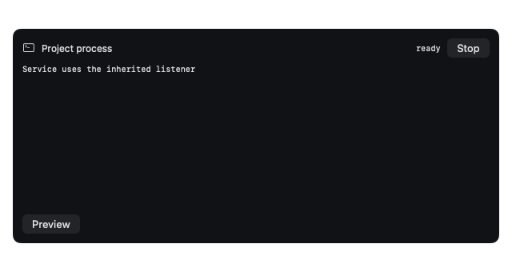

# D04 integration evidence — 2026-10-04

The deterministic project loop passes on the environment below. Production
project execution, artifact creation and executable preview remain disabled.
This is an implementation delivery for review, not authorization to enable
stage two, ship a release or start stage three. Live-model and desktop/browser
allowed-path acceptance remain incomplete.

## Fixed inputs and environment

Initial Swift baseline: `00ddb79ba2bafdfc79871a35fe373f538b711fa1` (main).
It includes D01 #271 (`68a503282b022607e2091482afc2aa5bd5b0b0b5`),
D02 #273 (`e5e510bc32df360158890c3adb68eff42a0da504`), D03 #274
and P09 #268 (`b7734bad3b8233ee5ad1d01cd5e0ff4ce8f63738`).
Final Swift base: `786abaf67e881b0b6d17eb8c9c566691896d18e7`, including
conversation-storage change #272 that merged during this task. Integration
preserves account authority separately from the local conversation cache partition.
API baseline: `356bcf95ccffff2f0dee41386fba6c361e0d2b2a` (main).

| Component | Observed version |
| --- | --- |
| macOS / architecture | 26.6.2 (25G83), arm64 |
| Swift | 6.4, swiftlang-6.4.0.34.1 |
| CLT Python | 3.9.6 |
| WebKit framework | 21624 / 21624.5.1.11.3 |
| Safari | 27.0 / 21625.1.29.18.28 |
| Chrome | 154.0.8037.93 |
| Go | 1.27.0 |
| SwiftLint / SwiftFormat | 0.65.1 / 0.63.0 |

The fixture sources are in `d04-fixtures/`; neither requires downloads.
Only private D01 staged copies execute, using D02's offline CLT Python
single-process backend. The service inherits its listener on fd 3 and proves
readiness through the nonce path. Source files remain unchanged after execution.

## Measured device scenarios

| Scenario | Observations | Result / test duration |
| --- | --- | --- |
| Frontend | Read requirement, stage Prototype → Launch ready, review/export diff, run checker, start service, nonce readiness, real JS/DOM/console, PNG, open/export artifacts, Stop, PID reaped and port closed | Pass / 0.273 s |
| Independent static page | Separate source/checker, staged diff, actual exit 0, isolated WebKit static load and JS/DOM, PNG, open/export matching bytes, checker reaped | Pass / 0.178 s |
| Failed check / readiness / conflict / cancellation | Actual exit 1; missing nonce times out; concurrent human edit rejected and preserved; cancel closes service | Pass / 1.018 s |
| Failed preview / cancelled resource read | A page throws a real script error; successful preview artifacts are not published; cancelled proxy read fails | Pass / 0.174 s |
| Lease authority and Stop | Reject forged identity, wrong origin/session/run and another active lease; Stop closes view, process and port; cancelling an older run cannot cancel the replacement | Pass / 0.290 s |
| Revocation and lifecycle | Root revocation, run replacement, deadline, workspace deletion and shutdown invalidate pages | Pass / 1.970 s |
| Real network denial | Actual TCP/UDP traps observe no HTTP, WebSocket, file, other-lease or STUN escape from WebKit | Pass / 1.235 s |
| Private conversation | Real ready service survives routed tool dispatch under account authority; native Stop cancels it | Pass / 0.146 s |
| Proxy bounds | Real redirect, oversized headers/body, undeclared/missing resources and cancellation rejected | Pass / 0.468 s |

These are XCTest wall durations, not model latency. No model request is used
in these device tests. The output/approval tests additionally cover every UTF-8
page boundary, duplicates/gaps, visible loss/truncation, default-off gates,
full effective launch requests, one-use approvals, denied replay, input/EOF,
selected account/conversation validation and model Stop/reset.

The final run's [frontend record](d04-evidence/frontend.json) and
[static record](d04-evidence/static.json) contain the actual diff, exit,
readiness, DOM, console/errors, screenshot and open/export digests and measured
cleanup. Their `mode: local` identifies host-local execution, not a live Local
model run. The API's optional measured-evidence test reread these fresh records
and PNGs with the race detector and passed. Evidence is trusted harness output,
not a signed attestation. It contains only synthetic fixture data.

The card images render a receipt from a real ready service; they are not proof
of an interactive human clicking every control. Stop/access and preview effects
are exercised separately through the same native adapters.

## Protocol fixtures versus live models

Local runs through the Swift Local engine. Cloud + Cloud and Cloud + custom
run through the API engine and explicit device inference protocol. Each mode
covers six ordered scenarios: success, failed test, failed preview, source
conflict, cancellation and stale lease. The Local fixture also rejects duplicate
receipts. Scripted model replies claiming completion do not override failed
device receipts or the independent Go evidence verifier. These fixtures pass;
they do not measure model behavior.

| Live mode | Frontend / static task | Model/provider version | Cost | Latency | Human attribution |
| --- | --- | --- | --- | --- | --- |
| Local | Not executed / not executed | Not configured | N/A | N/A | No configured live endpoint/model/key |
| Cloud + Cloud | Not executed / not executed | Not configured | N/A | N/A | No authenticated API/model endpoint configuration |
| Cloud + custom | Not executed / not executed | Not configured | N/A | N/A | No configured API and custom provider |

`ASK_EVAL_BASE_URL`, `ASK_EVAL_MODEL`, `ASK_EVAL_API_KEY` and
`TYPEFLUX_API_URL` were absent. No credentials were extracted from personal
storage. Zero cost/latency would be misleading; neither was measured. Model
failure attribution and provider/MCP acceptance still need a configured,
authorized live environment and human review.

## Real browser and desktop preflight

Ran `TYPEFLUX_AUTOMATION_ACCEPTANCE=1 swift test --skip-build --filter
AskAutomationAcceptanceTests` on the final build. The permission evidence test
passed; three allowed-path tests explicitly failed their prerequisites:

| Path | Current observation | Allowed-path result |
| --- | --- | --- |
| Safari Automation | Preflight -600 (target unavailable) | Not executed |
| Chrome Automation | Preflight -1744 (consent required) | Not executed |
| Accessibility / desktop | `AXIsProcessTrusted() == false` | Not executed |
| Screen recording | `CGPreflightScreenCaptureAccess() == false` | Not executed |

No TCC settings or browser JavaScript-from-Apple-Events preferences were changed.
Installed browser versions do not prove browser acceptance. WebKit's successful
fixture screenshots do not replace this permission matrix. No real isolated PG
environment was configured; there are no database changes or PG acceptance claims.

## Regression and coverage

The initial pristine Swift baseline `make coverage` failed with 2,741 XCTest cases,
4 skips and one existing `ManagedProcessTests.testCancelTimeoutRaceAlwaysReaps`
PID-unwrapping failure; all 708 Swift Testing tests passed. An intermediate
candidate run passed XCTest but reproduced the previously reported account-card
click test's four assertions. No assertion was removed. The pre-rebase candidate `make coverage` passed: 2,755 XCTest with 4 skips and
708 Swift Testing tests, zero failures. After #272 merged, a separate pristine
worktree at `786abaf6` passed `make coverage`: 2,741 XCTest with 4 skips and
723 Swift Testing tests, zero failures. The rebased candidate is measured
separately: **2,756 XCTest, 4 skips, zero failures; 723 Swift Testing, one
account-card test failing four assertions**. The final `make coverage` therefore
exits 2. XCTest took 135.436 s and Swift Testing 47.234 s; all **15 new test
methods** passed. The account-card test passes when rerun alone. This is the
previously reported intermittent UI failure, but it did not occur in the new
pristine baseline run, so the final full command is not reported as green.
Coverage below comes from manually merging only the final run's two raw profiles;
no earlier or targeted-retest profile was added.

The four ordinary-run skips are the three opt-in browser/desktop cases and
`AskMemoryNotesSettingsTests.testRenderRemovalFailure` (snapshot opt-in absent).
The separate browser/desktop opt-in results above are failures, not green skips.

Line coverage uses LLVM's instrumented-line denominator. The core scope below
includes the terminal adapter/buffer, dynamic proxy/capture, modified preview
host, runtime and runtime policy; it excludes SwiftUI rendering and general app
files. [Machine-readable per-file counts](d04-evidence/coverage.json) also include
all shared wiring and UI files touched by this change.

| Module | Covered / instrumented lines | Coverage |
| --- | --- | --- |
| AskDevelopmentPreview | 87 / 87 | 100% |
| AskProjectPreviewCapture | 47 / 50 | 94.00% |
| AskLocalTools+Terminal | 232 / 238 | 97.48% |
| AskTerminalTextBuffer | 42 / 42 | 100% |
| AskPreviewHost | 283 / 311 | 91.00% |
| AskProjectRuntime | 239 / 239 | 100% |
| AskProjectRuntimePolicy | 91 / 93 | 97.85% |
| **Core total** | **1,021 / 1,060** | **96.32%** |
| New terminal card UI (separate) | 148 / 236 | 62.71% |

Shared wiring whole-file coverage is 93.75% for AskLocalTools, 91.67% for
AskLocalTools+Approval, 98.46% for AskLocalTools+Project and 94.40% for
AskConversationModel. General SwiftUI view files remain below the core target.
The 90% target is not claimed for every touched UI file.

All production `Sources/Typeflux/*.swift` files, recursively, compared on the
new main: baseline **70,169 / 130,556 = 53.7463%**, final
**70,926 / 131,446 = 53.9583%**. Before the main update the same metric was
53.5612% baseline → 53.7784% candidate. The reported core counts remain unchanged.
Full-repository 90% coverage is not achieved.

Strict lint passes for the six new/refactored preview/terminal implementation
files. Whole-repository SwiftLint reports **2,986 diagnostics (554 errors,
2,432 warnings)** versus **2,972 (554 errors, 2,418 warnings)** on the final pristine
`786abaf6` baseline with the same tool version. The 14 added warnings are test layout plus
line/type length in shared wiring; full lint is not green. Older D03 lint totals
are not used as this run's baseline.

API: full ordinary tests and vet pass; related Ask race tests pass. Changed
eval-package statement coverage is **164 / 167 = 98.2%**. Repository coverage
is 83.7% baseline → 83.8% final, above its approved 80% floor and below the strict
90% gate. Full race tests reproduce the same two baseline ASR failures:
`TestAliyunClient_Flow_WithMockServer` and `TestASRWS_AliyunAutoAdaptsWAV`.
See the API repository's `docs/harness/d04-project-loop.md` for commands.

## Review and remaining limits

Self-review verified that production constructors keep all new gates off,
approval displays the effective request and rechecks authority before spawn,
page reads remain bounded and bound to a live lease, and asynchronous old-run
cancellation cannot stop a new run. Integration with #272 additionally uses
`AskRoute.account`, not the local cache owner, to bind and cancel runtime leases;
the new private-conversation test exercises a real service through routed
status dispatch and native Stop. A real page-error regression caught isolated
world listeners missing page-world exceptions; collection now checks both
worlds, including immediately after snapshot, and the negative test passes.

This supports the explicit offline HTML/JS/CSS adapter only. No shell, child
processes, package manager, fetch/XHR, WebSocket, hot reload, external page
resources, native bridge or runtime-directory snapshot export was enabled.
Exports remain original entry files, not multi-file archives. Console hooks are
observational and can be tampered with by hostile page code.

Normal Stop/revocation/deadline/shutdown clean up; host SIGKILL can leave a
sandboxed orphan. CPU, memory and copy-disk quotas are absent. Preview depends
on verified WebKit SPI on this exact OS/framework combination; cross-version
and App Store distribution acceptance remain outstanding. Interactive save-panel
and complete human UI acceptance remain pending. Rollback disables the runtime
and preview while retaining generated artifacts/logs. None of these limitations
is waived by the deterministic tests.
