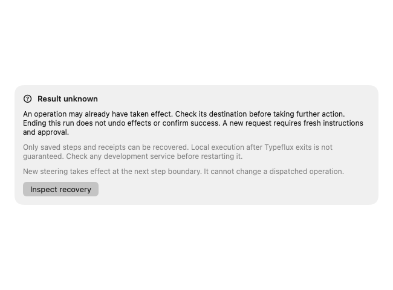
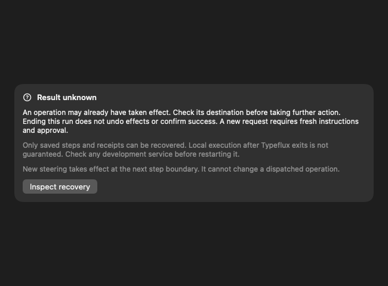
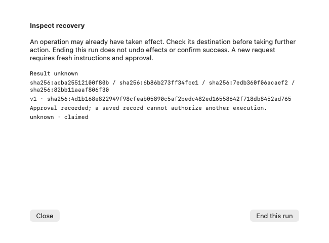
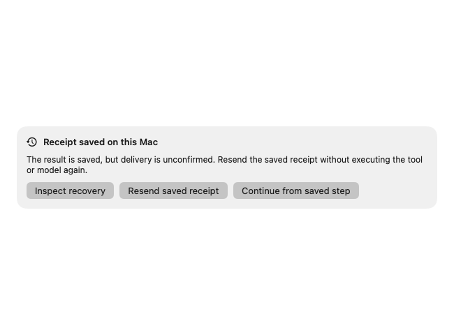

# R04 client receipt recovery

GUL-183 extends the existing SQLite tool claim/receipt journal to cover device
inference and explicit recovery. The implementation starts from Swift main
`e5135cc6ec623d47b436c9d18657b559a27bdb8f` (including GUL-195 / #282), then
integrates main `5ec2bf5a` (GUL-193 / #283). The compatibility target is API main
`981d226bc09829026851675b5498a843a33792a9`, including per-model reasoning levels.
The copied R03 v1 fixture is byte-identical to that API revision and its preceding
`ee888910` revision. A companion API PR adds only regression tests and a required
PostgreSQL gate entry. No PostgreSQL migration, worker, budget counter or
production flag changes here.

## Persistence and dispatch

`AskConversationCache` still owns the single SQLite connection and `ask_tools`
claim/receipt bytes. An additive `ask_execution` table attaches the original
account, conversation, root (when present), run, device, step, call and operation
identity, tool version, arguments digest, approval reference, delivery status and
bounded transition history. Inference receipts use an `inference/` key namespace
in the same journal. Inputs are hashed; prompts and raw arguments are not copied
into the audit. Receipt bodies are stored because retransmission needs them.
Persisted approval records cannot be imported as grants.

Claim, binding and audit commit together before dispatch. Receipt bytes and their
audit transition commit together before HTTP delivery. SQLite uses WAL and FULL
synchronous writes. A second connection cannot win the same claim. A stored
receipt is immutable, including across restarts. Receipt completion persists to
its original partition even if cancellation or logout races the completion;
network delivery rechecks the active session. The existing GUL-195 budget
identity and independent late-usage settlement are unchanged.

The user may resend a saved receipt on its original account and device. This
path calls only the existing result endpoints and never calls the model, tool
executor, retry endpoint or client drive loop. The server/local engine may
checkpoint its next step when accepting a result; the client does not dispatch
that next step during recovery. Duplicate acknowledgements do not cause another
execution. Late inference receipts can meter the original operation without
restoring its answer after cancellation or retry.

A claim without a receipt is unknown. It is not converted to an invented failed
result and never dispatches again. Legacy SQLite claims and conversations remain
readable; records lacking a complete persisted binding are inspection-only.
Identity is not reconstructed from the current account/device or from receipt
assertions. Account switching also hides another account's local recovery detail.

## User interaction

Opening history loads messages and observes authoritative status; it never
resumes local execution or adds a recovery notice by itself. Completed tasks
with confirmed results stay quiet. A card appears only for the current task's
unconfirmed results, unknown outcomes, or device work that can be continued.
Ordinary server execution and earlier tasks' bound journal entries do not create
a recovery notice. The card offers plain-language sync, continue, or review
actions. Review explains what the user should check in the affected app or file;
raw receipts, hashes, tool identifiers and audit transitions stay out of the user
interface. The journal is retained unchanged. Ending the inspected run uses
`/cancel`; it neither undoes effects nor marks an unknown operation successful.
No resolution endpoint is assumed.

GUL-198 native SwiftUI fixtures show the [completed conversation](../images/ask-recovery-completed-zh.png)
and [a task that needs review](../images/ask-recovery-review-zh.png). These are
synthetic local test conversations, not captures of a live provider session.

An unknown operation blocks ordinary resume, steering and queued-message resume.
After ending that run, the user can write and submit fresh instructions. This is
a new run, with fresh tool approval where required; the old journal is retained.
Queued instructions do not silently become authorization after cancellation.
Steering copy identifies the next step boundary and explains that it cannot alter
an already dispatched operation. The existing new-conversation controls and
image-recovery flow remain in place.

## Wire, local lifecycle and rollback

`AskAPIClient(recoveryMetadataEnabled: true)` opts into the R03 display header on
HTTP and SSE. Its default is false, including production DI. Parsing the optional
`run.recovery` value enables no worker or recovery action. Malformed/future
versions and unknown states block dispatch. Queued/unknown retain the API's
legacy active wire status; they cannot become permission for a competing run.
SSE reconnection consumes full snapshots. Usage, budget and recovery sequences
are reconciled independently, and a delayed active snapshot cannot resurrect the
same terminal run or replace a newer run at an equal conversation revision.

Local waiting inference remains receiptable after an offline interval. A
persisted engine/built-in step found running on process restart is unknown, and
ambiguous local tool receipts stop further dispatch. Local tasks are not promised
to continue after app exit. D02's current single Python process lifecycle still
applies; recovery does not restart development services or guarantee orphan
cleanup after host SIGKILL.

Rollback means disabling metadata opt-in and automatic capabilities while keeping
compatible receipt/read/cancel code and journal files. Conversation deletion
removes history/drafts but leaves an execution tombstone and journal. Additive
SQLite delete guards retain claim/owner rows even when an older cache writer
issues its old conversation-delete SQL. Never remove the journal or tombstones to
make an unknown operation runnable. Ordinary conversation deletion is not secure
account erasure; full local data erasure requires an explicit separate operation.

All existing restricted capabilities, automatic recovery, worker, Memory and
budget flags retain their default-off configuration. This PR does not authorize
production enablement or merge.

## Diagnostics

Audit transitions are `claimed`, `receiptSaved`, `retransmitting`, `acknowledged`
and `ended`. Delivery confirmation survives trimming the bounded event list.
Recovery diagnostics use bounded SHA-256 prefixes for run/step/call/operation
correlations and a fixed outcome vocabulary. They contain no prompts, arguments,
URLs, provider errors, tokens or result bodies. The inspector's local evidence is
separate from diagnostics. Local tool operation IDs follow the existing budget
`run/call/tool` identity; inference IDs are the original operation IDs. Remote
worker operation IDs, when publicly returned, remain in the API's message
diagnostics; the client does not invent private worker journal evidence.

## Validation boundary

See `r04-validation.md` for this revision's measured results. SQLite failure
injection, client/model restart, receipt-only retransmission, identity changes,
SSE ordering, budget/Memory regression, native recovery rendering and recovery-action
state transitions are covered by local tests. Real subprocess SIGKILL tests verify
SQLite durability after claim and after receipt commit; this is not a full desktop
application lifecycle test. The R03 PostgreSQL gate is rerun against
an isolated PostgreSQL 16 instance, independently of the Swift transport tests.
These layered checks are not a live Swift-to-production-provider acceptance run.
Real provider/MCP, multi-machine desktop identity, browser/computer permission
matrices and host-SIGKILL development-service cleanup remain R06 acceptance work.

## Native view captures

These are synthetic fixtures rendered by the real SwiftUI recovery views, not a
live remote operation or an end-to-end desktop automation run. Interaction tests
exercise the recovery action/state logic; native AX button dispatch was not
reliably available in this test host.

