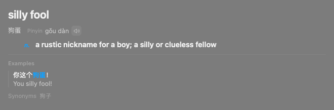

# GUL-254: target-language word card

`word-card-zh-to-en.png` renders the production `AskWordCardView` with a synthetic
Chinese-to-English dictionary reply. It verifies the visual hierarchy, without
calling a live model: the English equivalent appears first, followed by the
Chinese source word and its pinyin, then definitions and examples.

Reproduce from the repository root:

```sh
TYPEFLUX_ASK_SNAPSHOTS=docs/images/verification/GUL-254 \
  swift test --filter AskWordCardTranslationViewTests
```

`AskWordCardTranslationTests` also exercises the AI prompt and JSON parsing,
copy/insert actions, both typed and selected input, other target languages,
SQLite persistence and saved-card reuse. Cards saved before the translation
field was added decode without migration and use their first target-language
meaning until regenerated.

Validation on this workspace:

- `swift build` passes.
- `swift test --no-parallel --enable-code-coverage --filter
  'AskTranslation|AskWordCard|AskTranslate|AskWordBook'`: 122 tests pass.
- Changed executable lines: 30/30 covered. Line coverage across the five changed
  production files: 97.87% (each file exceeds 94%).
- Full XCTest run: 3035 tests, 7 skipped, no failures.
- Full Swift Testing run with `--no-parallel`: 1713 tests, 6 failed assertions in
  4 existing composer UI tests. The same assertions fail on unchanged HEAD
  `97603b81`: the voice button's frame moves and context-preview accessibility
  labels are missing. The PR remains a draft because the full suite is not green.
- SwiftLint reports the same 30 existing production violations on HEAD and the
  fix, with no new violations. The new regression test file passes SwiftLint
  and SwiftFormat (preserving the surrounding Swift Testing naming convention).


