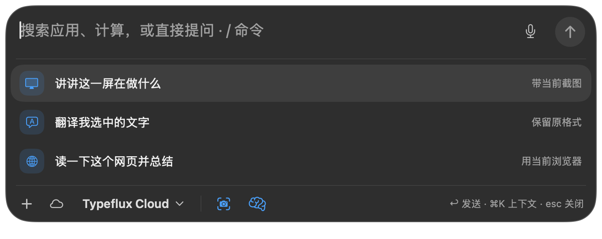
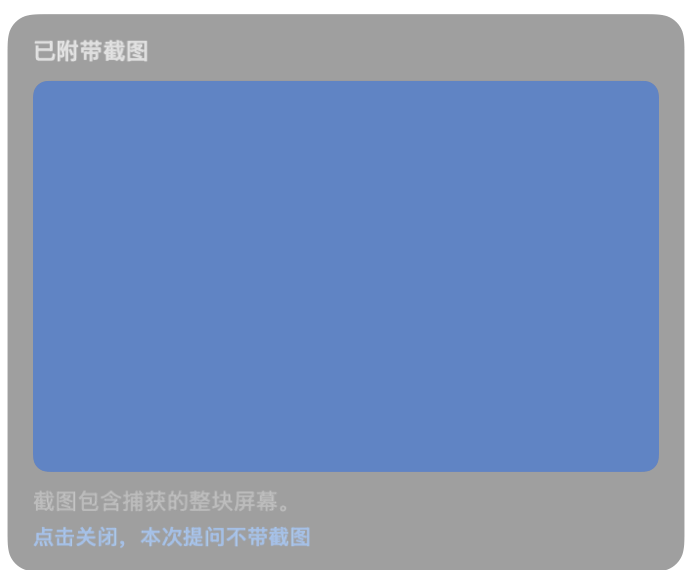

# GUL-235: launcher screenshot hover preview

The launcher input row no longer displays the captured application/window token
or its screenshot thumbnail. The footer screenshot switch previews the captured
image in the existing nonactivating, click-through hover panel. Clicking still
switches screenshot inclusion. The original screenshot and memory icons retain
their appearance, order and toggle actions. Context settings remain available
through Command-K; outgoing source and selected text remain intact.

## Validation

The following command passed **53 tests in 9 suites** on macOS:

```sh
swift test --enable-code-coverage --no-parallel --filter 'AskLauncherHeader|AskLauncherContextTests|AskContextChipsTests|AskHoverCardTests|AskCapturedContentItemsTests|AskCapturedComposerTests|AskComposerTests|AskComposerChromeTests'
```

Native event tests cover the cleared input row, the original footer switch
spacing and memory toggle actions, opening and closing context settings with
Command-K, recording transitions, preview focus and sizing, a toggle click while hovering,
excluded screenshot previews, missing/invalid/failed captures, capture updates
while the card is open, and a capture arriving during the hover delay.

LLVM LCOV records cover **44/48 added executable production lines (91.7%)**:
13/13 in `AskComposerViews.swift` and 31/35 in `AskContextChips.swift`. This is
added-line coverage, not whole-project or branch coverage. `git diff --check`
passes. Strict SwiftLint reports the same 15 existing violations as the unchanged
files at `5ce40d36`; the change adds none.

The full command, `swift test --enable-code-coverage --no-parallel`, did not pass:

- XCTest ran 2,890 tests, with 6 skips and 0 failures.
- Swift Testing recorded 14 issues in existing context UI, capped-width,
  conversation sizing and native computer-tool tests. All 14 issue locations
  and messages reproduced with the two modified production files restored to
  `5ce40d36`, using the affected suites as filters. Task files were restored
  afterwards and the final 53-test command passed again.
- The full run then stalled in `AskRecoveryRenderTests`, inside Vision OCR.
  Process sampling reported the dispatch soft limit of 64 blocked threads.
  The exact test-helper process was stopped; the rest of the full suite was
  not executed. No claim of full-suite success is made.

These full-suite results are from the first revision. The footer-icon correction
reran the focused command above with `TYPEFLUX_ASK_SNAPSHOTS` enabled to regenerate
the native UI screenshots; all 53 tests passed again. The full suite was not
rerun for this correction, and its existing validation blockers remain.

## Self-review

Reviewed the launcher-to-request flow, failure and missing-image states, hover
task cancellation and panel ownership, accessibility, capture privacy, and
documentation consistency. Fixed stale preview updates and the race where a
capture arriving during the hover delay could leave the card with old content.
The hover task now carries the current item and image together, refreshes an open
card, and cancels when disabled or removed. Regression tests pass.

On review, removed the extra context-settings icon introduced in the first
revision. Command-K now uses the existing footer switch group as its popover
anchor. No new visible control is added, and the screenshot and memory symbols
and rendering code are unchanged. Native tests exercise both original toggle
actions and Command-K. Regenerated the screenshots with synthetic memory so
the original brain icon is visible alongside the screenshot icon.

## Screenshots

These are unchanged native renders of production views with synthetic fixtures.
The blue rectangle is the fixture screenshot; no personal desktop is captured.




