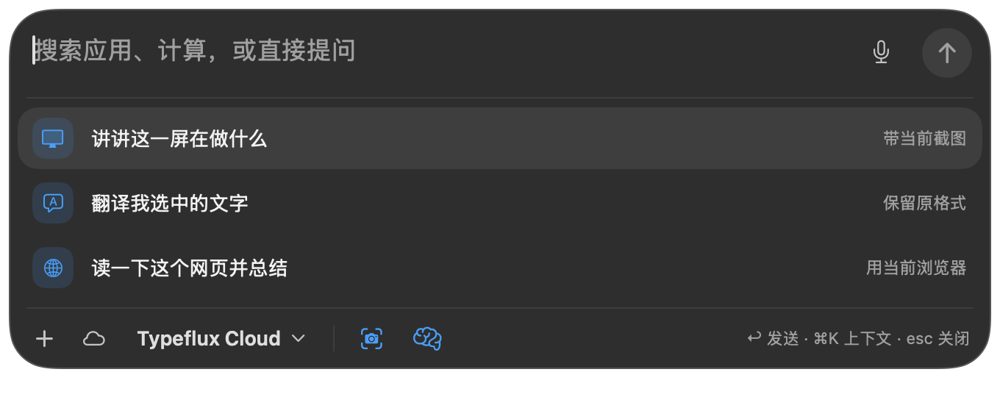

# GUL-235: remove launcher slash commands

The floating launcher no longer opens a command palette when typing `/` or `、`,
and no longer registers Command-/. Former commands such as `/memory` remain
ordinary question text and reach the request unchanged. Removed the command hint
from all five launcher localizations. Workspace slash commands, keyword plugins,
Command-K, screenshot previews and the original footer icons retain their behavior.

## Validation

On macOS, this command passed **92 tests in 16 suites**:

```sh
TYPEFLUX_ASK_SNAPSHOTS=../review-gul235-no-slash swift test --enable-code-coverage --no-parallel --filter 'AskLauncherHeader|AskLauncherContextTests|AskSlashQueryTests|AskCommand|AskQuickResultsTests|AskPluginSessionTests|AskPluginViewTests'
```

Native keyboard tests cover `/memory` and `、memory` reaching the API as text,
Command-/ leaving the draft unchanged, Escape dismissing the launcher, stable
launcher height, and workspace command execution. Existing cases exercise
Command-K, footer toggles, screenshot hover previews, voice, quick results and
keyword plugins. All five launcher placeholders omit the command hint while
the workspace placeholders retain it.

LLVM coverage records execute the one added executable production line, the
conditional slash-query binding (1/1). Both launcher and workspace views are
exercised. This is added-line coverage, not whole-project or branch coverage.
`git diff --check` passes.

Strict SwiftLint on `AskComposerViews.swift` and `AskAttachViews.swift` exits 2
with 14 violations. Linting their unchanged versions at base `7a35d4d3` also
reports 14 violations with the same rule counts; this change adds none.

The full suite was not rerun for this follow-up. The earlier issue-wide run had
baseline test failures and stalled in Vision OCR; see the
[previous validation record](gul-235-launcher-hover-preview.md). No claim of
full-suite success is made.

## Self-review

Checked the complete input-to-request flow, both command entry points, ordinary
and Chinese slash input, Return and Escape routing, accessibility, localization,
and documentation consistency. The launcher omits both the command callback
and shortcut registration; its palette rendering path is removed. Workspace
command handling remains connected and tested. No new asynchronous work or
resource ownership is introduced, and snapshots use synthetic context only.

Updated an existing render test that expected the launcher to grow for a command
palette. A new workspace keyboard test initially sent a synchronous insertion
before the palette refreshed; it now follows the existing tests' paced key-event
pattern. Both revised cases passed individually, then the complete related
92-test run passed.

Self-review also strengthened the height regression to require an actual,
nonzero native measurement. Rechecked it with
`swift test --enable-code-coverage --no-parallel --filter launcherSlashTextDoesNotGrowTheCard`;
the test passed.

## Screenshot

Unedited native render of production views with synthetic screenshot and memory
fixtures. The original screenshot and brain icons remain visible.


