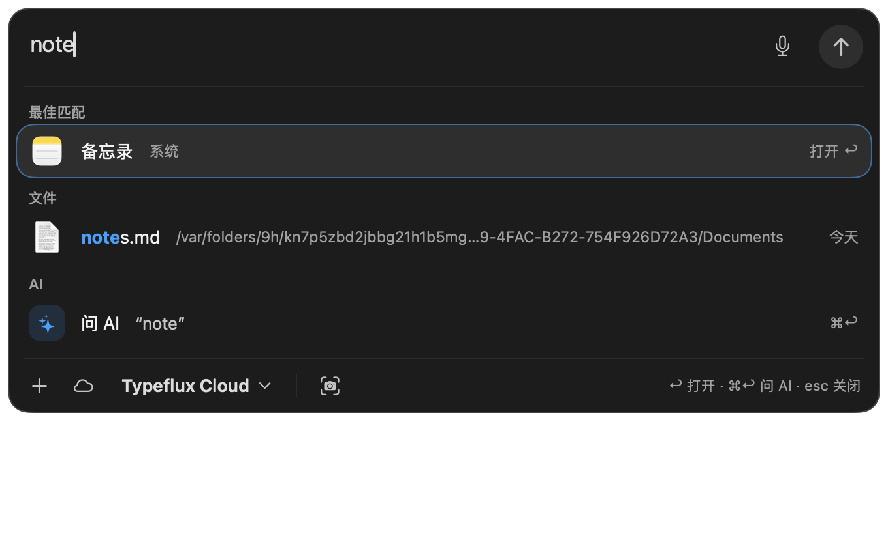
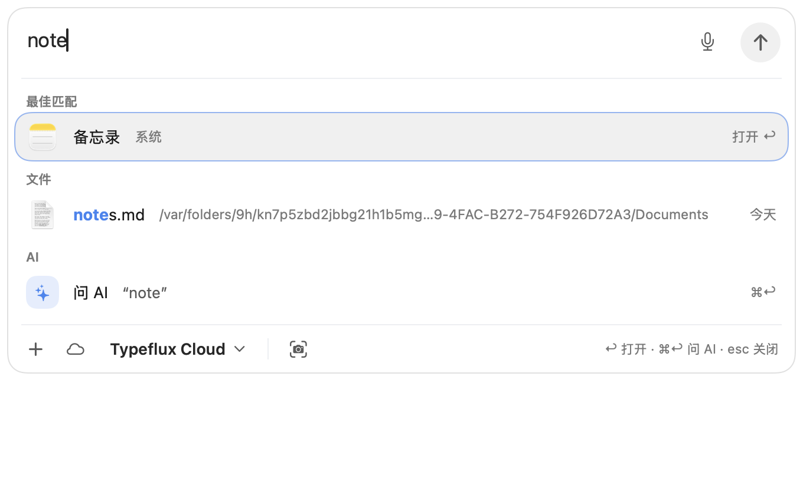

# GUL-242 — responsive launcher search

## Behavior and implementation

Input handlers no longer synchronously scan application or file indexes. `AskQuickSearchSession` owns independent application and file workers. Each worker has at most one running request and one replaceable pending request. Applications publish immediately; files wait for a cancellable 60 ms debounce. Mixed mode buffers an early file response until the application provider has answered. Explicit file-first mode may publish files immediately.

Each input invalidates the previous generation and its cancellation token. File scans check cancellation every 256 records and between chunks. There are at most four concurrent scan workers. Old-query rows are removed immediately, and actions also compare the current draft against the session's query, protecting the interval before SwiftUI delivers `onChange`. Closing the panel, switching plugins, disabling a provider and resetting the account invalidate work. Reopening refreshes the current text.

Mixed/apps-first ordering now also governs the promoted best row, so a stronger file cannot jump above an application. Weak application matches keep Ask AI as the default action. User choices follow stable application IDs and file paths across batches. Pointer motion, rather than a layout-induced hover event, changes selection; asynchronous results cannot move a row under a stationary pointer and steal Return.

Both ordinary and `f` searches refresh after index publication. Search-setting notifications are scoped to the relevant defaults store. File publication notifications are coalesced for 80 ms; live plugin refreshes retain their debounce. A building/loading index can show its status even before the first hit.

File relevance scans and recent-file scans use bounded Top-K heaps. Relevance pruning includes usage boosts and the final tie-breakers, fixing omissions caused by the old per-chunk `limit * 4` cutoff. Usage is grouped by directory, avoiding repeated linear `record(at:)` lookups. Memory accounting is computed outside the file index publication lock.

Result icons and thumbnails use asynchronous Quick Look requests, with a 256-entry cache, shared in-flight loads, file-version keys and cancellation when the last consumer leaves. View bodies display cached images or placeholders. The API supports asynchronous generation and request cancellation: [Apple QLThumbnailGenerator documentation](https://developer.apple.com/documentation/quicklookthumbnailing/qlthumbnailgenerator).

No index format migration or new package dependency is required. Existing filename, pinyin, extension/path filters, file actions and file-first mode remain supported.

## Reproducible performance evidence

Run `bash scripts/launcher_search_benchmark.sh` on macOS. It compiles the production search and coordinator sources with `swiftc -O`; provider contracts are extracted verbatim. Only localization is stubbed. It creates deterministic synthetic names (seed 242), nested directories, Chinese names and modification dates, without scanning user folders. Each query has one warm-up and 30 measured runs. File limit is 24 and there are 500 synthetic application entries.

Observed on Apple M4 / Apple Swift 6.4, with a concurrent build in another workspace. These are load-sensitive measurements, not a controlled before/after comparison. The complete output is in [gul-242/benchmark.txt](gul-242/benchmark.txt).

| Production coordinator, 1,000,000 records | p50 | p95 | Maximum |
|---|---:|---:|---:|
| Accept input and schedule work | 0.058 ms | 0.126 ms | 0.230 ms |
| Publish application batch | 0.232 ms | 0.477 ms | 0.558 ms |
| Publish file batch, including 60 ms debounce | 74.558 ms | 78.129 ms | 78.461 ms |

These measure input handling and observable result publication, not frame presentation or FPS. The synchronous scanner remains workload-sensitive (individual million-record queries reached p95 72.636 ms in this loaded run), but that work no longer occupies the UI thread. Recent-file p95 was 9.991 ms at 500,000 records and 24.150 ms at 1,000,000 records. Do not describe every scanner query as faster than the initial baseline.

`LauncherSearch` signpost events identify input acceptance, application completion and file completion without logging query text. The coordinator benchmark verifies the actual staged code path; interaction tests separately drive the real AppKit/SwiftUI launcher while a deliberately stalled file provider is still running.

## Verification

- 195 related Swift Testing cases in 28 suites passed in 56.498 s using `swift test -j 2 --no-parallel --enable-code-coverage --filter 'AskQuickResults|AskQuickSearchSession|AskSearchScheduling|AskResultImageCache|AskLauncherToggle|AskFileIndex|AskFileScope|AskFuzzy|AskApp|LauncherSearchSettings|AskPluginSession|AskPluginFiles|AskFileSearchPlugin'`.
- Coverage from that run: 422/435 changed executable source lines, **97.01%**, using `git diff --unified=0` plus LLVM LCOV `DA` records. Comments, resources and non-executable lines are excluded. This is changed-code coverage, not whole-repository coverage.
- New coordinator, worker/cancellation, heap and pointer files each have 100% LLVM line coverage; the image cache has 96.05%. `AskFileSearch.swift` has 100% line coverage in the focused run.
- Scenarios include slow-file/fast-app and slow-app/fast-file completion, explicit file-first behavior, 100 input replacements, actual cancellation observation, disabled/hidden sessions, calculation handling, empty filtered queries, no-hit indexing notices, result/selection stability, usage and tie ordering, and capped Top-K compared with an unpruned search across chunks.
- Real launcher tests cover opening an application while files are blocked, ordinary and keyword index refresh without typing, settings changes, close/reopen, Return/arrows/actions, workflow lists and translation shortcuts. The translation test now waits for the requested result rather than accepting an older intermediate result.
- Two snapshot tests passed in 16.204 s. Light/dark application-first screenshots and file-mode rendering were visually inspected; icons load and the application stays above the stronger file result. See the screenshots below.
- Full-suite limitations are recorded separately below; the focused pass does not imply that the entire repository is green.

## Full-suite validation limits

The initial unfiltered `swift test --enable-code-coverage` run reported failures in desktop-observation/permission, window sizing, shared UI state and other suites outside the focused search run. It then stopped making progress in `AskRecoveryRenderTests` while Apple Vision text recognition waited in `_dispatch_semaphore_wait_slow`. A one-second process sample confirmed that stack; only this run's test helper was terminated.

A second run, `swift test --skip-build --no-parallel --skip AskRecoveryRenderTests`, hit the 600-second diagnostic deadline and was stopped with its own process group. The XCTest phase completed 3,015 tests (8 skipped, one Keychain failure). Swift Testing reported failures in application-index refresh timing, capped-width sizing, composer/source-context UI and conversation window sizing before the deadline. A sample at the deadline showed active AppKit/SwiftUI layout during a workflow launcher test, rather than the earlier Vision semaphore wait. That workflow test passes in the focused run. The full serial run did not finish, so it has no complete Swift Testing total.

The application-index test exhausted its existing 500 × 5 ms wait in this run, although it passed in the focused run; concurrent builds/tests were active on this Mac. This is a timing observation, not proof that every failure is environmental or pre-existing. No assertions were weakened and no permissions were changed to obtain a green result. Full-suite acceptance remains unverified.

A follow-up grouping the failed index/layout/composer suites with launcher interaction tests reproduced the index timeout and UI failures, then reached its 150-second diagnostic deadline. It also has no complete test total. The draft PR retains these unresolved validation failures explicitly; the 195-test passing result above is from the separate focused run.

SwiftLint reported 15 errors in existing large/complex classes among touched files. Extracting and linting their original HEAD versions also reported 15 errors; the new search components introduce no lint errors.
