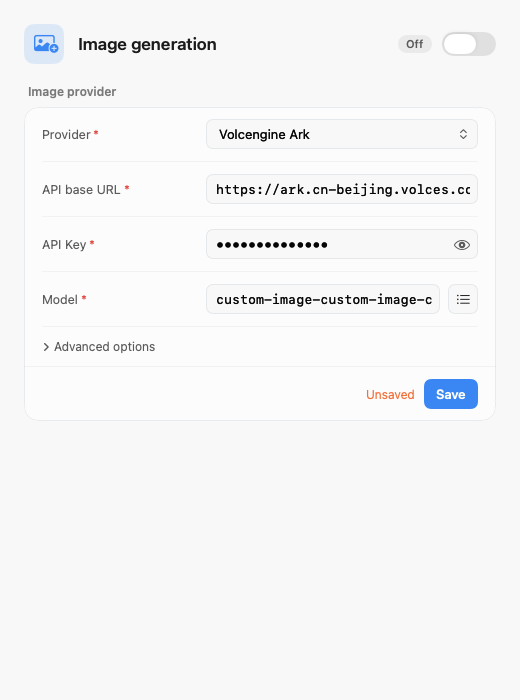
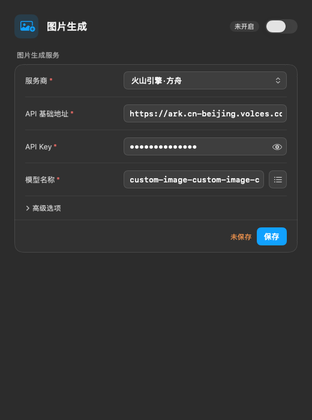
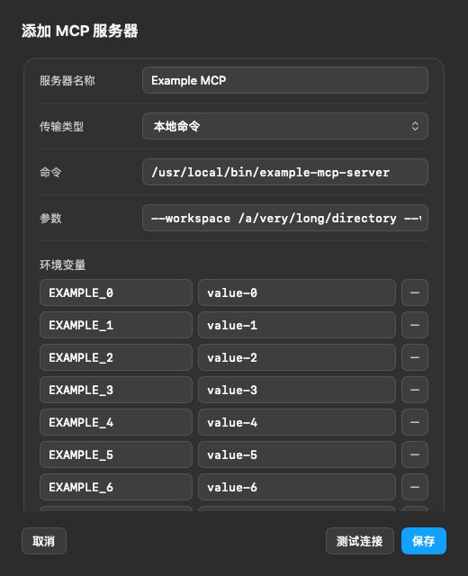
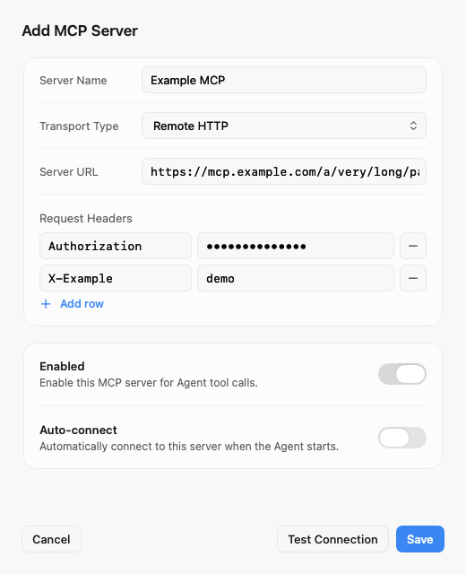
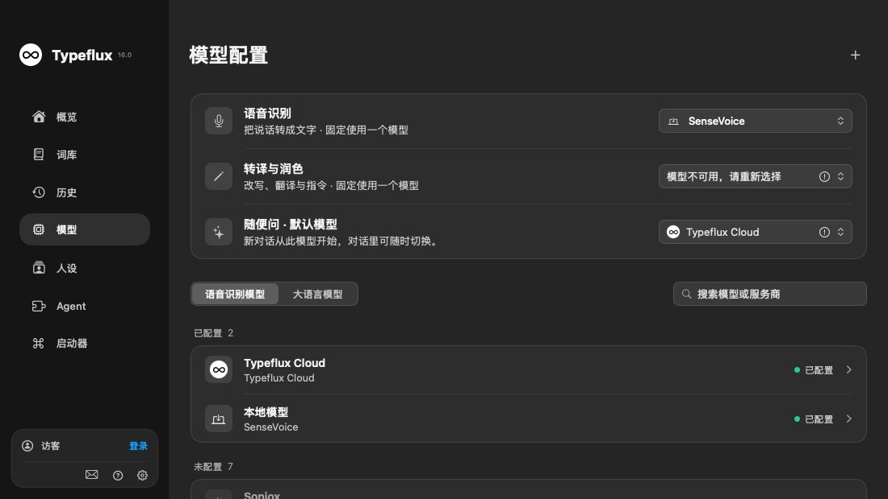
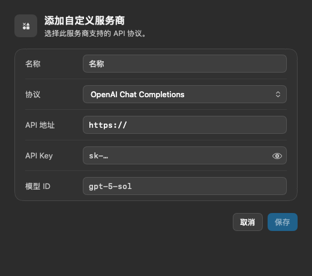
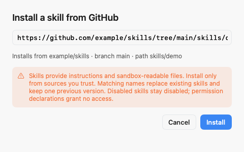

# GUL-245: Agent and model settings polish

Agent and model settings share 30-point fields, searches, selectors and actions, with 7-point corners and consistent spacing. The Agent introduction, pane subtitles, image hints/billing footnote, and file/code/automation explanation cards are removed. The skill installer keeps its URL preview, trust warning and errors without the fixed introduction. Model scene row descriptions remain; the standalone scene caption is removed.

MCP editing uses the model endpoint canvas and cards, a scrolling transport form, masked secret rows, and a fixed Cancel/Test/Save footer. Model availability reads “Configured” rather than claiming a network connection. The custom model placeholder is `gpt-5-sol`.

Image connection drafts, including keys and model discovery results, survive provider and pane switches within one settings window. Unsaved drafts stay in memory; Save remains explicit, and a new window loads only persisted values.

## Validation

The final focused command passed **97 tests**: 77 XCTest tests and 20 Swift Testing tests, with no failures. It includes 15 new settings UI tests and four added image-draft regression tests.

```sh
TYPEFLUX_SETTINGS_POLISH_SNAPSHOTS=../screenshots/polish \
TYPEFLUX_AGENT_SETTINGS_SNAPSHOTS=../screenshots/agent \
TYPEFLUX_PROTOCOL_SNAPSHOTS=../screenshots/protocol \
swift test --enable-code-coverage --no-parallel --filter 'AgentSettingsRedesignTests|AskImageSettingsTests|SettingsPolishTests|ModelSettingsPresentationTests|ModelProtocol|AskAgentToolsTests|AskHarnessUITests'
```

Native event and accessibility tests cover pane switching without saving, Save and key reveal, search clearing, external focus bindings and Shift-Tab traversal, the Agent-to-MCP-sheet entry and dismissal, disabled/loading actions, both transport saves and connection failure/cancellation. Native renders cover English/Chinese, light/dark, minimum/default window heights, long inputs, many key/value rows, success/failure and the skill install sheet. The fixture screenshot archive contains 56 images; no personal desktop is captured.

LLVM LCOV from the final focused run covers **401/433 added or changed executable production lines (92.61%)**. This measures changed lines, not whole-project or branch coverage. The new MCP form has 100% line coverage; shared controls have 96.8%; the modified image-draft logic has 100% changed-line coverage.

`swift build` passed (131.70 seconds). The final focused test command rebuilt the app and tests after integrating main at `f6cd29d7`. `git diff --check` passes. Both new production files pass strict SwiftLint. Repository-wide strict SwiftLint remains red: 1,268 violations versus 1,270 at `f6cd29d7`, with **zero introduced violations**, compared by file, rule and source line.

The full command `swift test --enable-code-coverage --no-parallel` was also run:

- XCTest: 3,033 tests, seven skipped, zero failures.
- Swift Testing: 1,627 tests in 250 suites, 14 issues. Full-suite success is not claimed.
- An isolated worktree at unchanged `2d0a58b7`, with the same `Package.resolved`, reproduced ten of those issue locations: the voice-button frame, seven source-preview assertions, tool recovery state and the workflow output popover. These failures are outside this settings change.
- The remaining four full-run issues were overlay frame-settling timeouts. All five `OverlayTransitionRenderingTests` tests passed when run separately on both the unchanged baseline and the current revision.

The full run preceded the final accessibility and immediate-dismissal cleanup fixes and the integration of latest main. The final focused command passed after those fixes; the full suite was not repeated for them.

## Self-review

Reviewed entry-to-save/dismissal flows, empty and long inputs, transport changes, provider drafts, failure/cancellation, task/connection ownership, secret storage, accessibility, keyboard focus, and localization consistency. Fixed these findings:

- Native menus discard some label backgrounds; their shared chrome now wraps the native menu.
- A second focus binding in the field style interfered with existing bindings; the style reads the focus environment instead.
- Saved-server tests could report into an unrelated draft; test ownership and displayed target are now separate.
- MCP failure/cancellation now disconnects the client. Cancel/Save immediately clears the draft test, without waiting for sheet dismissal animation.
- Decorative loading indicators no longer replace the button's accessibility role.
- The existing configured-label localization key is updated in place rather than duplicated.

The permissions, sandbox and action-confirmation mechanisms are retained. Draft keys are not written to defaults or logs.

## Review screenshots

All images are native renders with synthetic fixtures.

| Image generation · English/light | Image generation · Chinese/dark |
| --- | --- |
|  |  |

| MCP · Chinese/dark, many rows | MCP · English/light, error |
| --- | --- |
|  |  |






