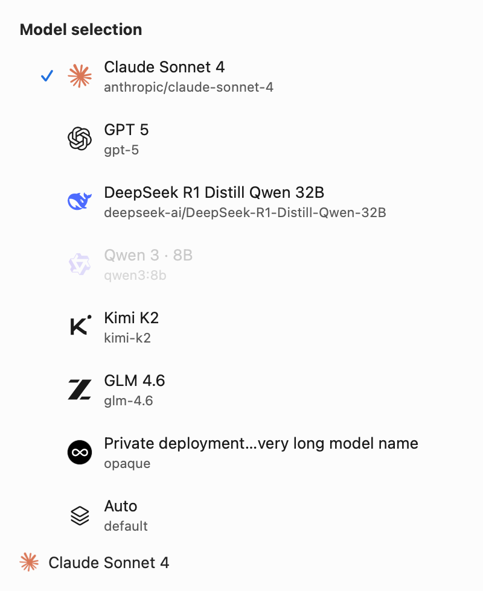
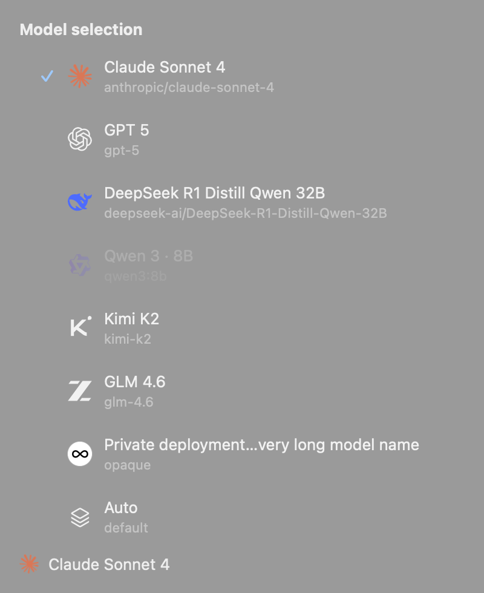
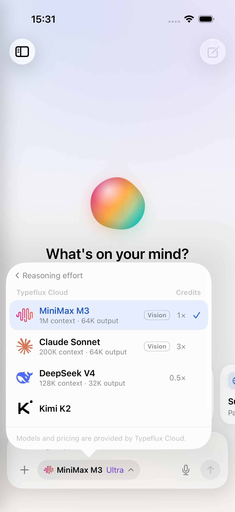

# Model icon verification

The macOS captures render the actual shared model row and icon views with
fixtures covering a selected row, an unavailable row, a long name, a custom
deployment, an automatic choice, and a compact current-model label. The iOS
capture comes from the app's offline preview, driven by its model-selection UI
test. No live account or model request is used for these screenshots.

| macOS light | macOS dark |
| --- | --- |
|  |  |



Validation commands:

```sh
swift test --package-path Packages/TypefluxChat --enable-code-coverage
TYPEFLUX_CATALOG_CAPTURE_DIR="$PWD/captures" swift test --no-parallel --enable-code-coverage
python3 -m unittest discover -s scripts/tests
python3 scripts/sync_model_icons.py --source /path/to/pinned/lobe-icons --check
```

iOS validation runs `TypefluxIOSTests` and
`ChatFlowTests/testUnifiedModelEffortPickerAndModelCapabilities` on an iPhone 17
simulator through `xcodebuild test`, with coverage enabled. The shared tests
check the complete inventory (72 Models plus 14 supporting provider logos),
all 172 theme-specific PNG hashes, and matching/fallback behavior. Native tests
decode every PNG in AppKit and UIKit and render both themes.

Results (2026-10-08, Xcode 27.0):

- Shared package: 56 tests passed; resolver line coverage 98.0%.
- macOS targeted model selection/settings/icon checks: 16 XCTest and 16 Swift
  Testing tests passed.
- iOS: 156 unit tests and the model-selection UI flow passed. The final Kimi
  artwork was also verified by rerunning the presentation suite and UI flow.
- Python tooling: all 75 tests passed; pinned asset synchronization is clean.
- Full macOS serial run: 3,038 XCTest tests passed (7 skipped); 1,753 Swift
  Testing tests ran, with 4 failing tests / 6 assertions in
  `AskComposerInteractionTests`. A clean worktree at the unchanged base
  `fee46308` reproduces the same four failures and six assertions using
  `swift test --skip-build --no-parallel --filter AskComposerInteractionTests`:
  `voiceButtonClickAndHoldWorkInBothComposers`,
  `sourceChipPreviewsMetadataAndRemovalCanBeUndoneWithoutAScreenshot`,
  `narrowLauncherWrapsContentAndKeepsMemoryInTheFooter`, and
  `selectedTextPreviewCanRemoveOnlyTheSelection`. These concern voice-button
  positioning and source-context OCR. The default concurrent run also showed
  additional UI timing failures; serial execution isolates the four baseline
  failures above. They are not changed by this PR.
