# GUL-293: Safari icons and Typeflux settings titles

Application result rows use `AskResultImageCache`. Application links are now resolved off the main thread before cache lookup and request coalescing, and Finder loads the resolved bundle icon off the main thread. The resolved URL is part of the cache identity, so aliases share an image and retargeted links load the new bundle. File previews retain their existing Quick Look path.

The `setting` keyword names Typeflux settings in all five languages. Tests verify the plugin, keyword directory, keyword settings/editor, workflow owner name, and opening action use that title. The signed-out translation screenshot fixture also uses its localized title.

## Validation

Host: mac-mini, macOS 26.6.2, Apple Swift 6.4. Source baseline: `277147b2` (`main`).

- `swift build`: passed, exit 0.
- `swift test --enable-code-coverage --filter ...`: passed, 19 XCTest tests and 62 Swift Testing tests in 13 suites.
- `swift test --skip-build --enable-code-coverage`: passed, 3076 XCTest tests (8 skipped, 0 failures) and 2001 Swift Testing tests in 310 suites.
- `swift test --enable-code-coverage --filter 'AskLauncherNoticeLayoutTests|AskComposerPlaceholderTests|ExclusiveUIStateLanguageTests'`: 7 tests passed.
- `LocalizationResourceTests`: all 19 tests passed, including exact titles in en, zh-Hans, zh-Hant, ja and ko.
- SwiftLint on all 11 changed Swift files: no errors or new warnings; all 33 warnings match the baseline counts by file/rule. See [lint.json](lint.json).
- Added/changed executable production Swift lines: **20/20 covered (100%)**, measured from the final full-suite coverage run (the focused run also covers 20/20) by intersecting `git diff --unified=0 277147b2` added lines with LLVM LCOV `DA` records. This is changed-line coverage, not whole-repository or branch coverage. See [coverage.json](coverage.json), [changed-lines.json](changed-lines.json), and [full-changed.lcov](full-changed.lcov), and [focused-changed.lcov](focused-changed.lcov).

The filtered suites were `AskAppEntryTests`, `AskAppMatcherTests`, `AskAppIndexTests`, `AskQuickResultsAppTests`, `AskResultImageCacheTests`, `AskLocalizationPolishTests`, `LocalizationResourceTests`, `AskKeywordListPresentationTests`, `AskKeywordDraftTests`, `AskLocalizationPolishVisualTests`, `AskQuickResultsVisualTests`, `ExclusiveUIStateLanguageTests`, and `AskComposerPlaceholderTests`.

## Native production-view evidence

Screenshots render `AskLauncherView` and `AskPluginResultsView` in native AppKit windows on mac-mini. The Safari entry is scanned from the installed `/Applications/Safari.app`; the final snapshot waits for the asynchronous image load before capture. Tests use isolated settings/authentication fixtures and restore the in-memory language and window state. Appearance is set per window.

| Surface | Before | After |
| --- | --- | --- |
| Safari, light | 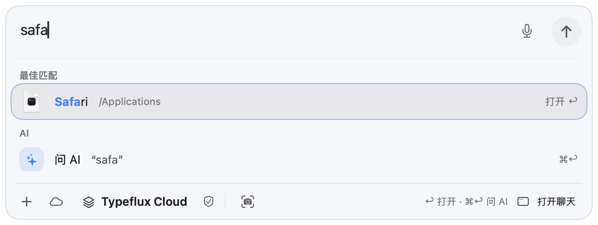 |  |
| Safari, dark | 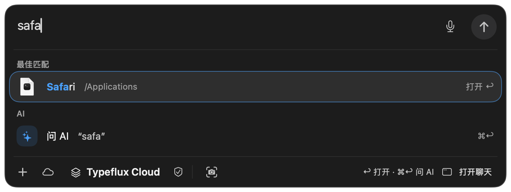 | 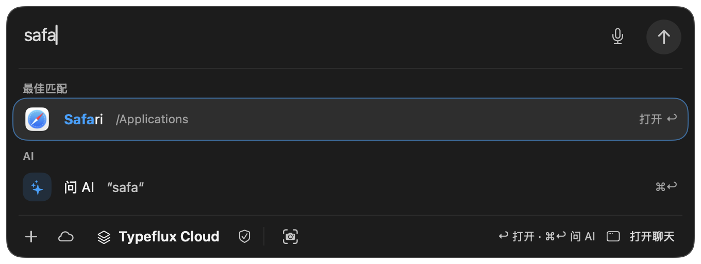 |
| setting, light | 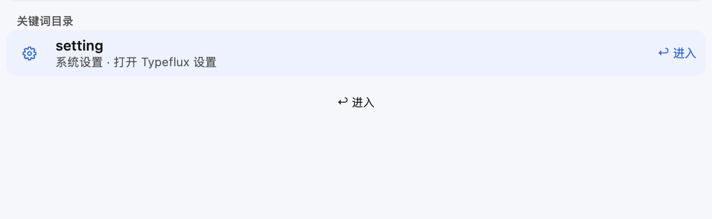 | 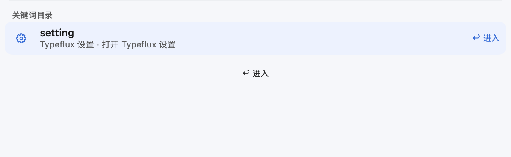 |
| setting, dark | 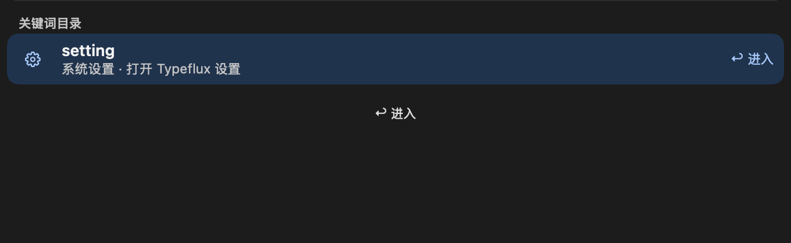 | 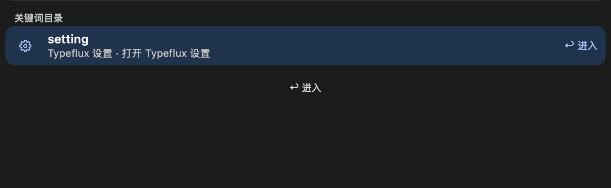 |
| Sign-in card, light | 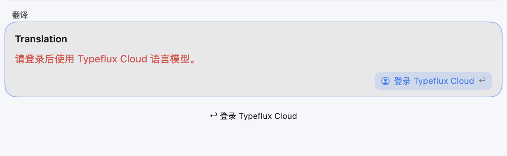 | 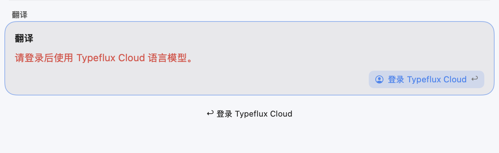 |
| Sign-in card, dark | 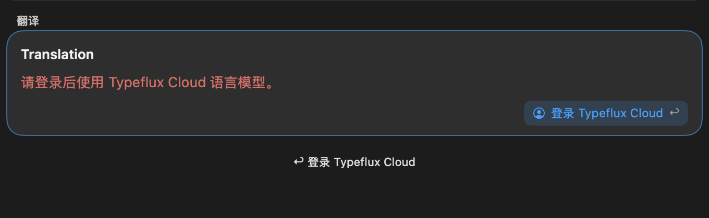 | 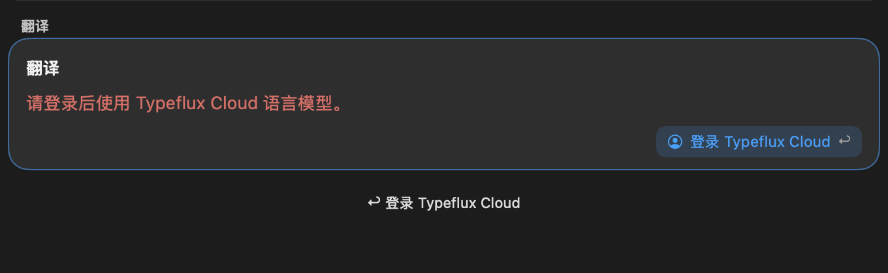 |

The captured accessibility trees confirm `setting, Typeflux 设置 · 打开 Typeflux 设置` and the translation card title `翻译`.

## Self-review

Checked the production row-to-cache-to-Finder path, hidden relative links, alias coalescing, link retargeting, cache version/scale preservation, cancellation, failed-load retry, bounded cache storage, localization consumers and test cleanup. Filesystem/Finder work is awaited off the main thread; only image construction and cache/UI state use MainActor. The existing IME placeholder suite now carries `.exclusiveUIState`, as required by the repository's isolation audit. The notice-height fixture disables app/file search in its isolated settings domain: the asynchronous search placeholder otherwise adds 77pt during a full run and interferes with its notice-only assertions. No settings-opening or application-launch action behavior changed.
